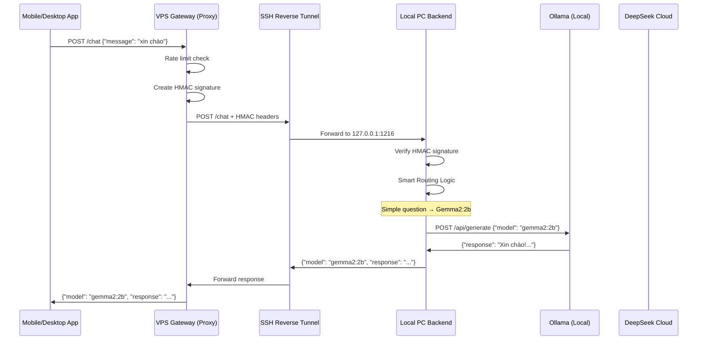

# StillMe Secure Architecture - SSH Tunnel + HMAC Authentication

## 🏗️ Kiến trúc bảo mật

### **VPS Gateway (Secure Proxy)**
- **Vai trò**: Proxy trung gian với bảo mật HMAC
- **Port**: 21568
- **Bảo mật**: 
  - HMAC authentication với Local Backend
  - Rate limiting (10 RPS, burst 20)
  - Timeout protection (10s connect, 20s read)
  - Secure logging (không log body/headers nhạy cảm)
- **Chức năng**: 
  - Nhận request từ mobile/desktop app
  - Ký HMAC và forward đến Local PC Backend
  - Trả response về app
- **Không xử lý**: AI logic, routing, models

### **Local PC Backend (Smart Routing + AI)**
- **Vai trò**: Xử lý routing logic và AI models
- **Port**: 1216 (bind 127.0.0.1 only)
- **Bảo mật**:
  - HMAC verification từ Gateway
  - Chỉ bind localhost (127.0.0.1)
  - Không expose ra Internet
- **Chức năng**:
  - Smart routing (chọn model phù hợp)
  - Chạy AI models local (Gemma, DeepSeek Coder)
  - Fallback đến cloud APIs
  - Xử lý tất cả AI logic

### **SSH Reverse Tunnel**
- **Mục đích**: Kết nối bảo mật VPS ↔ Local PC
- **Cách hoạt động**: Local PC tạo tunnel đến VPS
- **Bảo mật**: Encrypted connection, không expose backend ra Internet

---

## 🔄 Luồng xử lý bảo mật



---

## 🧠 Smart Routing Logic

### **Câu đơn giản** → `gemma2:2b` (Ollama local)
- **Keywords**: xin chào, hello, 2+2, ping, thời tiết
- **Fallback**: DeepSeek Cloud nếu Gemma fail

### **Câu về code** → `deepseek-coder:6.7b` (Ollama local)
- **Keywords**: code, python, function, algorithm, viết code
- **Fallback**: DeepSeek Cloud nếu DeepSeek Coder fail

### **Câu phức tạp** → `deepseek-cloud` (API)
- **Keywords**: phân tích, microservices, architecture, machine learning
- **Fallback**: Gemma2:2b nếu DeepSeek Cloud fail

---

## 🚀 Cách chạy (Production)

### **1. Local PC Backend**
```bash
# Cài đặt Ollama và pull models
ollama pull gemma2:2b
ollama pull deepseek-coder:6.7b

# Tạo .env.local với GATEWAY_SECRET
echo "GATEWAY_SECRET=your_super_secret_key" > .env.local

# Chạy backend (bind 127.0.0.1 only)
python local_stillme_backend.py
```

### **2. SSH Reverse Tunnel**
```bash
# Windows PowerShell
.\tools\start_tunnel.ps1 -VpsIp 160.191.89.99

# Linux/macOS
./tools/start_tunnel.sh -i 160.191.89.99
```

### **3. VPS Gateway**
```bash
# Deploy VPS với bảo mật
bash deploy_vps_proxy.sh

# Set GATEWAY_SECRET trên VPS
echo "GATEWAY_SECRET=your_super_secret_key" >> /opt/stillme/.env
systemctl restart stillme-gateway
```

### **4. Test End-to-End**
```bash
# Test từ VPS
curl -s http://127.0.0.1:21568/health | jq
curl -s -X POST http://127.0.0.1:21568/chat \
  -H 'Content-Type: application/json' \
  -d '{"message":"xin chào","session_id":"test"}' | jq
```

---

## 📊 Performance

### **Latency Expectations**
- **Simple questions**: 1-3s (Gemma local)
- **Code questions**: 2-5s (DeepSeek Coder local)
- **Complex questions**: 5-15s (DeepSeek Cloud)

### **Fallback Strategy**
- **Primary model fail** → Try fallback model
- **All models fail** → Return error message
- **Timeout**: 30s for cloud, 3s for local

---

## 🔧 Configuration

### **Environment Variables**

#### **Local PC (.env.local)**
```bash
# Backend Configuration
BACKEND_PORT=1216
OLLAMA_BASE_URL=http://127.0.0.1:11434
GEMMA_TIMEOUT=3.0
DEEPSEEK_TIMEOUT=30.0
DEEPSEEK_RETRY=2
DEEPSEEK_BACKOFF=2.0
DEEPSEEK_API_KEY=sk-...

# Security (MUST MATCH VPS)
GATEWAY_SECRET=your_super_secret_key
```

#### **VPS (/opt/stillme/.env)**
```bash
# Gateway Configuration
GATEWAY_PORT=21568
LOCAL_BACKEND_URL=http://localhost:1216
REQUEST_CONNECT_TIMEOUT=10
REQUEST_READ_TIMEOUT=20
RATE_LIMIT_RPS=10
RATE_LIMIT_BURST=20

# Security (MUST MATCH LOCAL PC)
GATEWAY_SECRET=your_super_secret_key
```

### **Security Notes**
- **GATEWAY_SECRET**: Phải giống nhau ở cả Local PC và VPS
- **Local Backend**: Chỉ bind 127.0.0.1, không expose ra Internet
- **SSH Tunnel**: Bắt buộc cho production, ngrok chỉ dùng demo

---

## 🛠️ Troubleshooting

### **SSH Tunnel Issues**
- Check SSH connection: `ssh root@160.191.89.99`
- Verify tunnel is active: `netstat -tlnp | grep 1216` (on VPS)
- Check firewall on Local PC

### **HMAC Authentication Issues**
- Verify `GATEWAY_SECRET` matches on both sides
- Check timestamp drift (max 5 minutes)
- Review logs for HMAC verification errors

### **VPS Gateway Issues**
- Check `LOCAL_BACKEND_URL=http://localhost:1216`
- Verify SSH tunnel is forwarding port 1216
- Check rate limiting: `journalctl -u stillme-gateway -f`

### **Local Backend Issues**
- Check Ollama is running: `ollama list`
- Verify models are pulled: `ollama pull gemma2:2b`
- Check API keys for cloud fallback
- Verify binding to 127.0.0.1:1216

### **Security Issues**
- Ensure no API keys in logs
- Verify backend not accessible from Internet
- Check HMAC signatures in network traffic

---

## 📈 Monitoring

### **Health Endpoints**
- **VPS Gateway**: `GET /health`
- **Local Backend**: `GET /health`
- **Backend Status**: `GET /admin/backend-status`

### **Logs (Secure)**
- **VPS Gateway**: Rate limiting, HMAC signing, latency (no body content)
- **Local Backend**: Routing decisions, model calls, HMAC verification
- **SSH Tunnel**: Connection status, reconnection attempts

### **Security Metrics**
- HMAC verification success/failure rates
- Rate limiting triggers
- SSH tunnel uptime
- Authentication failures

### **Performance Metrics**
- Request latency (Gateway → Backend)
- Model selection accuracy
- Fallback usage
- Error rates by component
