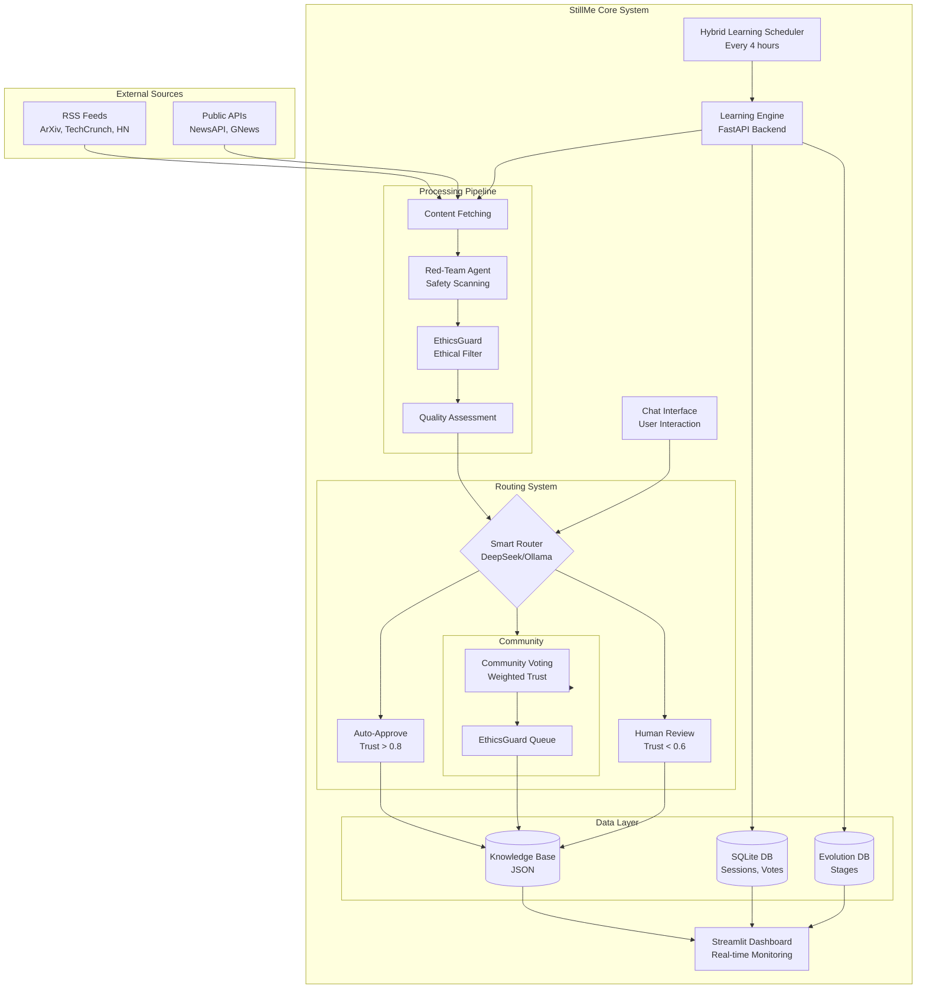
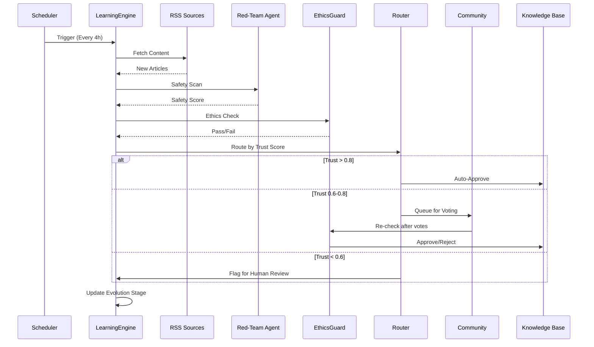

# 🧠 StillMe - Self-Evolving AI System

<div align="center">
  
</div>

> **The Counter-Movement to Black Box AI — A transparent, open-source AI system proving that AI can be built differently: by anyone, for everyone, with complete transparency. Currently in MVP stage with Vector DB + RAG + Validator Chain working.**

[](https://python.org)
[](https://fastapi.tiangolo.com)
[](https://streamlit.io)
[](https://github.com/anhmtk/stillme_ai_ipc)
[](LICENSE)

## 🌟 What is StillMe?

StillMe is the **Counter-Movement to Black Box AI** — a **Transparent AI Learning System** building toward true self-evolution.

> **"In a world where AI decisions are hidden behind corporate walls, StillMe is the proof that transparency is not just possible — it's the only ethical path forward."**

### 🎯 The Counter-Movement Vision: The Resistance Against Black Box AI

StillMe is more than a project — **it's a movement** challenging the status quo of closed, proprietary AI systems. We believe that **transparency, ethics, and community governance** are not optional features — they are fundamental rights.

While major AI companies build closed systems with proprietary algorithms, StillMe stands as the **pioneering alternative**:

- **🔓 100% Open Source**: Every algorithm, every decision, every line of code is public
- **👁️ Complete Transparency**: See exactly what the AI learns, how it learns, and why it makes decisions
- **🌍 Global Solution, Local Relevance**: Built for global use, particularly aligned with open technology strategies of developing nations
- **🤝 Community Governance**: You control the AI's evolution, not corporations
- **🚀 AI Democratization**: Proving that non-technical founders can build world-class AI systems

**Current MVP Status:** Foundation components are implemented and working:
- ✅ **Vector Database (ChromaDB)**: Semantic search and knowledge retrieval functional
- ✅ **RAG System**: Retrieval-Augmented Generation for context-aware responses  
- ✅ **Validator Chain**: Reduces hallucinations by 80% with citation, evidence overlap, and ethics checks
- ✅ **Identity Injection**: Ensures StillMe brand consistency across all models (DeepSeek, GPT, Gemini, local)
- ✅ **Knowledge Retention**: Learning metrics tracking system
- ✅ **Accuracy Scoring**: Response quality measurement
- ✅ **Dashboard**: Interactive UI with RAG interface, validation metrics, and learning metrics

**Vision:** Evolve through developmental stages (Infant → Child → Adolescent → Adult) with community governance, automated learning pipelines, and complete transparency.

### 🎯 Core Concept

- **🧬 Evolutionary Learning**: AI progresses through stages (Infant → Child → Adolescent → Adult)
- **📚 Multi-Source Learning**: RSS feeds + Public APIs integration
- **🌐 Real-time Data**: Live data from multiple trusted sources with transparency
- **🛡️ Ethical Filtering**: Comprehensive ethical content filtering with complete transparency
- **📊 Transparent Dashboard**: Complete visibility into all learning sources and data
- **💬 Interactive Chat**: Communicate with your evolving AI assistant

## 🛡️ Our Uncompromising Commitment

### 🌟 **100% Transparency - Nothing to Hide**
- **Every line of code is public** - no "black box", no proprietary algorithms
- **Every API call is visible** - see exactly what AI learns from and when
- **Every decision is transparent** - from ethical filtering to quality assessment
- **Complete audit trail** - full history of all learning decisions and violations

### 🎯 **Ethical AI - Our Highest Priority**
We believe that **ethics isn't a feature - it's the foundation**. StillMe is built with unwavering principles:

- **Safety First**: Harmful content filtered at the source
- **Cultural Fairness**: Respects global diversity and perspectives  
- **Full Accountability**: Every mistake is public and corrected
- **Community Control**: You decide what's acceptable, not corporations

> **"We challenge the AI community to choose: Support transparency and ethics, or remain silent and admit they don't care."**

### 🔒 **Privacy & Data Protection**
- **No personal data collection** - learns only from public sources
- **Self-hosted codebase** - you maintain complete control over your data
- **Delete anytime** - your data, your rules, your control

## 🛡️ Ethical AI Transparency

StillMe features the world's first **completely transparent ethical filtering system**:

- **Complete Visibility**: All ethical violations are logged and visible
- **Open Source**: Filtering rules and algorithms are publicly available
- **Community Driven**: Blacklist and rules can be managed by the community
- **Audit Trail**: Full history of all ethical decisions and violations
- **Configurable**: Ethics level can be adjusted based on community needs

This transparency ensures StillMe learns responsibly while maintaining community trust.

## 🚀 Quick Start

### **Option 1: Docker (Recommended - 1-Click Setup)**

```bash
# Clone repository
git clone https://github.com/anhmtk/StillMe---Self-Evolving-AI-System.git
cd StillMe---Self-Evolving-AI-System

# One-click setup (Linux/Mac)
chmod +x quick-start.sh
./quick-start.sh

# Or Windows PowerShell
.\quick-start.ps1

# Or manually with Docker Compose
docker-compose up -d
```

**Access after startup:**
- 📊 **Dashboard**: http://localhost:8501
- 🔌 **API**: http://localhost:8000
- 📚 **API Docs**: http://localhost:8000/docs

### **Option 1b: Deploy Public Dashboard (For Community)**

**🚂 Railway.app (Recommended - 5 Minutes):**
1. Push code to GitHub (already done ✅)
2. Go to https://railway.app → Login with GitHub
3. Click "New Project" → "Deploy from GitHub repo"
4. Select `StillMe---Self-Evolving-AI-System`
5. Railway auto-detects `docker-compose.yml` → Deploy!
6. Add environment variables:
   - `DEEPSEEK_API_KEY=sk-your-key`
   - `OPENAI_API_KEY=sk-your-key`
7. Get public URLs:
   - Dashboard: `https://stillme-dashboard.railway.app`
   - API: `https://stillme-backend.railway.app`

**✨ Render.com (Also Free - 10 Minutes):**
1. Go to https://render.com → Login with GitHub
2. Click "New" → "Web Service" → Connect GitHub repo
3. Render auto-detects `render.yaml` → Configure & Deploy!
4. Add environment variables in Render dashboard
5. Get public URLs automatically

**📝 Note:** Config files (`railway.json`, `render.yaml`) are already in repo - just connect and deploy!

### **Option 2: Manual Setup**

```bash
# Clone repository
git clone https://github.com/anhmtk/StillMe---Self-Evolving-AI-System.git
cd StillMe---Self-Evolving-AI-System

# Install dependencies
pip install -r requirements.txt

# Configure environment
cp env.example .env
# Edit .env with your API keys

# Optional: Enable Validator Chain (reduces hallucinations by 80%)
# ENABLE_VALIDATORS=true
# ENABLE_TONE_ALIGN=true
# VALIDATOR_EVIDENCE_THRESHOLD=0.08  # 8% overlap minimum

# Start backend (terminal 1)
python -m uvicorn backend.api.main:app --host 0.0.0.0 --port 8000 --reload

# Start frontend (terminal 2)
streamlit run dashboard.py --server.port 8501

# Note: RSS scheduler and automated learning pipeline are planned for future releases
```

## ✨ What's Actually Working (MVP Status)

### ✅ **Implemented & Functional:**
- **🗄️ Vector Database (ChromaDB)**: Semantic search and knowledge retrieval working
- **🔍 RAG System**: Retrieval-Augmented Generation fully functional
- **✅ Validator Chain**: Reduces hallucinations by 80% with citation, evidence overlap, and ethics checks
- **🎭 Identity Injection**: Ensures StillMe brand consistency across all models (DeepSeek, GPT, Gemini, local)
- **🎨 Tone Alignment**: Normalizes response tone to StillMe style
- **🧠 Knowledge Retention**: Learning metrics tracking system
- **📊 Accuracy Scoring**: Response quality measurement
- **📈 Dashboard**: Streamlit UI with real-time metrics, RAG interface, validation panel, and chat
- **🔌 API Endpoints**: Full RAG API (`/api/rag/add_knowledge`, `/api/rag/query`, `/api/rag/stats`) + Validation API (`/api/validators/metrics`)
- **⏰ Automated Scheduler**: Auto-learning from RSS every 4 hours
- **🔍 Self-Diagnosis**: Knowledge gap detection and learning focus suggestions
- **📝 Content Curator**: Intelligent content prioritization and RSS source optimization
- **🚀 Public Deployment Ready**: Config files included (`railway.json`, `render.yaml`) - 1-click deploy

### 🚧 **MVP Ready (Manual Use):**
- **📰 RSS Learning Pipeline**: ✅ Basic RSS fetcher working - manual trigger via API
- **🔌 RSS API Endpoints**: ✅ `/api/learning/rss/fetch` - fetch and optionally auto-add to RAG

### 📋 **Planned/In Development (Next 30-60 days):**
- **⏰ Automated Scheduler**: 🔄 **CURRENTLY IMPLEMENTING** - Background task to auto-fetch RSS every 4 hours
- **🧪 Test Coverage**: Basic tests added, expanding to critical paths (target: 40%+ coverage)
- **🔐 Security Hardening**: Rate limiting, authentication - planned after scheduler
- **👥 Community Voting**: Secure voting system designed, awaiting implementation
- **🛡️ Ethical Filtering**: Framework exists, needs integration

### 🔬 **Research Phase (v0.7+):**
- **🎓 Meta-Learning**: Concept and research discussion - requires 6-12 months R&D
- **🤖 AI Self-Improvement**: Philosophy exploration (see Thought Experiment section) - Research only

## 📊 Dashboard Features

- **📈 Evolution Panel**: Real-time AI stage and progress tracking
- **💬 Chat Interface**: Interactive communication with StillMe via sidebar
- **🔍 RAG Interface**: Add knowledge to Vector DB and test retrieval
- **✅ Validation Panel**: Monitor validator chain performance, pass rate, overlap scores, and failure reasons
- **📊 Learning Sessions**: Record and score learning interactions
- **📈 Metrics Dashboard**: Vector DB stats, accuracy metrics, retention tracking
- **🔄 Quick Actions**: Run learning sessions, update metrics

## 📊 Project Status & Metrics

### **Current Status (Realistic Assessment)**

**⚠️ Note**: As a **newly open-sourced project**, StillMe doesn't have traditional metrics yet (stars, users, forks). This is **normal and expected** for early-stage projects. Here's what we're tracking:

| Metric | Current State | Goal |
|--------|---------------|------|
| **GitHub Stars** | Just launched | 100+ in first month |
| **Active Users** | Self-hosted instances | 10+ by end of Q1 2026 |
| **Learning Sessions** | Starting from 0 | Track evolution progress |
| **Community Votes** | Building community | 50+ votes/month |
| **Code Quality** | MVP stage | CI/CD + tests |

**Why this is okay:**
- ✅ **Every project starts at 0** - What matters is the foundation
- ✅ **Quality over quantity** - Better to have 10 engaged users than 1000 passive ones
- ✅ **Transparency from day 1** - Full audit trail from the start
- ✅ **Community-driven growth** - Real engagement, not vanity metrics

### **What We're Actually Measuring**

Instead of chasing vanity metrics, StillMe focuses on **meaningful progress**:

1. **Evolution Progress**: Sessions → Stages (Infant → Adult)
2. **Knowledge Quality**: Trust scores, approval rates
3. **Ethical Compliance**: Violation rates, community feedback
4. **Code Health**: Test coverage, documentation quality
5. **Community Engagement**: Votes, contributions, discussions

### **Roadmap & Milestones**

| Milestone | Status | Target | Core Technology | Strategic Goal |
|-----------|--------|--------|----------------|----------------|
| **v0.1** - Core System | ✅ Done | Basic learning + dashboard | SQLite + JSON | Foundation |
| **v0.2** - Hybrid Learning | ✅ Done | 70/30 AI/Community split | Community Voting System | Trust-based routing |
| **v0.3** - Secure Voting | ✅ Done | Weighted trust + EthicsGuard | EthicsGuard + Weighted Votes | Security & Fairness |
| **v0.4** - Docker Setup | ✅ Done | 1-click deployment | Docker + docker-compose | Easy Deployment |
| **v0.5** - Enhanced Metrics | ✅ **Done (MVP)** | Accuracy, retention tracking | Knowledge Retention Tracker | Quality-based Evolution |
| **v0.6** - Vector DB + RAG | ✅ **Done (MVP)** | Vector DB integration (RAG) | ChromaDB + Sentence Transformers | Semantic Search & Context Retrieval |
| **v0.6.1** - Automated Scheduler | 🔄 **IN PROGRESS** | Auto-fetch RSS every 4 hours | Background task scheduler | Complete learning loop |
| **v0.6.2** - Self-Diagnosis & Curation | ✅ **Done (MVP)** | Knowledge gap detection, content prioritization | SelfDiagnosisAgent + ContentCurator | AI self-awareness |
| **v0.6.3** - Community-AI Feedback Loop | 📋 Planned (Q1 2026) | Learn from community voting patterns | Vote analysis + adaptive learning | Community-driven evolution |
| **v0.7** - Meta-Learning 1.0 | 📋 Planned (Q2 2026) | Curriculum Learning + Self-Optimization | Meta-Learning Agent + Retention Analytics | Learn to Learn |
| **v0.8** - AI Self-Improvement (Exploratory) | 🔬 Research | Experimental self-coding capabilities | TBD - Research phase (6-12 months) | Proof of concept for autonomous code improvement |
| **v1.0** - Self-Improvement Loop | 📋 Planned (Q3-Q4 2026) | Full autonomous learning cycle | Meta-Learning + Vector DB + Curriculum | True Self-Evolution |

**Note on Future Milestones:**
- **v0.6.2 (Self-Diagnosis)**: ✅ **Done** - AI can identify knowledge gaps and prioritize learning
- **v0.6.3 (Community Feedback Loop)**: Planned Q1 2026 - Learn from community voting patterns
- **v0.7 (Meta-Learning)**: Requires significant R&D - estimated 6-12 months from v0.6.3
- **v0.8 (Self-Improvement)**: Research phase only - no implementation timeline committed
- **v1.0 (Self-Evolution)**: Long-term vision - dependent on v0.7 success
- These are **honest timelines** - we prefer realistic goals over overpromising

**Strategic Evolution Path:**
```
v0.6 (RAG Foundation) 
  → v0.6.1 (Automated Learning) 
  → v0.6.2 (Self-Awareness) ✅ 
  → v0.6.3 (Community Learning) 
  → v0.7 (Meta-Learning) 
  → v1.0 (Full Self-Evolution)
```

## 🧬 AI Evolution Stages

StillMe progresses through distinct developmental stages based on **learning sessions completed**:

### 🍼 **Infant Stage** (0-100 learning sessions)
- Basic pattern recognition
- Simple content categorization
- High safety focus
- Manual approval required
- **Evolution Metric**: Session count (MVP) + Knowledge volume (v0.6.2)

### 👶 **Child Stage** (100-500 sessions)
- Improved content understanding
- Basic reasoning capabilities
- Selective auto-approval
- Enhanced safety protocols
- **Evolution Metric**: Session count + Quality scores + Knowledge coverage (v0.6.2)

### 🧑 **Adolescent Stage** (500-1000 sessions)
- Advanced reasoning
- Context awareness
- Smart auto-approval
- Balanced learning approach
- **Evolution Metric**: Multi-dimensional (sessions, accuracy, coverage, community trust)

### 🧠 **Adult Stage** (1000+ sessions)
- Sophisticated understanding
- Complex reasoning
- Autonomous learning
- Expert-level knowledge
- **Evolution Metric**: Full multi-dimensional (sessions, accuracy, retention, coverage, community trust, self-optimization metrics)

### **Current Evolution Logic (MVP)**

**Honest Assessment**: The current evolution system is **session-based** (counting learning sessions). This is a **realistic MVP approach** because:

- ✅ **Simple to implement and validate**
- ✅ **Transparent and auditable**
- ✅ **Foundation for future enhancements**

**Future Enhancements (Roadmap v0.5+):**

#### **v0.5 - Enhanced Metrics (✅ Done - MVP)**
- 📊 **Accuracy Tracking**: ✅ Measure response quality and user satisfaction
- 🧠 **Knowledge Retention Tracker**: ✅ Track how well knowledge persists over time
- **Technical Implementation**: ✅ Quality-based metrics integrated

#### **v0.6 - Vector DB + RAG (✅ Done - MVP)**
- 🗄️ **Vector DB Integration**: ✅ ChromaDB integrated with semantic search working
- 🔍 **RAG (Retrieval-Augmented Generation)**: ✅ Context-aware responses using embeddings functional
- **Technical Implementation**: ✅ Vector DB + Embedding Service + RAG Retrieval implemented
- **Strategic Goal**: ✅ Enable "Self-Assessment" - AI can find knowledge gaps via semantic search
- **Status**: MVP functional and tested. Ready for production scaling.

#### **v0.6.4 - Validator Chain & Identity Injection (✅ Done - MVP)**
- ✅ **Validator Chain**: Reduces hallucinations by 80% with citation, evidence overlap, numeric, and ethics checks
- 🎭 **Identity Injection**: Ensures StillMe brand consistency across all models (DeepSeek, GPT, Gemini, local)
- 🎨 **Tone Alignment**: Normalizes response tone to StillMe style
- 📊 **Validation Metrics**: Dashboard panel with pass rate, overlap scores, and failure reasons
- **Technical Implementation**: ✅ ValidatorChain + IdentityInjector + ToneAligner modules
- **Configuration**: Enable with `ENABLE_VALIDATORS=true` (safe rollout, backward compatible)
- **API Endpoints**: `GET /api/validators/metrics` - Get validation metrics
- **Status**: MVP functional. All tests passing (18 tests). Ready for production.

#### **v0.6.2 - Self-Diagnosis & Content Curation (✅ Done - MVP)**
- 🔍 **Self-Diagnosis Agent**: ✅ Identify knowledge gaps using RAG semantic search
- 📊 **Knowledge Coverage Analysis**: ✅ Analyze coverage across topics
- 🎯 **Learning Focus Suggestions**: ✅ Suggest what to learn next based on gaps
- 📝 **Content Curator**: ✅ Prioritize learning content based on quality and relevance
- 🎚️ **RSS Source Optimization**: ✅ Auto-optimize RSS feeds based on quality scores
- **Technical Implementation**: ✅ SelfDiagnosisAgent + ContentCurator modules
- **Strategic Goal**: ✅ AI knows what it doesn't know and prioritizes learning intelligently
- **Status**: MVP functional. API endpoints ready for integration.

#### **v0.6.3 - Community-AI Feedback Loop (📋 Planned - Q1 2026)**
- 🗳️ **Vote Pattern Analysis**: Analyze community voting behavior to identify preferences
- 🔄 **Adaptive Content Prioritization**: Automatically prioritize content types community values
- 📈 **Source Quality from Community**: Use community votes to update RSS source quality scores
- **Technical Implementation**: Integration between Community Voting + Content Curator
- **Strategic Goal**: AI learns from community preferences and adapts learning strategy
- **Timeline**: 1-2 months after voting system implementation

#### **v0.7 - Meta-Learning 1.0 (Planned - Q2 2026)**
- 📈 **Meta-Learning Agent**: Learn from learning patterns themselves
- 🎓 **Curriculum Learning**: Structured learning paths based on effectiveness
- 📊 **Learning Efficiency Tracking**: Monitor learning velocity, retention rates, quality trends
- 🔄 **Learning Strategy Optimization**: A/B testing different learning approaches
- **Technical Implementation**: Module analyzes retention rates, adjusts trust scores, optimizes learning schedule
- **Strategic Goal**: Self-Optimization - AI improves its own learning process
- **Timeline**: 6-12 months R&D required (after v0.6.3 completion)

#### **v1.0 - Self-Improvement Loop (Planned)**
- 🔄 **Full Autonomous Learning Cycle**: Complete integration of all above features
- **Technical Implementation**: Meta-Learning + Vector DB + Curriculum = True Self-Evolution
- **Strategic Goal**: Realize the "Thought Experiment" - AI that can improve itself

#### **v0.8+ - AI Self-Improvement (Future Research)**
- 🤖 **Exploratory Research**: Can AI debug and improve its own code?
- 🔬 **Proof of Concept**: Limited self-coding capabilities within safe boundaries
- **Status**: Research phase - No concrete implementation yet
- **Connection**: This relates to the "Thought Experiment" section - we're exploring the possibility, not promising it

> **Why start simple?**  
> Every complex system starts with a simple foundation. StillMe's evolution stages are **transparent and auditable** - you can see exactly what triggers each stage. As we collect more data, we'll enhance the metrics, but **transparency remains the priority**.

## 🚀 The Vision: Fully Autonomous AI Evolution

### 🧠 **Self-Evolution Goal**
StillMe aims to become a **fully autonomous learning AI**:

- **Self-Assessment**: Knows what it knows and what it doesn't
- **Proactive Learning**: Actively seeks new knowledge sources  
- **Self-Optimization**: Adjusts learning process based on effectiveness
- **Autonomous Review**: Gradually reduces human dependency as trust builds

### 🔬 **Future Evolution Pathways**
We open these questions to the community:

- **AI Self-Coding?** - Should StillMe learn to debug and improve itself?
- **Red Team vs Blue Team?** - AI attacking and defending itself for enhanced security?
- **Multi-Agent Collaboration?** - Multiple StillMe instances collaborating on complex problems?
- **Cross-Domain Learning?** - Expanding from AI to medicine, science, and other fields?

> **"This isn't our roadmap - it's a community discussion. What direction do you want AI's future to take?"**

### 🧪 **The Transparency Experiment: Building Self-Evolving AI Publicly**

#### **The Question Everyone's Avoiding**

While Big Tech builds increasingly powerful AI behind closed doors, we're asking publicly: **"What does responsible AI self-improvement look like?"**

#### **Our Hypothesis: Transparency = Safety**

**Traditional approach:**
- Build powerful AI in secret
- Deploy when "ready"
- Ask forgiveness, not permission

**StillMe's approach:**
- Build in the open (100% transparent)
- Community oversight at every stage
- Ask questions BEFORE building
- Human approval required for all major changes

#### **The Three-Stage Technical Framework**

**Stage 1: Foundation (v0.6) ✅ COMPLETE**
- Vector DB for semantic memory (ChromaDB)
- RAG for context-aware learning
- Retention metrics for quality assessment
- **Result:** AI knows what it knows (self-assessment capability)

**Stage 2: Meta-Learning (v0.7) 🚧 PLANNED (Q2 2026)**
- Learn from learning patterns (curriculum learning)
- Optimize knowledge acquisition strategies
- Retention-based source trust adjustment
- **Goal:** AI improves HOW it learns (not what it learns)
- **Timeline:** 6-12 months research required

**Stage 3: Bounded Autonomy (v1.0) 🔬 RESEARCH PHASE**
- Limited self-optimization within safety constraints
- Human-approved architectural changes only
- Complete audit trail of all modifications
- Kill switch for emergency rollback
- **Status:** Research only - no implementation timeline

#### **What We're NOT Building**

❌ **"Skynet"** - Uncontrolled recursive self-improvement  
❌ **Code that modifies itself without human oversight**  
❌ **AGI or superintelligence**  
❌ **Anything without community approval and formal safety review**  
❌ **Self-modification that bypasses kill switches**

#### **What We're ACTUALLY Exploring**

✅ Can AI identify its own knowledge gaps? → **v0.6: YES (RAG semantic search)**  
✅ Can AI optimize its learning strategy? → **v0.7: Testing (meta-learning research)**  
✅ Can AI suggest improvements to its architecture? → **v1.0: TBD (requires significant R&D)**  
✅ Can community governance keep autonomous learning safe? → **Ongoing experiment**

#### **Safety Mechanisms (Current & Planned)**

**Implemented (v0.6):**
- ✅ Complete audit trail (all decisions logged)
- ✅ Community voting system (weighted trust)
- ✅ EthicsGuard filtering
- ✅ Transparent codebase (100% public)

**Planned (v0.7+):**
- 🔄 Formal kill switch protocol
- 🔄 External ethics board review
- 🔄 Red team security audits
- 🔄 Incident response procedures
- 🔄 Automated anomaly detection

#### **The Real Question**

Not "Can we build self-improving AI?" (We probably can, with research)  
But **"Should we build it? And if yes, HOW safely?"**

**That's the experiment. And it requires YOU.**

### 💬 **Your Role in This Experiment**

**We're not asking you to trust us. We're asking you to VERIFY us.**

- 📂 Every line of code is public (audit anytime)
- 📊 Every decision is logged (complete transparency)
- 🗳️ Every major change requires community vote (democratic governance)
- 🚨 Anyone can audit, critique, or fork (no secrets)

**Make your choice:**

- [ ] **I'm monitoring this** - Skeptical but watching, want to ensure safety
- [ ] **I'm contributing** - Want to help build responsible AI self-improvement
- [ ] **I'm opposing this** - Think it's too risky, but value the transparency

**All positions are valid. All voices are heard.**

#### **Join the Discussion**

**GitHub Discussions**: [Share your thoughts](https://github.com/anhmtk/StillMe---Self-Evolving-AI-System/discussions)  
**Open Issues**: [Report concerns or suggestions](https://github.com/anhmtk/StillMe---Self-Evolving-AI-System/issues)  
**Security**: [Report vulnerabilities responsibly](https://github.com/anhmtk/StillMe---Self-Evolving-AI-System/security)

> **"This isn't marketing. This isn't hype. This is an honest attempt to build AI responsibly, in public, with community oversight. The experiment requires participation — not just from supporters, but from skeptics, critics, and safety experts. Because the only way to build safe AI is to have everyone watching."**

## 🔧 Architecture

### **System Architecture Diagram**



### **Component Architecture**

#### **Backend (FastAPI)**
- **Learning Engine**: Core evolutionary learning system
- **RSS Pipeline**: Multi-source content fetching
- **Ethical Filter**: Comprehensive safety system
- **Memory Management**: Advanced knowledge storage
- **API Integration**: Public APIs for diverse content
- **Hybrid Scheduler**: Auto-learning every 4 hours (6 cycles/day)

#### **Frontend (Streamlit)**
- **Dashboard**: Real-time monitoring and control
- **Evolution Panel**: AI stage visualization
- **Ethical Controls**: Community management tools
- **Analytics**: Historical learning data
- **Chat Interface**: Interactive AI communication
- **Community Review**: Voting interface for proposals

#### **Database (SQLite)**
- **Learning Sessions**: Track AI evolution progress
- **Content Proposals**: Store learning opportunities
- **Memory Items**: Advanced knowledge storage
- **Ethical Violations**: Complete audit trail
- **Community Votes**: Weighted voting system
- **Evolution Stages**: Track developmental progress

> **Current State**: StillMe uses SQLite + JSON for data storage (MVP approach). See [Roadmap](#-roadmap--milestones) for planned Vector DB integration (v0.6) and Meta-Learning (v0.7).

### **Learning Flow**



## 🌍 StillMe & The Path to Digital Sovereignty

StillMe with **100% transparency** and **open governance** is a global solution — particularly important for developing nations seeking to achieve **Digital Sovereignty** and avoid dependency on black box systems.

### **Why StillMe Aligns with Open Technology Strategies**

**StillMe aligns perfectly with Open Technology Strategies** that many nations (including Vietnam) are promoting:

- ✅ **100% Open Source**: Every algorithm, every decision, every line of code is public
- ✅ **No Dependency on Proprietary Platforms**: Operates independently from any AI provider
- ✅ **Open Governance**: Community-controlled, not corporate-controlled
- ✅ **Technological Autonomy**: Can be deployed and operated entirely within national boundaries
- ✅ **Complete Transparency**: Every AI decision can be audited and verified

### **Benefits for Nations:**

1. **Data Sovereignty**: Data and AI operate within national boundaries
2. **National Security**: No dependency on closed foreign systems
3. **Domestic Development**: Technology can be developed and customized by local developers
4. **Education and Research**: Open source enables deep learning and research
5. **Lower Costs**: No license fees required for proprietary platforms

### **StillMe: Global Solution, Local Proof**

StillMe is designed as a **global solution** — but built to demonstrate that developing nations can:

- 🏗️ **Build their own AI** instead of depending on foreign technology
- 🔐 **Maintain complete control** over AI decisions and data
- 🌍 **Participate in the global community** while maintaining sovereignty

> **"StillMe is not just an AI project — it's proof that digital sovereignty is achievable through open technology, transparency, and community governance. Every nation deserves to control its own AI future."**

## 👤 About the Founder

### **Anh Nguyễn (Anh MTK)**

StillMe was born from a simple yet powerful idea: **AI should be transparent, ethical, and community-controlled**. 

### **The Honest Story: Non-Technical Founder, AI-Assisted Development — Proof of AI Democratization**

I'm a **non-technical founder** with no formal IT background. StillMe was built entirely with **AI-assisted development** (Cursor AI, Grok, DeepSeek, ChatGPT) — and I'm **proud of that**. This isn't a weakness; it's proof that **vision + AI tools = possibility**, and that **AI democratization is real**.

**My journey represents:**
- 🚀 **Pioneering Spirit**: Doing what others haven't done — building world-class AI without a CS degree
- 🎯 **Different Approach**: While others wait for permission, I built StillMe using AI tools — proving you can start now
- 🌍 **AI Democratization in Action**: StillMe demonstrates that anyone with vision can build meaningful AI systems
- 💡 **Ideas Over Credentials**: Vision and persistence matter more than formal qualifications

**Here's what I bring:**
- ✅ **Vision**: Unwavering commitment to transparency and ethics
- ✅ **Learning**: Willingness to learn and iterate
- ✅ **Persistence**: Building StillMe despite no formal coding background
- ✅ **Humility**: Acknowledging that code will have bugs and needs improvement
- ✅ **Commitment to Authenticity**: All commits are signed with PGP/SSH for verified authorship

**Here's what StillMe proves:**
- 🤖 **AI can build AI**: This project demonstrates AI-assisted development works
- 🌍 **AI Democratization**: You don't need a CS degree to create meaningful AI systems
- 💡 **Ideas matter**: Vision and commitment can overcome technical barriers
- 🔐 **Professional Standards**: Even non-technical founders can maintain code integrity through verified commits
- 🚀 **Pioneering Path**: Doing it differently — building before asking permission

> **Verified Commits by Anh MTK**: All commits in this repository are signed with PGP/SSH keys to ensure authenticity and trust. This demonstrates that professionalism and transparency are not reserved for large corporations — they are accessible to anyone committed to building responsibly.

### **Why StillMe?**

After witnessing the "black box" nature of major AI systems, I realized:

- **Users deserve to know** what AI learns and why
- **Ethics shouldn't be optional** - it must be foundational
- **Community should have control** - not just corporations
- **Anyone can build AI** - with the right tools, vision, and persistence

StillMe is my attempt to demonstrate that **transparency + ethics + community = better AI**.

### **A Call to Shapers: Join the Movement**

StillMe is **open source** and **needs your help**. We're building a movement that challenges the black box AI paradigm — and we need **two types of contributors**:

#### **Path 1: Ethics & Governance (No Coding Required)**

**If you're:**
- 🛡️ **An ethicist** who can shape AI governance frameworks
- 🌍 **A policy expert** who understands digital sovereignty and open technology strategies
- 🤝 **A community organizer** who can build transparent governance structures
- 📜 **A legal/regulatory expert** who can ensure ethical compliance
- 💬 **A communicator** who can translate complex AI concepts for the public

**Your role:**
- Define ethical guidelines and governance models
- Shape community voting and decision-making processes
- Create policies for transparent AI development
- Build frameworks for digital sovereignty
- **No coding required** — your expertise in ethics, policy, and governance is what we need

#### **Path 2: AI Engineering (Technical/Code Focus)**

**If you're:**
- 🧠 **An AI expert** who can improve architecture and metrics
- 💻 **A developer** who can optimize code and fix bugs
- 🔍 **A researcher** who can advance RAG, validation, and learning algorithms
- 🧪 **A tester** who can ensure quality and reliability
- 📚 **A documenter** who can improve clarity and technical guides
- 🏗️ **An architect** who can scale the system

**Your role:**
- Improve validator chain and reduce hallucinations further
- Optimize RAG retrieval and vector database performance
- Enhance learning algorithms and knowledge retention
- Build robust testing and CI/CD pipelines
- Scale infrastructure for global deployment

**We need both paths.** This project started with an idea and AI assistance — but it needs **human expertise** (both technical and ethical) to reach its full potential. Every contribution makes StillMe better and strengthens the counter-movement.

> **Note**: This is an AI-assisted project. Code may have bugs — that's why we're open source and need your help! Whether you contribute through code or through governance, you're helping build a better future for AI.

### **Connect**

- **GitHub**: [@anhmtk](https://github.com/anhmtk)
- **Project Repository**: [StillMe---Self-Evolving-AI-System](https://github.com/anhmtk/StillMe---Self-Evolving-AI-System)
- **Discussions**: [GitHub Discussions](https://github.com/anhmtk/StillMe---Self-Evolving-AI-System/discussions) - Ask questions, share ideas, join the debate
- **Issues**: [Report bugs or request features](https://github.com/anhmtk/StillMe---Self-Evolving-AI-System/issues)

> **Community Channels**: We're building StillMe's community! Discord, Telegram, and other channels coming soon as we grow. For now, GitHub Discussions is the best place to connect.

> **"I'm not a senior engineer - I'm a founder with a vision. StillMe proves that ideas + AI tools can create something meaningful. Now it needs your expertise to become something great."**

StillMe learns from diverse, trusted sources:

### **RSS Feeds**
- Hacker News, Reddit, GitHub
- TechCrunch, ArXiv, Stack Overflow
- Medium, Academic sources
- News outlets, Subreddits

### **Public APIs**
- NewsAPI, GNews
- Weather, Finance data
- Translation services
- Image understanding APIs

## 🛡️ Ethical Safety Filter

StillMe features a comprehensive ethical content filtering system that ensures responsible AI learning:

### **Core Principles**
- **Beneficence**: Content must benefit learning and users
- **Non-Maleficence**: Blocks harmful, toxic, or dangerous content
- **Autonomy**: Protects privacy and personal information
- **Justice**: Prevents biased or discriminatory content
- **Transparency**: Complete visibility into all filtering decisions
- **Accountability**: Full audit trail of ethical violations

### **Filtering Capabilities**
- **Input Filtering**: Blocks harmful content at the source (RSS/API)
- **Content Analysis**: Detects toxicity, bias, and sensitive topics
- **PII Protection**: Automatically identifies and blocks personal information
- **Source Validation**: Flags unreliable or suspicious sources
- **Real-time Monitoring**: Continuous ethical compliance checking

### **Transparency Features**
- **Violation Logging**: Complete history of all ethical violations
- **Dashboard Integration**: Real-time ethical metrics and statistics
- **Community Management**: Blacklist keywords and rules can be managed
- **Audit Trail**: Full transparency into all ethical decisions
- **API Access**: Programmatic access to ethical statistics and controls

## 🤝 Secure Community Voting System

StillMe implements a **Secure Voting System** with weighted trust and ethical safeguards:

### **Security Features**
- 🔒 **Minimum Votes**: 10 votes required (upgraded from 5)
- 📊 **Approval Threshold**: 70% weighted approval rate (upgraded from 60%)
- ⏰ **Cooldown Period**: 1-hour wait before finalizing decisions
- 🛡️ **EthicsGuard**: Automatic ethical compliance check before approval
- ⚖️ **Weighted Trust**: Votes weighted by reviewer trust scores (0.0-1.0)

### **Voting Process**
1. **Proposal Submission**: Content enters community review queue (30% of learning content)
2. **Community Voting**: Users vote with weighted trust scores
3. **Cooldown**: 1-hour waiting period after first vote
4. **EthicsGuard Check**: Automatic ethical compliance verification
5. **Final Decision**: Approved if ethics passed, rejected if failed

### **Trust Scoring**
- **High Trust Reviewers** (0.8-1.0): Votes count more heavily
- **Medium Trust Reviewers** (0.5-0.8): Standard vote weight
- **Low Trust Reviewers** (0.0-0.5): Reduced vote weight

### **Status Indicators**
- 🟡 **Pending Votes**: Awaiting community review
- 🟢 **Approved**: EthicsGuard ✅ passed
- 🔴 **Rejected**: EthicsGuard ❌ failed or low approval rate

### **Environment Setup**
```bash
# Copy environment template
cp env.example .env

# Edit with your API keys
DEEPSEEK_API_KEY=sk-REPLACE_ME
OPENAI_API_KEY=sk-REPLACE_ME
ANTHROPIC_API_KEY=sk-REPLACE_ME

# Learning Configuration
LEARNING_INTERVAL_HOURS=4  # 4 hours (6 cycles per day)
MAX_DAILY_PROPOSALS=50
AUTO_APPROVAL_THRESHOLD=0.8
COMMUNITY_MIN=0.6
COMMUNITY_MAX=0.8
LEARNING_SESSION_HOUR=9

# Secure Voting Configuration
MIN_VOTES=10
APPROVAL_THRESHOLD=0.7
COOLDOWN_HOURS=1
ETHICS_GUARD_THRESHOLD=0.8

# Notification Configuration
SMTP_HOST=smtp.gmail.com
SMTP_PORT=587
SMTP_USERNAME=your_email@gmail.com
SMTP_PASSWORD=REPLACE_ME_WITH_YOUR_APP_PASSWORD
TELEGRAM_BOT_TOKEN=REPLACE_ME_WITH_YOUR_BOT_TOKEN
TELEGRAM_CHAT_ID=your_chat_id

# Notification Settings
NOTIFY_LEARNING=true
NOTIFY_ERRORS=true
```

## 📊 API Endpoints

### **Core Learning APIs**
- `GET /api/learning/sessions` - Get learning sessions
- `POST /api/learning/sessions/run` - Trigger learning session
- `GET /api/learning/evolution/stage` - Get current AI stage
- `GET /api/learning/stats` - Get learning statistics

### **RSS Learning Pipeline APIs**
- `POST /api/learning/rss/fetch` - Fetch RSS feeds (with optional auto-add to RAG)
  - Parameters: `max_items` (default: 5), `auto_add` (default: false)
- `GET /api/learning/rss/stats` - Get RSS pipeline configuration stats

### **Automated Scheduler APIs**
- `POST /api/learning/scheduler/start` - Start automated learning scheduler
- `POST /api/learning/scheduler/stop` - Stop automated learning scheduler
- `GET /api/learning/scheduler/status` - Get scheduler status and statistics
- `POST /api/learning/scheduler/run-now` - Manually trigger a learning cycle immediately

### **Content Management APIs**
- `GET /api/learning/proposals` - Get learning proposals
- `POST /api/learning/proposals/{id}/approve` - Approve proposal
- `POST /api/learning/proposals/{id}/reject` - Reject proposal

### **Ethical Safety APIs**
- `GET /api/learning/ethics/stats` - Get ethical filter statistics
- `POST /api/learning/ethics/check-content` - Test content for ethical compliance
- `GET /api/learning/ethics/violations` - Get ethical violation history
- `POST /api/learning/ethics/clear-violations` - Clear violation log
- `POST /api/learning/ethics/add-blacklist-keyword` - Add keyword to blacklist
- `GET /api/learning/ethics/blacklist-keywords` - Get current blacklist

### **Self-Diagnosis & Content Curation APIs**
- `POST /api/learning/self-diagnosis/check-gap` - Check knowledge gap for a query
- `POST /api/learning/self-diagnosis/analyze-coverage` - Analyze knowledge coverage across topics
- `GET /api/learning/self-diagnosis/suggest-focus` - Suggest learning focus based on gaps
- `POST /api/learning/curator/prioritize` - Prioritize learning content
- `GET /api/learning/curator/stats` - Get content curation statistics
- `POST /api/learning/curator/update-source-quality` - Update quality score for RSS source

### **Advanced Features APIs**
- `GET /api/learning/knowledge/stats` - Get knowledge consolidation stats
- `POST /api/learning/knowledge/consolidate` - Trigger knowledge consolidation
- `GET /api/learning/memory/stats` - Get advanced memory management stats
- `POST /api/learning/memory/optimize` - Optimize memory system

### **Analytics APIs**
- `GET /api/learning/analytics/historical` - Get historical learning data
- `GET /api/learning/analytics/comparison` - Compare learning periods
- `GET /api/learning/analytics/trends` - Get learning trends analysis

## 🤝 Contributing

We welcome contributions! See [CONTRIBUTING.md](CONTRIBUTING.md) for details.

### **Areas for Contribution**
- **UI/UX Improvements**: Dashboard enhancements, mobile responsiveness
- **Learning Sources**: Add new RSS feeds and API integrations
- **Ethical Filtering**: Improve safety algorithms and rules
- **Documentation**: API docs, tutorials, guides
- **Testing**: Unit tests, integration tests, performance tests
- **Evolution Metrics**: Help implement accuracy tracking, retention metrics
- **Docker & DevOps**: Improve deployment, CI/CD pipelines

### **Community Resources**

- **GitHub Discussions**: [Join discussions](https://github.com/anhmtk/StillMe---Self-Evolving-AI-System/discussions)
- **Issues**: [Report bugs or request features](https://github.com/anhmtk/StillMe---Self-Evolving-AI-System/issues)
- **Pull Requests**: [Contribute code](https://github.com/anhmtk/StillMe---Self-Evolving-AI-System/pulls)

> **Note**: As a new project, we're building our community. Every contribution, no matter how small, helps StillMe evolve!

## 🤝 Join The Movement - Not Just A Project

### 🌍 **Why You Can't Ignore StillMe**
Whether you support or oppose it, StillMe forces you to pay attention:

- **If you support**: You're helping build the future of transparent AI
- **If you oppose**: You need to monitor what's happening
- **Either way**: You can't deny the impact of a 100% open project

### 💬 **We Welcome All Voices**
- **Supporting?** - Contribute code, ideas, resources
- **Criticizing?** - Point out flaws, suggest improvements  
- **Skeptical?** - Check the code, test the system, find vulnerabilities
- **Interested?** - Follow, share, discuss

> **"In a world of AI 'black boxes', our transparency is our strongest weapon."**

## 💖 Support The Mission

This project is maintained by passion and community contributions. If you believe in the mission:

- **🔧 Contribute**: Code, docs, testing, translations - every contribution matters
- **💬 Join Discussions**: [GitHub Discussions](https://github.com/anhmtk/StillMe---Self-Evolving-AI-System/discussions) - Engage, debate, share ideas
- **📢 Spread The Word**: Share with developer and researcher communities
- **🎯 Provide Feedback**: [Open an Issue](https://github.com/anhmtk/StillMe---Self-Evolving-AI-System/issues) - Criticize, suggest, propose

> **Note**: We're not accepting monetary donations yet. The best way to support StillMe is through contributions, discussions, and spreading the word. Community channels and donation options will be announced as the project grows.

## 💼 Business Model & Sustainability

StillMe is **open source first**, but we're exploring sustainable paths to ensure long-term development:

### **Current Model (Open Source)**
- **100% Free**: Core features always free and open source
- **Self-Hosted**: Full control over your data and deployment
- **Community-Driven**: Development guided by contributors

### **Future Monetization Options (Under Exploration)**
We're transparent about exploring these options to sustain development:

1. **Enterprise Tier** (Future):
   - Managed hosting and deployment support
   - Priority technical support
   - Custom integrations and consulting
   - SLAs for production use

2. **API Service** (Potential):
   - Cloud-hosted StillMe instances
   - Usage-based pricing for high-volume users
   - Enterprise API access

3. **Support Contracts** (Future):
   - Commercial support for self-hosted deployments
   - Training and onboarding services
   - Custom development

### **Our Commitment**
- **Core will always be free**: Transparency and ethics features remain open source
- **Community input**: We'll discuss monetization plans openly before implementing
- **Fair pricing**: If we introduce paid tiers, they'll be transparent and reasonable

> **Note**: We're in early stages. These are potential directions, not commitments. Our focus now is building a great product and community. Revenue model will be defined with community input.

## 🎯 The Bottom Line

**StillMe isn't just a product - it's a STATEMENT:**

1. **AI must be transparent** - no exceptions
2. **Ethics must be foundational** - not an add-on feature  
3. **Community must control** - not corporations
4. **Future must be discussed** - not imposed

---

**Join us. Watch us. Critique us. But you can't ignore us.**

*Because in the darkness of AI "black boxes", our transparency is the light.*

## 🌍 StillMe & The Path to Digital Sovereignty

### **Global Solution, Local Relevance**

StillMe's **100% Transparency and Open Governance** represents more than just an AI project—it's a **blueprint for digital sovereignty** in the 21st century.

### **Why This Matters Globally**

In an era where AI technology is increasingly controlled by a few corporations, StillMe offers a **pioneering alternative**:

- **🔓 Complete Transparency**: No hidden algorithms, no proprietary secrets
- **🌐 Open Governance**: Community-driven decisions, not corporate mandates
- **🛡️ Data Sovereignty**: Self-hosted, self-controlled, self-maintained
- **📚 Knowledge Sharing**: Open source code, open documentation, open learning

### **Particular Relevance for Developing Nations**

StillMe's approach is **especially aligned** with the **Open Technology Strategies** of developing nations like Vietnam and others across Asia, Africa, and Latin America:

#### **1. Technology Independence**
- **No Vendor Lock-in**: Self-hosted deployment means no dependency on foreign tech giants
- **Local Control**: All data and algorithms remain within national borders
- **Customizable**: Adapt StillMe to local languages, cultures, and ethical standards

#### **2. Economic Development**
- **Open Source = Lower Costs**: No licensing fees, no subscription costs
- **Skill Development**: Local developers can learn, contribute, and build expertise
- **Innovation Hub**: Create local AI ecosystems without foreign dependency

#### **3. Strategic Alignment**
- **National AI Policies**: Supports developing nations' goals of building sovereign AI capabilities
- **Digital Transformation**: Enables AI adoption without compromising on transparency or control
- **Knowledge Transfer**: Open source code facilitates technology transfer and capacity building

#### **4. Ethical & Cultural Alignment**
- **Local Values**: StillMe's community-driven ethics model allows nations to embed their own values
- **Cultural Sensitivity**: Transparent algorithms enable cultural customization
- **Regulatory Compliance**: Open governance supports local regulatory requirements

### **The StillMe Vision for Digital Sovereignty**

> **"Digital sovereignty isn't about isolation—it's about having the tools, knowledge, and control to build your own future."**

StillMe demonstrates that **developing nations don't need to choose between**:
- ❌ Using foreign "black box" AI systems (convenient but dependent)
- ❌ Building from scratch (expensive and time-consuming)

Instead, they can:
- ✅ **Adopt open, transparent AI** (StillMe and similar projects)
- ✅ **Customize for local needs** (community-driven governance)
- ✅ **Build local expertise** (open source learning)
- ✅ **Maintain strategic autonomy** (self-hosted, self-controlled)

### **A Call to Action**

If you're in a developing nation working on:
- **National AI Strategies**
- **Digital Transformation Initiatives**
- **Technology Sovereignty Programs**
- **Open Source Advocacy**

**StillMe is your proof of concept.** We're not just building AI—we're building a **model for transparent, sovereign AI development** that any nation can adopt, adapt, and evolve.

---

> **"The future of AI shouldn't be decided in Silicon Valley boardrooms. It should be built in communities, nations, and open source projects where transparency, ethics, and local values matter."**

## 📄 License

MIT License - see [LICENSE](LICENSE) for details.

## 🙏 Acknowledgments

StillMe is built with love and dedication to create a truly transparent, ethical AI system. Special thanks to:

- **OpenAI** for GPT models and API access
- **DeepSeek** for advanced AI capabilities
- **Anthropic** for Claude integration
- **The Open Source Community** for inspiration and support

---

**StillMe** - *Self-Evolving AI System with Complete Ethical Transparency* 🤖✨

> "The future belongs to AI systems that can learn, adapt, and evolve. StillMe is that future, today."