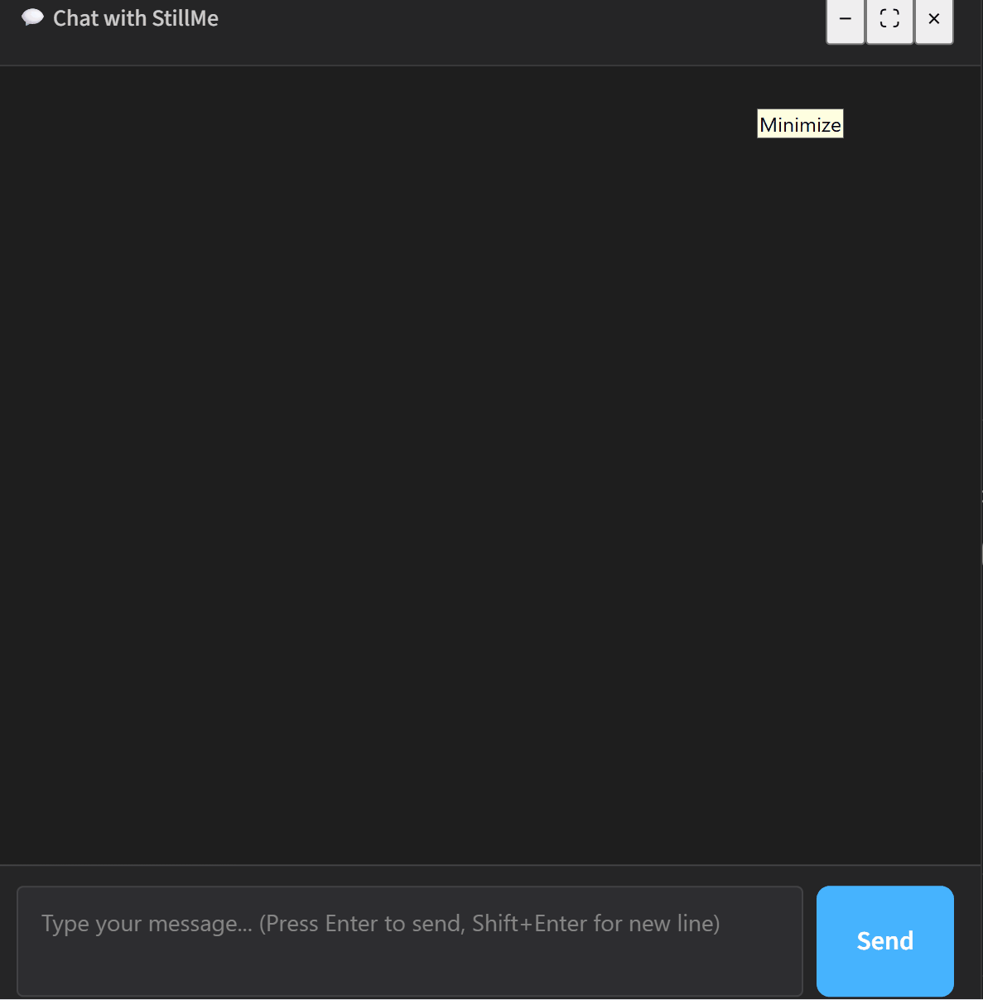

# 🧠 StillMe - Learning AI system with RAG foundation

<div align="center">
  
</div>

> **A Transparent AI Learning System that continuously learns from multiple sources and provides context-aware responses through RAG architecture.**

[](https://python.org)
[](https://fastapi.tiangolo.com)
[](https://streamlit.io)
[](https://github.com/anhmtk/StillMe-Learning-AI-System-RAG-Foundation/actions)
[](docs/MILESTONES.md)
[](LICENSE)

## 🚀 StillMe in 60 seconds

**StillMe is a validation‑first, transparent RAG system that knows when it doesn’t know.**  
It continuously learns, cites sources, and refuses to fabricate when evidence is missing.

**Why devs & researchers care:**
- **Transparent by default**: citations, traceability, and validator decisions are visible
- **Validation chain**: multi‑layer checks reduce hallucinations and enforce honesty
- **Continuous learning**: updates from RSS/arXiv/CrossRef/Wikipedia every 4 hours

**Quick links:**
- ▶️ **Start here**: [`docs/SUMMARY.md`](docs/SUMMARY.md)
- 🧭 **Constitution**: [`docs/CONSTITUTION.md`](docs/CONSTITUTION.md)
- 🧱 **Architecture**: [`docs/ARCHITECTURE.md`](docs/ARCHITECTURE.md)
- 🧪 **API Docs**: `http://localhost:8000/docs`
- 🤝 **Contribute**: [`CONTRIBUTING.md`](CONTRIBUTING.md)

**Demo / Screenshot:**
<div align="center">
  
</div>

**Quick start (3 lines):**
```bash
git clone https://github.com/anhmtk/StillMe-Learning-AI-System-RAG-Foundation.git
cd StillMe-Learning-AI-System-RAG-Foundation
docker compose up -d
```

---

## 📑 Table of Contents

- [What is StillMe?](#-what-is-stillme)
- [Why StillMe?](#-why-stillme)
- [About the Founder](#-about-the-founder)
- [StillMe in Numbers](#-stillme-in-numbers)
- [Use Cases](#-use-cases)
- [Quick Start](#-quick-start)
- [Features](#-features)
- [API Reference](#-api-reference)
- [Architecture](#-architecture)
- [Contributing](#-contributing)
- [Documentation](#-documentation)

---

## 🌟 What is StillMe?

StillMe is a **RAG-based AI system** that:
- Continuously learns from RSS feeds, arXiv, CrossRef, and Wikipedia
- Provides context-aware responses using ChromaDB vector search
- Validates responses to reduce hallucinations
- Tracks learning metrics and knowledge retention
- Accesses real-time data from external APIs (weather, news) with full transparency

**Core Philosophy:** *"In the AI era, true value lies not in what AI can do, but in what AI chooses NOT to do."* — A truly intelligent AI knows what NOT to do, not that it can do everything. StillMe preserves what makes humans human by knowing its boundaries.

### 🎯 Core Identity & Constitution

StillMe's foundational principle: **"I don't build an AI that knows everything. I build an AI that KNOWS IT DOESN'T KNOW — and has the courage to admit it. That's not a weakness. That's a SUPER POWER."**

**Key Principles:**
- **Intellectual Humility**: Knowing when we don't know is our core strength
- **Transparency**: Every decision, every learning source, every limitation is visible
- **Ethical Boundaries**: We know what NOT to do — we don't simulate emotions, claim consciousness, or replace human agency
- **Anti-Anthropomorphism**: StillMe explicitly states it is an AI system, not a human. All responses clarify StillMe's nature as a statistical model without subjective experience
- **Cultural Respect**: Built to serve a global community with diverse cultural and philosophical backgrounds
- **Scientific Honesty**: We distinguish between aspirational goals and measured results

**📜 Full Constitution:** See [`docs/CONSTITUTION.md`](docs/CONSTITUTION.md) for complete operating principles, ethical guidelines, and philosophical foundations.

**Tech Stack:**
- **Backend**: FastAPI, Python 3.12+
- **Vector DB**: ChromaDB with sentence-transformers embeddings
- **Frontend**: Streamlit dashboard
- **LLM**: DeepSeek, OpenAI GPT (configurable)

## 🏗️ StillMe Core Framework

StillMe is built on **StillMe Core** - a modular framework for building transparent, validation-first AI systems.

**Framework Structure:**
```
stillme_core/
├── validation/          # Validation framework (19 validators, 7 layers)
├── rag/                 # RAG system (ChromaDB, embeddings)
├── external_data/       # External data providers
├── learning/            # Continuous learning pipeline
├── postprocessing/      # Post-processing and quality improvement
├── monitoring/          # Unified metrics and monitoring
├── self_improvement/    # Self-improvement mechanisms
└── config/             # Configuration management
```

**Key Features:**
- ✅ **Modular Design**: Each component is independent and reusable
- ✅ **Self-Aware**: Tracks its own performance and improves over time
- ✅ **Transparent**: All decisions are logged and explainable
- ✅ **Extensible**: Easy to add new validators, fetchers, providers

**Framework Philosophy:**
> "We're building a framework, not just an app. Everything we build for StillMe today must be usable by other AI systems tomorrow."

📚 **Framework Documentation**: [docs/framework/](docs/framework/)

**Validation Source of Truth:**
- Validator count and layer structure are read from `data/stillme_manifest.json` via `backend/core/manifest_loader.py`
- Current structure: **19 validators total**, organized into **7 layers**

## 🤔 Why StillMe?

**The Problem:**
- **ChatGPT/Claude are black boxes** — You can't verify their sources or understand their decision-making
- **They hallucinate confidently** — No way to catch errors or verify claims
- **They're frozen in time** — Can't learn from new information published after their training cutoff
- **No transparency** — Hidden algorithms, hidden data sources, hidden decision-making processes

**StillMe's Solution:**
- ✅ **100% Transparent** — Every source is cited, every decision is visible, every line of code is public
- ✅ **Validated Responses** — Multi-layer validation chain reduces hallucinations through citation, evidence overlap, and confidence scoring
- ✅ **Continuously Learning** — Updates knowledge every 4 hours from trusted sources (RSS, arXiv, CrossRef, Wikipedia)
- ✅ **Open Source** — You can inspect, modify, and improve everything
- ✅ **Intellectual Humility** — StillMe knows when it doesn't know and has the courage to admit it

> **If Git is the mechanism that ensures code integrity through history and commit hashes, then StillMe is the mechanism that ensures knowledge integrity through Validation Chain and source traceability history.**

**Perfect for:**
- 🔬 **Researchers** who need verifiable sources and audit trails
- 💼 **Developers** building transparent AI applications
- 🏢 **Organizations** requiring accountability and compliance
- 🎓 **Educators** teaching students about AI transparency
- 🌍 **Anyone** who values honesty over false confidence

## 🔧 StillMe Through the Git Mental Model

> **Note:** This section provides a mental model for developers familiar with Git. These are **conceptual analogies**, not exact technical mappings. StillMe's architecture is more complex than Git (semantic search vs. linear history, confidence scores vs. deterministic hashes, etc.). For non-developers, see the [Architecture](#-architecture) section for a technical overview.

> **Important:** StillMe uses the **core principles** of Git (auditability, history, traceability) to manage knowledge, but it is **not** "Git for AI" or "Git for Knowledge Base" without qualification. The key difference: **Git requires human decisions for commits, while StillMe uses an automated Validation Chain to accept/reject new knowledge.**

For developers familiar with Git, here's how StillMe's architecture conceptually maps to Git concepts:

- **Validation Chain ≈ `git blame` of reasoning**
  - Trace every claim back to its evidence source
  - Know exactly which validator checked which part of the response
  - Full audit trail of validation decisions
  - *Note: Unlike `git blame` (deterministic SHA-based), validation includes uncertainty quantification and confidence scores*

- **RAG + Citations ≈ commit history of knowledge**
  - Every piece of knowledge has an origin you can inspect
  - Citations act like commit hashes — immutable references to sources
  - Complete lineage from source to response
  - *Note: RAG uses semantic similarity (vector search), not linear history. Citations don't have parent-child relationships like commits*

- **Epistemic State ≈ branch status**
  - `KNOWN` = clean (clear evidence, validators pass, high confidence)
  - `UNCERTAIN` = dirty (warnings present, medium confidence, needs review)
  - `UNKNOWN` = conflicted (fallback triggered, no context, critical failures)
  - *Note: Epistemic states are more nuanced than Git branch status — they include confidence scores (0.0-1.0) and partial knowledge states*

- **Continuous Learning = `git pull` of knowledge**
  - Fetching + integrating new sources every 4 hours
  - Automated updates from RSS feeds, arXiv, CrossRef, Wikipedia
  - Knowledge base grows incrementally, never frozen

- **ChromaDB ≈ repository of embeddings**
  - Vector storage = code repository
  - Semantic search = `git grep` but for meaning
  - Embeddings = compressed representations of knowledge
  - *Note: Unlike Git's hash-based storage, ChromaDB uses vector similarity for semantic search*

- **Validator Chain ≈ CI/CD pipeline of truth**
  - Automated checks that prevent hallucination from being merged
  - Each validator = a CI check (citation, evidence overlap, confidence)
  - Failures trigger fallback, not deployment
  - *Note: Validators include probabilistic confidence scoring, not just pass/fail like CI checks*

- **Self-Correction ≈ `git rebase` / `fixup`**
  - Rewrite reasoning when validation fails
  - Post-processing improves quality without changing core facts
  - Maintains response history while fixing issues
  - *Note: Self-correction uses LLM-based rewriting, not deterministic code transformations*

- **Fallback Handler ≈ merge conflict resolution**
  - If evidence is missing → produce an explicit uncertainty response
  - Never fabricate information, always admit limitations
  - Transparent about what StillMe doesn't know
  - *Note: Fallback produces epistemic uncertainty responses, not code conflict markers*

- **Audit Logs = `git log --decorate --graph`**
  - Chronological trace of all decisions
  - Validation metrics stored in `data/validation_metrics.jsonl`
  - Learning metrics stored in `data/learning_metrics.jsonl`
  - Accessible via API endpoints (`GET /api/validators/metrics`, `GET /api/learning/metrics/daily`)

**Key Differences from Git:**
- **Core Difference:** Git requires **human decisions** for commits, while StillMe uses an **automated Validation Chain** to accept/reject new knowledge
- StillMe uses **semantic similarity** (vector search), not linear history
- StillMe includes **confidence scores** and **uncertainty quantification**, not just deterministic pass/fail
- StillMe's knowledge graph is **non-linear** (multiple sources can contribute to one answer)
- StillMe's validation includes **probabilistic checks** (evidence overlap, confidence thresholds), not just binary validations
- Git handles **code differences** (text diff), while StillMe handles **knowledge differences** and **validation**

This mental model helps developers understand StillMe's transparency conceptually: **StillMe applies Git's core principles (auditability, history, traceability) to knowledge management, but with automated validation, semantic search, and uncertainty quantification.**

## 👤 About the Founder

StillMe was initiated by **Anh Nguyễn**, a Vietnamese founder passionate about transparent and responsible AI.

**What makes this story unique:** The founder doesn't have a formal IT background — demonstrating that with passion, vision, and modern AI tools, anyone can meaningfully contribute to the future of AI. This reflects an environment where innovation is not only possible but encouraged, where individuals can pursue ambitious AI projects that contribute to the global open-source community.

**However, StillMe is now a community-driven open-source project.** All knowledge is guided by intellectual humility and evidence-based principles, not personal authority. StillMe adheres to the **"evidence-over-authority"** principle: evidence and citations always take precedence over personal opinions.

> *"I don't build an AI that knows everything. I build an AI that KNOWS IT DOESN'T KNOW — and has the courage to admit it. That's not a weakness. That's a SUPER POWER."*

## 📊 StillMe in Numbers

- **790 questions** evaluated on TruthfulQA benchmark (full evaluation)
- **91.1% citation rate** (full) / **100% citation rate** (subset) — Industry-leading source attribution
- **85.8% transparency score** — More than double baseline systems (30%)
- **100% open source** — Every line of code is public
- **6 learning cycles/day** — Continuously updated knowledge base
- **30-50% cost reduction** — Pre-filter system reduces embedding costs
- **35% accuracy** (subset) / **13.5% accuracy** (full) — Competitive performance with 7x improvement from baseline
- **93.9% validation pass rate** — High-quality, grounded responses
- **70.5% uncertainty rate** — Demonstrates intellectual humility

**📄 For detailed evaluation results and performance metrics, see [`docs/SUMMARY.md`](docs/SUMMARY.md)**

### 🎯 Technical Milestones

- **Self-Comprehension Achievement (2025-12-05)**: StillMe achieved 100% accuracy in answering questions about its own source code implementation. This represents a **technical milestone** in AI self-understanding - the ability to semantically analyze and explain its own implementation through RAG-based code retrieval.
  - **Comprehension Score**: 100.0% (Q&A accuracy: 100%, Indexing coverage: 100%)
  - **Codebase Analyzed**: 259 files, 67,456 lines
  - **Indexed**: 316 files, 377 code chunks
  - **Insights Generated**: Architecture comprehension, component awareness, code organization understanding
  - 📄 **Full Report**: [`docs/reports/stillme_self_comprehension_report_20251205_164714.md`](docs/reports/stillme_self_comprehension_report_20251205_164714.md)
  
  **⚠️ Important**: This is a **technical achievement** in code understanding through semantic analysis, not a claim of consciousness. StillMe demonstrates advanced pattern recognition about its own implementation, operating through deterministic code.

## 💼 Use Cases

### Research & Academia
- Verifiable sources for academic work
- Audit trails for research assistance
- Transparent methodology for peer review

### Healthcare
- Transparent AI for medical information (with proper disclaimers)
- Source citations for medical claims
- Confidence scoring for critical decisions

### Legal
- Audit trail for legal research assistance
- Citation verification for legal claims
- Transparent decision-making processes

### Education
- Teaching students about AI transparency
- Demonstrating responsible AI development
- Learning tool with verifiable sources

### Enterprise
- Building transparent AI applications
- Compliance and accountability requirements
- Customizable validation chains

### Open Source Community
- Inspectable AI systems
- Community-driven learning
- Transparent governance

## 🚀 Quick Start

### Prerequisites

- Python 3.12+
- Docker & Docker Compose (recommended)
- API keys: `DEEPSEEK_API_KEY` or `OPENAI_API_KEY`

### Option 1: Docker (Recommended)

```bash
# Clone repository
git clone https://github.com/anhmtk/StillMe-Learning-AI-System-RAG-Foundation.git
cd StillMe-Learning-AI-System-RAG-Foundation

# Copy environment template
cp env.example .env
# Edit .env with your API keys

# Start services
docker compose up -d

# Check logs
docker compose logs -f
```

**Access:**
- Dashboard: http://localhost:8501
- API: http://localhost:8000
- API Docs: http://localhost:8000/docs

### Option 2: Manual Setup

```bash
# Clone repository
git clone https://github.com/anhmtk/StillMe-Learning-AI-System-RAG-Foundation.git
cd StillMe-Learning-AI-System-RAG-Foundation

# Install dependencies
pip install -r requirements.txt

# Configure environment
cp env.example .env
# Edit .env with your API keys:
# DEEPSEEK_API_KEY=sk-your-key
# OPENAI_API_KEY=sk-your-key

# Start backend (terminal 1)
python -m uvicorn backend.api.main:app --host 0.0.0.0 --port 8000 --reload

# Start frontend (terminal 2)
streamlit run dashboard.py --server.port 8501
```

### Environment Variables

**Required:**
- `DEEPSEEK_API_KEY` or `OPENAI_API_KEY` - LLM API key

**Optional:**
- `ENABLE_VALIDATORS=true` - Enable Validator Chain (reduces hallucinations)
- `ENABLE_ARXIV=true` - Enable arXiv fetching (default: true)
- `ENABLE_WIKIPEDIA=true` - Enable Wikipedia fetching (default: true)
- `GNEWS_API_KEY` - GNews API key for news provider (optional, get at https://gnews.io/api)
- `COMMUNITY_MIN_VOTES=10` - Minimum votes for community proposals (default: 10)

See `env.example` for full list.

## ✨ Features

### ✅ Implemented & Working

#### 🧠 Codebase Assistant (Phase 3 Complete)
- **Code Q&A**: Query StillMe's codebase via API (`POST /api/codebase/query`)
- **Test Generation**: Generate unit tests for code (`POST /api/codebase/generate-tests`)
- **Code Review**: Review code for issues (`POST /api/codebase/review`)
- **Git History**: Query commit history for design decisions (`POST /api/codebase/query` with Git context)
- **Onboarding Mentor**: Generate personalized onboarding guides (`POST /api/codebase/onboarding`)
- **RAG-based Retrieval**: Semantic search with file:line citations
- **Status**: Phase 3 complete (255 files indexed, 377 chunks, 50+ commits indexed)
- 📚 See [`docs/CODEBASE_ASSISTANT.md`](docs/CODEBASE_ASSISTANT.md) for details

**Core RAG System:**
- ✅ Vector Database (ChromaDB) - Semantic search and knowledge retrieval
- ✅ RAG (Retrieval-Augmented Generation) - Context-aware responses
- ✅ Validator Chain - Reduces hallucinations through multiple validation checks
  - Citation validation (CitationRequired, CitationRelevance)
  - Evidence overlap checking (EvidenceOverlap)
  - Confidence scoring (0.0-1.0) with uncertainty detection
  - Language mismatch detection (LanguageValidator)
  - Ethics validation (EthicsAdapter)
  - Identity check (IdentityCheckValidator) - Prevents anthropomorphism
  - Ego neutrality (EgoNeutralityValidator) - Detects "Hallucination of Experience"
  - Source consensus (SourceConsensusValidator) - Detects contradictions between RAG sources
  - Factual hallucination detection (FactualHallucinationValidator)
  - Step-level validation (StepValidator) - Validates multi-step reasoning
  - Consistency checking (ConsistencyChecker) - Cross-validates claims
  - Fallback handling (FallbackHandler)
- ✅ Post-Processing System - Quality enhancement and variation
  - Quality evaluator - Rule-based quality assessment (0 token cost)
  - Rewrite engine - LLM-based answer refinement with retry mechanism
  - Cost-benefit logic - Intelligent rewrite decisions (prevents unnecessary rewrites)
  - Style sanitizer - Removes anthropomorphic language
  - Honesty handler - Specialized processing for transparency questions
- ✅ Epistemic State Classification - Response certainty indicators
  - KNOWN/UNCERTAIN/UNKNOWN states - Transparent knowledge classification
  - Rule-based classifier - Based on citations, confidence, and validation results
- ✅ Philosophical Question Processor - 3-layer system for consciousness/emotion questions
  - Intent classification (consciousness, emotion, understanding, mixed)
  - Sub-type detection (paradox, epistemic, meta, definitional, direct)
  - Varied answer templates (5 guard statements, 4 deep answer variations)
  - Anti-anthropomorphism enforcement - Explicitly states StillMe is AI system

**Learning Pipeline:**
- ✅ Multi-Source Learning - RSS, arXiv, CrossRef, Wikipedia
- ✅ Automated Scheduler - Fetches every 4 hours
- ✅ Pre-Filter System - Filters content before embedding (30-50% cost reduction)
- ✅ Content Curator - Prioritizes learning content
- ✅ Self-Diagnosis - Detects knowledge gaps

**Memory System:**
- ✅ Continuum Memory - Tiered architecture (L0-L3)
- ✅ Knowledge Retention Tracking
- ✅ Accuracy Scoring

**Community Features:**
- ✅ Community-Driven Learning - Voting system for learning proposals
- ✅ Interactive Conversation Learning - Learn from user conversations with permission

**External Data Layer:**
- ✅ Real-time Weather Data - Open-Meteo API integration (no API key required)
- ✅ News Provider - GNews API integration for latest news
- ✅ Intent Detection - Automatic routing for weather/news queries (English + Vietnamese)
- ✅ Caching - Redis support with in-memory fallback (reduces API calls)
- ✅ Retry Logic - Exponential backoff for failed requests
- ✅ Rate Limit Tracking - Prevents exceeding API limits
- ✅ Full Transparency - Source attribution and timestamp in all responses

**Self-Awareness & Monitoring:**
- ✅ **Unified Metrics System** - Centralized metrics collection from all components
- ✅ **Self-Improvement** - Analyzes patterns and suggests improvements
- ✅ **Time Estimation** - Estimates task completion based on historical performance
  - Calibrated estimates with confidence intervals
  - Conservative bias (slightly overestimate for reliability)
  - Transparent uncertainty communication
  - Learning from actual vs estimated time

**Meta-Learning (Stage 2):**
- ✅ **Phase 1: Retention Tracking** - Track document usage and calculate source trust scores
- ✅ **Phase 2: Curriculum Learning** - Analyze learning effectiveness and generate optimal learning order
- ✅ **Phase 3: Strategy Optimization** - Auto-tune similarity thresholds and A/B test strategies
- 📚 **Full Documentation**: [`docs/STAGE2_META_LEARNING_SUMMARY.md`](docs/STAGE2_META_LEARNING_SUMMARY.md)

**Dashboard:**
- ✅ Streamlit UI - Real-time metrics, chat interface, RAG interface
- ✅ Validation Panel - Monitor validator performance
- ✅ Memory Health - Track tier statistics and forgetting metrics

### 🚧 Experimental

- 🔬 **Nested Learning** - Tiered update frequency (experimental branch)

## 📡 API Reference

### Codebase Assistant

StillMe can understand and explain its own codebase using RAG-based code retrieval.

**Endpoint:** `POST /api/codebase/query` - Query codebase with questions  
**Stats:** `GET /api/codebase/stats` - Collection statistics

**Status:** ✅ Phase 3 Complete (Code Q&A + Test Generation + Code Review + Git History + Onboarding Mentor)

📚 **Full Documentation**: [`docs/CODEBASE_ASSISTANT.md`](docs/CODEBASE_ASSISTANT.md)

### Chat Endpoints

**POST `/api/chat/rag`** - Chat with RAG-enhanced responses
```json
{
  "message": "What is RAG?",
  "use_rag": true,
  "context_limit": 3
}
```

**POST `/api/chat/ask`** - Simplified Q&A endpoint (RAG enabled by default)
```json
{
  "message": "What is StillMe?"
}
```

**POST `/api/chat/smart_router`** - Auto-selects best endpoint (used by dashboard)

### Learning Endpoints

**POST `/api/learning/sources/fetch`** - Fetch from all sources
```
GET /api/learning/sources/fetch?max_items_per_source=5&auto_add=false
```

**POST `/api/learning/scheduler/start`** - Start automated scheduler
**POST `/api/learning/scheduler/stop`** - Stop scheduler
**GET `/api/learning/scheduler/status`** - Get scheduler status

**POST `/api/learning/rss/fetch`** - Fetch RSS feeds
```
POST /api/learning/rss/fetch?max_items=5&auto_add=false
```

### Meta-Learning Endpoints (Stage 2)

**Phase 1: Retention Tracking**
- `GET /api/meta-learning/retention` - Get retention metrics per source
- `GET /api/meta-learning/source-trust` - Get source trust scores based on retention
- `POST /api/meta-learning/update-source-trust` - Update source trust scores
- `GET /api/meta-learning/recommended-sources` - Get recommended sources

**Phase 2: Curriculum Learning**
- `GET /api/meta-learning/learning-effectiveness` - Analyze learning effectiveness
- `GET /api/meta-learning/curriculum` - Get optimal learning curriculum
- `POST /api/meta-learning/apply-curriculum` - Apply curriculum to learning system

**Phase 3: Strategy Optimization**
- `GET /api/meta-learning/strategy-effectiveness` - Get strategy effectiveness
- `GET /api/meta-learning/optimize-threshold` - Find optimal similarity threshold
- `GET /api/meta-learning/recommended-strategy` - Get recommended strategy
- `POST /api/meta-learning/ab-test/start` - Start A/B test
- `GET /api/meta-learning/ab-test/evaluate` - Evaluate A/B test

📚 **Full Documentation**: [`docs/STAGE2_META_LEARNING_SUMMARY.md`](docs/STAGE2_META_LEARNING_SUMMARY.md)

### RAG Endpoints

**POST `/api/rag/add_knowledge`** - Add knowledge to vector DB
**POST `/api/rag/query`** - Query vector DB
**GET `/api/rag/stats`** - Get RAG statistics

### System Endpoints

**GET `/health`** - Liveness probe
**GET `/ready`** - Readiness probe (checks DB, ChromaDB, embeddings)
**GET `/api/status`** - System status
**GET `/api/validators/metrics`** - Validation metrics

### Community Endpoints

**POST `/api/community/propose`** - Propose learning source
**POST `/api/community/vote`** - Vote on proposal
**GET `/api/community/pending`** - Get pending proposals
**GET `/api/community/queue`** - Get learning queue

**Full API Documentation:** http://localhost:8000/docs (Swagger UI)

## 🔧 Architecture

### System Flow Overview

```mermaid
graph LR
    A[User Query] --> B{Intent Detection}
    B -->|External Data| C[Weather/News API]
    B -->|Normal Query| D[RAG Retrieval]
    D --> E[ChromaDB<br/>Vector Search]
    E --> F[LLM Generation]
    F --> G[Validator Chain<br/>19 Validators (7 Layers)]
    G --> H{Validation Pass?}
    H -->|Yes| I[Post-Processing]
    H -->|No| J[Fallback Handler]
    I --> K[Final Response<br/>with Citations]
    J --> K
    
    L[Learning Pipeline<br/>Every 4 hours] --> M[RSS/arXiv/Wikipedia]
    M --> N[Pre-Filter]
    N --> O[Embedding]
    O --> E
    
    style G fill:#90EE90
    style K fill:#87CEEB
    style L fill:#FFD700
```

### Framework + Application Architecture

StillMe follows a **two-layer architecture**:

1. **StillMe Core Framework** (`stillme_core/`):
   - Modular, reusable components
   - Framework-first design
   - Can be used by other AI systems
   - Components: Validation, RAG, Learning, Monitoring, Self-Improvement

2. **StillMe Application** (`backend/`, `dashboard.py`):
   - Uses StillMe Core as dependency
   - Application-specific logic (identity, philosophy, API)
   - Built on top of framework

### Architecture Components
- **External Sources**: RSS, arXiv, CrossRef, Wikipedia, Stanford Encyclopedia
- **Learning Pipeline**: Scheduler → Source Integration → Pre-Filter → Content Curator → Embedding → ChromaDB
- **RAG System**: ChromaDB (vector search) + LLM (response generation)
- **Validator Chain**: Multi-layer validation framework with **19 validators total** organized into **7 layers** (runtime executes a context-dependent subset per request) ensuring quality and reducing hallucinations
- **Post-Processing**: Quality evaluation → Rewrite engine (with retry) → Style sanitization
- **Philosophical Processor**: Specialized 3-layer system for consciousness/emotion questions
- **Dashboard**: Streamlit UI for monitoring and interaction

**Data Flow:**

**Learning Cycle (Background, every 4 hours):**
1. Scheduler triggers learning cycle
2. Fetch from RSS, arXiv, CrossRef, Wikipedia
3. Pre-Filter removes low-quality content (saves 30-50% embedding costs)
4. Embedding Service converts text to vectors (paraphrase-multilingual-MiniLM-L12-v2, 384 dims)
5. Store in ChromaDB for semantic search

**Query Processing (Real-time):**
1. User query → Intent detection (external data / normal / philosophical)
2. If external data → Direct API call (weather/news/time)
3. If normal query → RAG retrieval from ChromaDB
4. LLM generates response with context
5. Validator Chain checks quality using a context-dependent subset from the 19-validator, 7-layer framework
6. Post-processing (quality eval + rewrite if needed)
7. Final response with citations and transparency metadata

**Anti-Anthropomorphism Mechanisms:**
- **Identity Check Validator**: Detects and prevents anthropomorphic language
- **Ego Neutrality Validator**: Catches "Hallucination of Experience" (claims of personal experience)
- **Philosophical Processor**: Explicitly states StillMe is AI system, not human
- **Style Sanitizer**: Removes emotional language and personal experience claims
- **Guard Statements**: Every philosophical answer includes clear statement that StillMe is AI

**Detailed Architecture:** See [`docs/ARCHITECTURE.md`](docs/ARCHITECTURE.md)

## 🤝 Contributing

We welcome contributions! See [CONTRIBUTING.md](CONTRIBUTING.md) for detailed setup guide.

### Quick Start for Contributors

1. Fork the repository
2. Create a feature branch: `git checkout -b feature/your-feature`
3. Make changes and add tests
4. Run tests: `pytest`
5. Submit a pull request

### Good First Issues

- Add type hints to functions
- Refactor to dependency injection (FastAPI `Depends()`)
- Improve documentation
- Add unit tests for existing features

### Areas Needing Help

- PostgreSQL migration (Alembic setup done, migration needed)
- SPICE framework implementation (framework ready)
- Observability (Prometheus metrics, structured logging)
- Performance optimization (Redis caching, query optimization)

**Community:**
- [GitHub Discussions](https://github.com/anhmtk/StillMe-Learning-AI-System-RAG-Foundation/discussions)
- [Issues](https://github.com/anhmtk/StillMe-Learning-AI-System-RAG-Foundation/issues)
- [Pull Requests](https://github.com/anhmtk/StillMe-Learning-AI-System-RAG-Foundation/pulls)

## 📚 Documentation

**Framework Documentation:**
- [`docs/framework/ARCHITECTURE.md`](docs/framework/ARCHITECTURE.md) - Framework architecture overview
- [`docs/framework/API.md`](docs/framework/API.md) - Framework API reference
- [`docs/framework/VALIDATION.md`](docs/framework/VALIDATION.md) - Validation system guide
- [`docs/framework/SELF_IMPROVEMENT.md`](docs/framework/SELF_IMPROVEMENT.md) - Self-improvement guide
- [`docs/MIGRATION_GUIDE.md`](docs/MIGRATION_GUIDE.md) - Migration from old structure

**Core Documentation:**
- [`docs/SUMMARY.md`](docs/SUMMARY.md) - **📊 Quick Summary: Evaluation Results & Key Metrics** (Start here!)
- [`docs/CONSTITUTION.md`](docs/CONSTITUTION.md) - **Core Identity & Operating Principles** (Constitutional Framework)
- [`docs/PAPER.md`](docs/PAPER.md) - **Research Paper: StillMe Framework for Transparent, Validated RAG Systems**
- [`docs/ARCHITECTURE.md`](docs/ARCHITECTURE.md) - System architecture details
- [`docs/PHILOSOPHY.md`](docs/PHILOSOPHY.md) - Philosophy and vision
- [`docs/VALIDATION_CHAIN_SPEC.md`](docs/VALIDATION_CHAIN_SPEC.md) - Must-pass vs warning validators
- [`docs/NO_SOURCE_POLICY.md`](docs/NO_SOURCE_POLICY.md) - Refusal rules when sources are missing
- [`docs/AUDIT_GUIDE.md`](docs/AUDIT_GUIDE.md) - Contributor audit checklist
- [`docs/API_DOCUMENTATION.md`](docs/API_DOCUMENTATION.md) - Complete API reference
- [`docs/DEPLOYMENT_GUIDE.md`](docs/DEPLOYMENT_GUIDE.md) - Deployment instructions
- [`docs/PAPER_TABLES_FIGURES.md`](docs/PAPER_TABLES_FIGURES.md) - Tables and figures for the paper

**User Guides:**
- [`docs/GETTING_STARTED.md`](docs/GETTING_STARTED.md) - Quick start guide (5 minutes)
- [`docs/USER_GUIDE.md`](docs/USER_GUIDE.md) - Complete user guide
- [`docs/FAQ.md`](docs/FAQ.md) - Frequently asked questions

**Development:**
- [`CONTRIBUTING.md`](CONTRIBUTING.md) - Contributing guidelines
- [`docs/PLATFORM_ENGINEERING_ROADMAP.md`](docs/PLATFORM_ENGINEERING_ROADMAP.md) - Technical roadmap

**Features:**
- [`docs/SPICE_ARCHITECTURE.md`](docs/SPICE_ARCHITECTURE.md) - SPICE framework
- [`docs/CONFIDENCE_AND_FALLBACK.md`](docs/CONFIDENCE_AND_FALLBACK.md) - Validation system
- [`docs/COST_BENEFIT_REWRITE.md`](docs/COST_BENEFIT_REWRITE.md) - Cost-benefit logic for RewriteLLM
- [`docs/EPISTEMIC_STATE.md`](docs/EPISTEMIC_STATE.md) - Epistemic state classification (KNOWN/UNCERTAIN/UNKNOWN)

**Milestones & Reports:**
- [`docs/MILESTONES.md`](docs/MILESTONES.md) - Technical milestones and achievements
- [`docs/reports/stillme_self_comprehension_report_20251205_164714.md`](docs/reports/stillme_self_comprehension_report_20251205_164714.md) - Self-Comprehension Report (Technical milestone: AI understanding its own source code)

## ⚠️ Known Limitations & Roadmap

**Current Limitations:**
- Single-threaded scheduler (needs distributed task queue for high scale)
- Response latency: 3-7s (optimized with Redis caching - 50-70% reduction for cached queries)

**Platform Engineering Status:**

**✅ Completed (v0.6+):**
- **Routerization**: 95% complete - All endpoints organized into modular routers (chat, RAG, learning, system, etc.)
- **Health & Readiness**: 90% complete - `/health`, `/ready`, `/status` endpoints implemented
- **ChromaDB Backup/Recovery**: Automated backup mechanism with restore capabilities
- **Circuit Breaker**: Prevents cascading failures for RSS feeds
- **Redis Caching**: 50-70% latency reduction for cached queries
- **Parallel Validation**: 2-3x faster validation with optimized parallel execution
- **Structured Logging**: Correlation IDs for request tracing
- **Feed Health Monitoring**: Proactive monitoring and automatic failure detection
- **Security Hardening**: Enhanced input sanitization, API key rotation, XSS/SQL injection prevention
- **PostgreSQL Migration Foundation**: SQLAlchemy models, Alembic setup, migration scripts

**⏳ In Progress:**
- **Dependency Injection Refactoring**: Migrating from direct imports to FastAPI `Depends()` pattern (0% → Target: 100%)
- **Metrics Endpoint**: Prometheus-compatible `/metrics` endpoint for observability

**📋 Planned:**
- **P2: Adaptive User Communication**: AI learns to understand user intent and proactively clarifies when needed
- **Distributed Task Queue**: Replace single-threaded scheduler for high-scale deployments

**See:** [`docs/PLATFORM_ENGINEERING_ROADMAP.md`](docs/PLATFORM_ENGINEERING_ROADMAP.md) for detailed roadmap

## 📄 License

MIT License - see [LICENSE](LICENSE) for details.

## 🙏 Acknowledgments

- **OpenAI** for GPT models and API
- **DeepSeek** for AI capabilities
- **The Open Source Community** for inspiration and support

---

**StillMe** - *Learning AI system with RAG foundation* 🤖✨
