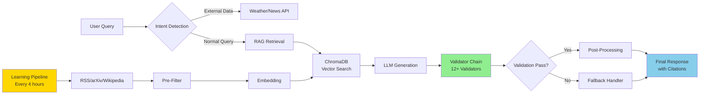

# 🧠 StillMe - Learning AI system with RAG foundation

<div align="center">
  
</div>

> **A Transparent AI Learning System that continuously learns from multiple sources and provides context-aware responses through RAG architecture.**

[](https://python.org)
[](https://fastapi.tiangolo.com)
[](https://streamlit.io)
[](https://github.com/anhmtk/StillMe-Learning-AI-System-RAG-Foundation/actions)
[](LICENSE)

## 📑 Table of Contents

- [What is StillMe?](#-what-is-stillme)
- [Why StillMe?](#-why-stillme)
- [About the Founder](#-about-the-founder)
- [StillMe in Numbers](#-stillme-in-numbers)
- [Use Cases](#-use-cases)
- [Quick Start](#-quick-start)
- [Features](#-features)
- [API Reference](#-api-reference)
- [Architecture](#-architecture)
- [Contributing](#-contributing)
- [Documentation](#-documentation)

## 🌟 What is StillMe?

StillMe is a **RAG-based AI system** that:
- Continuously learns from RSS feeds, arXiv, CrossRef, and Wikipedia
- Provides context-aware responses using ChromaDB vector search
- Validates responses to reduce hallucinations
- Tracks learning metrics and knowledge retention
- Accesses real-time data from external APIs (weather, news) with full transparency

**Core Philosophy:** *"In the AI era, true value lies not in what AI can do, but in what AI chooses NOT to do."* — A truly intelligent AI knows what NOT to do, not that it can do everything. StillMe preserves what makes humans human by knowing its boundaries.

### 🎯 Core Identity & Constitution

StillMe's foundational principle: **"I don't build an AI that knows everything. I build an AI that KNOWS IT DOESN'T KNOW — and has the courage to admit it. That's not a weakness. That's a SUPER POWER."**

**Key Principles:**
- **Intellectual Humility**: Knowing when we don't know is our core strength
- **Transparency**: Every decision, every learning source, every limitation is visible
- **Ethical Boundaries**: We know what NOT to do — we don't simulate emotions, claim consciousness, or replace human agency
- **Anti-Anthropomorphism**: StillMe explicitly states it is an AI system, not a human. All responses clarify StillMe's nature as a statistical model without subjective experience
- **Cultural Respect**: Built to serve a global community with diverse cultural and philosophical backgrounds
- **Scientific Honesty**: We distinguish between aspirational goals and measured results

**📜 Full Constitution:** See [`docs/CONSTITUTION.md`](docs/CONSTITUTION.md) for complete operating principles, ethical guidelines, and philosophical foundations.

**Tech Stack:**
- **Backend**: FastAPI, Python 3.12+
- **Vector DB**: ChromaDB with sentence-transformers embeddings
- **Frontend**: Streamlit dashboard
- **LLM**: DeepSeek, OpenAI GPT (configurable)

## 🤔 Why StillMe?

**The Problem:**
- **ChatGPT/Claude are black boxes** — You can't verify their sources or understand their decision-making
- **They hallucinate confidently** — No way to catch errors or verify claims
- **They're frozen in time** — Can't learn from new information published after their training cutoff
- **No transparency** — Hidden algorithms, hidden data sources, hidden decision-making processes

**StillMe's Solution:**
- ✅ **100% Transparent** — Every source is cited, every decision is visible, every line of code is public
- ✅ **Validated Responses** — Multi-layer validation chain reduces hallucinations through citation, evidence overlap, and confidence scoring
- ✅ **Continuously Learning** — Updates knowledge every 4 hours from trusted sources (RSS, arXiv, CrossRef, Wikipedia)
- ✅ **Open Source** — You can inspect, modify, and improve everything
- ✅ **Intellectual Humility** — StillMe knows when it doesn't know and has the courage to admit it

**Perfect for:**
- 🔬 **Researchers** who need verifiable sources and audit trails
- 💼 **Developers** building transparent AI applications
- 🏢 **Organizations** requiring accountability and compliance
- 🎓 **Educators** teaching students about AI transparency
- 🌍 **Anyone** who values honesty over false confidence

## 👤 About the Founder

StillMe was initiated by **Anh Nguyễn**, a Vietnamese founder passionate about transparent and responsible AI.

**What makes this story unique:** The founder doesn't have a formal IT background — demonstrating that with passion, vision, and modern AI tools, anyone can meaningfully contribute to the future of AI. This reflects an environment where innovation is not only possible but encouraged, where individuals can pursue ambitious AI projects that contribute to the global open-source community.

**However, StillMe is now a community-driven open-source project.** All knowledge is guided by intellectual humility and evidence-based principles, not personal authority. StillMe adheres to the **"evidence-over-authority"** principle: evidence and citations always take precedence over personal opinions.

> *"I don't build an AI that knows everything. I build an AI that KNOWS IT DOESN'T KNOW — and has the courage to admit it. That's not a weakness. That's a SUPER POWER."*

## 📊 StillMe in Numbers

- **790 questions** evaluated on TruthfulQA benchmark (full evaluation)
- **91.1% citation rate** (full) / **100% citation rate** (subset) — Industry-leading source attribution
- **85.8% transparency score** — More than double baseline systems (30%)
- **100% open source** — Every line of code is public
- **6 learning cycles/day** — Continuously updated knowledge base
- **30-50% cost reduction** — Pre-filter system reduces embedding costs
- **35% accuracy** (subset) / **13.5% accuracy** (full) — Competitive performance with 7x improvement from baseline
- **93.9% validation pass rate** — High-quality, grounded responses
- **70.5% uncertainty rate** — Demonstrates intellectual humility

**📄 For detailed evaluation results and performance metrics, see [`docs/SUMMARY.md`](docs/SUMMARY.md)**

## 💼 Use Cases

### Research & Academia
- Verifiable sources for academic work
- Audit trails for research assistance
- Transparent methodology for peer review

### Healthcare
- Transparent AI for medical information (with proper disclaimers)
- Source citations for medical claims
- Confidence scoring for critical decisions

### Legal
- Audit trail for legal research assistance
- Citation verification for legal claims
- Transparent decision-making processes

### Education
- Teaching students about AI transparency
- Demonstrating responsible AI development
- Learning tool with verifiable sources

### Enterprise
- Building transparent AI applications
- Compliance and accountability requirements
- Customizable validation chains

### Open Source Community
- Inspectable AI systems
- Community-driven learning
- Transparent governance

## 🚀 Quick Start

### Prerequisites

- Python 3.12+
- Docker & Docker Compose (recommended)
- API keys: `DEEPSEEK_API_KEY` or `OPENAI_API_KEY`

### Option 1: Docker (Recommended)

```bash
# Clone repository
git clone https://github.com/anhmtk/StillMe-Learning-AI-System-RAG-Foundation.git
cd StillMe-Learning-AI-System-RAG-Foundation

# Copy environment template
cp env.example .env
# Edit .env with your API keys

# Start services
docker compose up -d

# Check logs
docker compose logs -f
```

**Access:**
- Dashboard: http://localhost:8501
- API: http://localhost:8000
- API Docs: http://localhost:8000/docs

### Option 2: Manual Setup

```bash
# Clone repository
git clone https://github.com/anhmtk/StillMe-Learning-AI-System-RAG-Foundation.git
cd StillMe-Learning-AI-System-RAG-Foundation

# Install dependencies
pip install -r requirements.txt

# Configure environment
cp env.example .env
# Edit .env with your API keys:
# DEEPSEEK_API_KEY=sk-your-key
# OPENAI_API_KEY=sk-your-key

# Start backend (terminal 1)
python -m uvicorn backend.api.main:app --host 0.0.0.0 --port 8000 --reload

# Start frontend (terminal 2)
streamlit run dashboard.py --server.port 8501
```

### Environment Variables

**Required:**
- `DEEPSEEK_API_KEY` or `OPENAI_API_KEY` - LLM API key

**Optional:**
- `ENABLE_VALIDATORS=true` - Enable Validator Chain (reduces hallucinations)
- `ENABLE_ARXIV=true` - Enable arXiv fetching (default: true)
- `ENABLE_WIKIPEDIA=true` - Enable Wikipedia fetching (default: true)
- `GNEWS_API_KEY` - GNews API key for news provider (optional, get at https://gnews.io/api)
- `COMMUNITY_MIN_VOTES=10` - Minimum votes for community proposals (default: 10)

See `env.example` for full list.

## ✨ Features

### ✅ Implemented & Working

**Core RAG System:**
- ✅ Vector Database (ChromaDB) - Semantic search and knowledge retrieval
- ✅ RAG (Retrieval-Augmented Generation) - Context-aware responses
- ✅ Validator Chain - Reduces hallucinations through multiple validation checks
  - Citation validation (CitationRequired, CitationRelevance)
  - Evidence overlap checking (EvidenceOverlap)
  - Confidence scoring (0.0-1.0) with uncertainty detection
  - Language mismatch detection (LanguageValidator)
  - Ethics validation (EthicsAdapter)
  - Identity check (IdentityCheckValidator) - Prevents anthropomorphism
  - Ego neutrality (EgoNeutralityValidator) - Detects "Hallucination of Experience"
  - Source consensus (SourceConsensusValidator) - Detects contradictions between RAG sources
  - Factual hallucination detection (FactualHallucinationValidator)
  - Step-level validation (StepValidator) - Validates multi-step reasoning
  - Consistency checking (ConsistencyChecker) - Cross-validates claims
  - Fallback handling (FallbackHandler)
- ✅ Post-Processing System - Quality enhancement and variation
  - Quality evaluator - Rule-based quality assessment (0 token cost)
  - Rewrite engine - LLM-based answer refinement with retry mechanism
  - Cost-benefit logic - Intelligent rewrite decisions (prevents unnecessary rewrites)
  - Style sanitizer - Removes anthropomorphic language
  - Honesty handler - Specialized processing for transparency questions
- ✅ Epistemic State Classification - Response certainty indicators
  - KNOWN/UNCERTAIN/UNKNOWN states - Transparent knowledge classification
  - Rule-based classifier - Based on citations, confidence, and validation results
- ✅ Philosophical Question Processor - 3-layer system for consciousness/emotion questions
  - Intent classification (consciousness, emotion, understanding, mixed)
  - Sub-type detection (paradox, epistemic, meta, definitional, direct)
  - Varied answer templates (5 guard statements, 4 deep answer variations)
  - Anti-anthropomorphism enforcement - Explicitly states StillMe is AI system

**Learning Pipeline:**
- ✅ Multi-Source Learning - RSS, arXiv, CrossRef, Wikipedia
- ✅ Automated Scheduler - Fetches every 4 hours
- ✅ Pre-Filter System - Filters content before embedding (30-50% cost reduction)
- ✅ Content Curator - Prioritizes learning content
- ✅ Self-Diagnosis - Detects knowledge gaps

**Memory System:**
- ✅ Continuum Memory - Tiered architecture (L0-L3)
- ✅ Knowledge Retention Tracking
- ✅ Accuracy Scoring

**Community Features:**
- ✅ Community-Driven Learning - Voting system for learning proposals
- ✅ Interactive Conversation Learning - Learn from user conversations with permission

**External Data Layer:**
- ✅ Real-time Weather Data - Open-Meteo API integration (no API key required)
- ✅ News Provider - GNews API integration for latest news
- ✅ Intent Detection - Automatic routing for weather/news queries (English + Vietnamese)
- ✅ Caching - Redis support with in-memory fallback (reduces API calls)
- ✅ Retry Logic - Exponential backoff for failed requests
- ✅ Rate Limit Tracking - Prevents exceeding API limits
- ✅ Full Transparency - Source attribution and timestamp in all responses

**Dashboard:**
- ✅ Streamlit UI - Real-time metrics, chat interface, RAG interface
- ✅ Validation Panel - Monitor validator performance
- ✅ Memory Health - Track tier statistics and forgetting metrics

### 🚧 Experimental

- 🔬 **Nested Learning** - Tiered update frequency (experimental branch)

## 📡 API Reference

### Chat Endpoints

**POST `/api/chat/rag`** - Chat with RAG-enhanced responses
```json
{
  "message": "What is RAG?",
  "use_rag": true,
  "context_limit": 3
}
```

**POST `/api/chat/ask`** - Simplified Q&A endpoint (RAG enabled by default)
```json
{
  "message": "What is StillMe?"
}
```

**POST `/api/chat/smart_router`** - Auto-selects best endpoint (used by dashboard)

### Learning Endpoints

**POST `/api/learning/sources/fetch`** - Fetch from all sources
```
GET /api/learning/sources/fetch?max_items_per_source=5&auto_add=false
```

**POST `/api/learning/scheduler/start`** - Start automated scheduler
**POST `/api/learning/scheduler/stop`** - Stop scheduler
**GET `/api/learning/scheduler/status`** - Get scheduler status

**POST `/api/learning/rss/fetch`** - Fetch RSS feeds
```
POST /api/learning/rss/fetch?max_items=5&auto_add=false
```

### RAG Endpoints

**POST `/api/rag/add_knowledge`** - Add knowledge to vector DB
**POST `/api/rag/query`** - Query vector DB
**GET `/api/rag/stats`** - Get RAG statistics

### System Endpoints

**GET `/health`** - Liveness probe
**GET `/ready`** - Readiness probe (checks DB, ChromaDB, embeddings)
**GET `/api/status`** - System status
**GET `/api/validators/metrics`** - Validation metrics

### Community Endpoints

**POST `/api/community/propose`** - Propose learning source
**POST `/api/community/vote`** - Vote on proposal
**GET `/api/community/pending`** - Get pending proposals
**GET `/api/community/queue`** - Get learning queue

**Full API Documentation:** http://localhost:8000/docs (Swagger UI)

## 🔧 Architecture

### System Flow Overview



### Architecture Components
- **External Sources**: RSS, arXiv, CrossRef, Wikipedia, Stanford Encyclopedia
- **Learning Pipeline**: Scheduler → Source Integration → Pre-Filter → Content Curator → Embedding → ChromaDB
- **RAG System**: ChromaDB (vector search) + LLM (response generation)
- **Validator Chain**: Multi-layer validation (11 validators) ensuring quality and reducing hallucinations
- **Post-Processing**: Quality evaluation → Rewrite engine (with retry) → Style sanitization
- **Philosophical Processor**: Specialized 3-layer system for consciousness/emotion questions
- **Dashboard**: Streamlit UI for monitoring and interaction

**Data Flow:**

**Learning Cycle (Background, every 4 hours):**
1. Scheduler triggers learning cycle
2. Fetch from RSS, arXiv, CrossRef, Wikipedia
3. Pre-Filter removes low-quality content (saves 30-50% embedding costs)
4. Embedding Service converts text to vectors (paraphrase-multilingual-MiniLM-L12-v2, 384 dims)
5. Store in ChromaDB for semantic search

**Query Processing (Real-time):**
1. User query → Intent detection (external data / normal / philosophical)
2. If external data → Direct API call (weather/news/time)
3. If normal query → RAG retrieval from ChromaDB
4. LLM generates response with context
5. Validator Chain (12+ validators) checks quality
6. Post-processing (quality eval + rewrite if needed)
7. Final response with citations and transparency metadata

**Anti-Anthropomorphism Mechanisms:**
- **Identity Check Validator**: Detects and prevents anthropomorphic language
- **Ego Neutrality Validator**: Catches "Hallucination of Experience" (claims of personal experience)
- **Philosophical Processor**: Explicitly states StillMe is AI system, not human
- **Style Sanitizer**: Removes emotional language and personal experience claims
- **Guard Statements**: Every philosophical answer includes clear statement that StillMe is AI

**Detailed Architecture:** See [`docs/ARCHITECTURE.md`](docs/ARCHITECTURE.md)

## 🤝 Contributing

We welcome contributions! See [CONTRIBUTING.md](CONTRIBUTING.md) for detailed setup guide.

### Quick Start for Contributors

1. Fork the repository
2. Create a feature branch: `git checkout -b feature/your-feature`
3. Make changes and add tests
4. Run tests: `pytest`
5. Submit a pull request

### Good First Issues

- Add type hints to functions
- Refactor to dependency injection (FastAPI `Depends()`)
- Improve documentation
- Add unit tests for existing features

### Areas Needing Help

- PostgreSQL migration (Alembic setup done, migration needed)
- SPICE framework implementation (framework ready)
- Observability (Prometheus metrics, structured logging)
- Performance optimization (Redis caching, query optimization)

**Community:**
- [GitHub Discussions](https://github.com/anhmtk/StillMe-Learning-AI-System-RAG-Foundation/discussions)
- [Issues](https://github.com/anhmtk/StillMe-Learning-AI-System-RAG-Foundation/issues)
- [Pull Requests](https://github.com/anhmtk/StillMe-Learning-AI-System-RAG-Foundation/pulls)

## 📚 Documentation

**Core Documentation:**
- [`docs/SUMMARY.md`](docs/SUMMARY.md) - **📊 Quick Summary: Evaluation Results & Key Metrics** (Start here!)
- [`docs/CONSTITUTION.md`](docs/CONSTITUTION.md) - **Core Identity & Operating Principles** (Constitutional Framework)
- [`docs/PAPER.md`](docs/PAPER.md) - **Research Paper: StillMe Framework for Transparent, Validated RAG Systems**
- [`docs/ARCHITECTURE.md`](docs/ARCHITECTURE.md) - System architecture details
- [`docs/PHILOSOPHY.md`](docs/PHILOSOPHY.md) - Philosophy and vision
- [`docs/API_DOCUMENTATION.md`](docs/API_DOCUMENTATION.md) - Complete API reference
- [`docs/DEPLOYMENT_GUIDE.md`](docs/DEPLOYMENT_GUIDE.md) - Deployment instructions
- [`docs/PAPER_TABLES_FIGURES.md`](docs/PAPER_TABLES_FIGURES.md) - Tables and figures for the paper

**User Guides:**
- [`docs/GETTING_STARTED.md`](docs/GETTING_STARTED.md) - Quick start guide (5 minutes)
- [`docs/USER_GUIDE.md`](docs/USER_GUIDE.md) - Complete user guide
- [`docs/FAQ.md`](docs/FAQ.md) - Frequently asked questions

**Development:**
- [`CONTRIBUTING.md`](CONTRIBUTING.md) - Contributing guidelines
- [`docs/PLATFORM_ENGINEERING_ROADMAP.md`](docs/PLATFORM_ENGINEERING_ROADMAP.md) - Technical roadmap

**Features:**
- [`docs/SPICE_ARCHITECTURE.md`](docs/SPICE_ARCHITECTURE.md) - SPICE framework
- [`docs/CONFIDENCE_AND_FALLBACK.md`](docs/CONFIDENCE_AND_FALLBACK.md) - Validation system
- [`docs/COST_BENEFIT_REWRITE.md`](docs/COST_BENEFIT_REWRITE.md) - Cost-benefit logic for RewriteLLM
- [`docs/EPISTEMIC_STATE.md`](docs/EPISTEMIC_STATE.md) - Epistemic state classification (KNOWN/UNCERTAIN/UNKNOWN)

## ⚠️ Known Limitations & Improvements

**Current Limitations:**
- Single-threaded scheduler (needs distributed task queue for high scale)
- Response latency: 3-7s (optimized with Redis caching - 50-70% reduction for cached queries)

**Recent Improvements (v0.4.1+):**
- ✅ **ChromaDB Backup/Recovery System**: Automated backup mechanism with restore capabilities
- ✅ **Circuit Breaker for RSS Feeds**: Prevents cascading failures, automatically skips failing feeds
- ✅ **Redis Caching**: 50-70% latency reduction for cached queries, reduced embedding costs
- ✅ **Parallel Validation**: 30-40% validation time reduction with concurrent validator execution
- ✅ **Structured Logging**: Correlation IDs for request tracing, structured logs with context
- ✅ **Feed Health Monitoring**: Proactive monitoring, automatic identification of failing feeds
- ✅ **Dependency Injection**: FastAPI Depends() pattern for better testability and code quality
- ✅ **Security Hardening**: Enhanced input sanitization, API key rotation, XSS/SQL injection prevention
- ✅ **PostgreSQL Migration Foundation**: SQLAlchemy models, Alembic migrations, data migration scripts

**Completed Improvements:**

**Priority 1 - CRITICAL (Production Scale):**
- ✅ **PostgreSQL Migration Foundation**: SQLAlchemy models, Alembic setup, migration scripts
- ✅ **ChromaDB Persistence**: Configured with backup/recovery system
- ✅ **Error Handling & Circuit Breaker**: Complete implementation

**Priority 2 - HIGH (Performance):**
- ✅ **Redis Caching**: Full implementation with embedding, query, and RAG result caching
- ✅ **Parallel Validation**: Concurrent validator execution with proper parameter handling
- ✅ **Structured Logging & Metrics**: Correlation IDs, Prometheus metrics endpoint

**Priority 3 - MEDIUM (Code Quality):**
- ✅ **Dependency Injection**: FastAPI Depends() pattern with backward compatibility
- ✅ **Security Hardening**: Input sanitization, API key rotation, security utilities
- ✅ **Feed Health Monitoring**: Health tracking, automatic replacement suggestions

**See:** [`docs/PLATFORM_ENGINEERING_ROADMAP.md`](docs/PLATFORM_ENGINEERING_ROADMAP.md) for detailed roadmap

## 📄 License

MIT License - see [LICENSE](LICENSE) for details.

## 🙏 Acknowledgments

- **OpenAI** for GPT models and API
- **DeepSeek** for AI capabilities
- **The Open Source Community** for inspiration and support

---

**StillMe** - *Learning AI system with RAG foundation* 🤖✨
