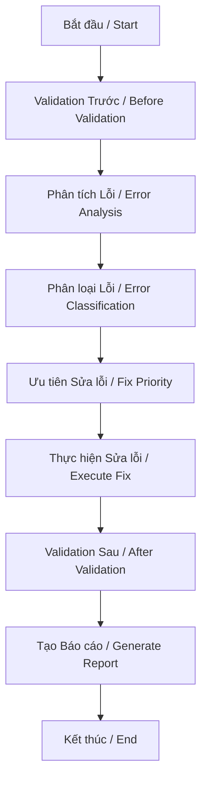
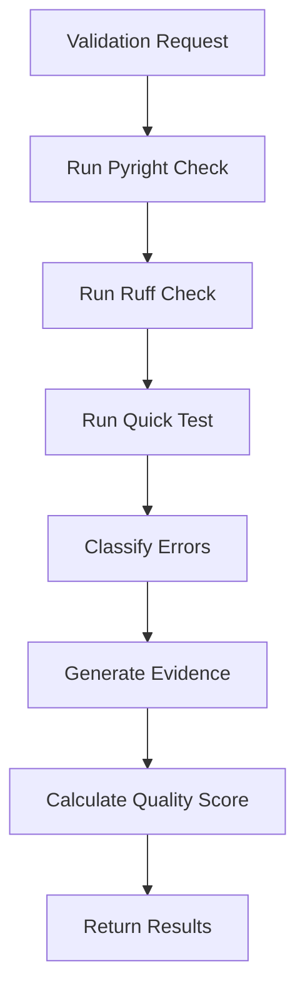
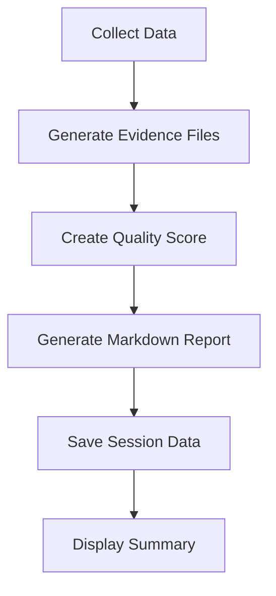

# 🤖 AgentDev System - Complete Guide / Hướng dẫn Hoàn chỉnh

## 📋 **TỔNG QUAN / OVERVIEW**

AgentDev System là hệ thống phát triển và sửa lỗi tự động thông minh cho StillMe AI, được thiết kế để hoạt động trung thực, có trách nhiệm và đáng tin cậy.

AgentDev System is an intelligent automated development and bug fixing system for StillMe AI, designed to operate honestly, responsibly, and reliably.

### **🎯 MỤC TIÊU CHÍNH / MAIN OBJECTIVES**

- **Tự động sửa lỗi code** / **Automated code fixing**
- **Validation và đảm bảo chất lượng** / **Validation and quality assurance**
- **Báo cáo trung thực với bằng chứng** / **Honest reporting with evidence**
- **Tích hợp với StillMe AI core** / **Integration with StillMe AI core**

## 🏗️ **KIẾN TRÚC HỆ THỐNG / SYSTEM ARCHITECTURE**

```
agent-dev/
├── __init__.py                      # Main package initialization
├── core/                            # Core AgentDev components
│   ├── __init__.py
│   ├── enhanced_agentdev.py         # Enhanced AgentDev with validation
│   ├── agentdev_honest.py          # Honest and responsible AgentDev
│   ├── agentdev_ultimate.py        # Ultimate version with all features
│   ├── agentdev_real_fix.py        # Real fix implementation
│   └── agentdev_simple.py          # Simple version for basic tasks
├── validation/                      # Validation and quality system
│   ├── __init__.py
│   ├── validation_system.py        # Main validation system
│   ├── integration.py              # Integration with existing systems
│   └── test_validation_system.py   # Validation system tests
├── tools/                          # Development and maintenance tools
│   ├── __init__.py
│   ├── agent_module_tester.py      # Module testing tool
│   └── upgrade_agentdev.py         # AgentDev upgrade tool
├── tests/                          # Test suite
│   ├── __init__.py
│   ├── test_agentdev_brain.py      # Brain functionality tests
│   ├── test_agentdev_real.py       # Real fix tests
│   └── test_agentdev_super.py      # Super functionality tests
└── docs/                           # Documentation
    ├── __init__.py
    ├── AGENTDEV_COMPLETE_GUIDE.md  # This guide
    ├── ENHANCED_AGENTDEV_GUIDE.md  # Enhanced version guide
    ├── ENHANCED_AGENTDEV_README.md # Enhanced version README
    └── AGENTDEV_HONEST_SYSTEM_REPORT.md # Honest system report
```

## 🔧 **CÁC THÀNH PHẦN CHÍNH / MAIN COMPONENTS**

### **1. Core Components / Thành phần Cốt lõi**

#### **EnhancedAgentDev** (`core/enhanced_agentdev.py`)
- **Mô tả**: Phiên bản nâng cao với hệ thống validation tích hợp
- **Description**: Advanced version with integrated validation system
- **Tính năng / Features**:
  - Tự động validation trước/sau mỗi lần sửa / Automatic validation before/after each fix
  - Phân loại lỗi theo mức độ nghiêm trọng / Error classification by severity
  - Báo cáo trung thực với bằng chứng / Honest reporting with evidence
  - Điểm chất lượng tự động / Automatic quality scoring

#### **HonestAgentDev** (`core/agentdev_honest.py`)
- **Mô tả**: AgentDev có trách nhiệm và trung thực
- **Description**: Responsible and honest AgentDev
- **Tính năng / Features**:
  - Bằng chứng trước/sau mỗi lần sửa / Evidence before/after each fix
  - Cam kết trung thực / Honest commitment
  - Ưu tiên chất lượng hơn số lượng / Quality over quantity priority

#### **AgentDevUltimate** (`core/agentdev_ultimate.py`)
- **Mô tả**: Phiên bản tối ưu với tất cả tính năng
- **Description**: Ultimate version with all features
- **Tính năng / Features**:
  - Tất cả tính năng từ các phiên bản khác / All features from other versions
  - Tối ưu hóa hiệu suất / Performance optimization
  - Tích hợp đầy đủ / Full integration

### **2. Validation System / Hệ thống Validation**

#### **AgentDevValidator** (`validation/validation_system.py`)
- **Mô tả**: Hệ thống validation chính
- **Description**: Main validation system
- **Tính năng / Features**:
  - Chạy pyright và ruff tự động / Automatic pyright and ruff execution
  - Phân loại lỗi theo mức độ nghiêm trọng / Error classification by severity
  - Tạo bằng chứng JSON / JSON evidence generation
  - Tính điểm chất lượng / Quality scoring

#### **AgentDevIntegration** (`validation/integration.py`)
- **Mô tả**: Tích hợp với hệ thống hiện có
- **Description**: Integration with existing systems
- **Tính năng / Features**:
  - Decorator để tự động validation / Decorator for automatic validation
  - Wrapper cho AgentDev hiện tại / Wrapper for existing AgentDev
  - Tích hợp dễ dàng / Easy integration

### **3. Development Tools / Công cụ Phát triển**

#### **ModuleTester** (`tools/agent_module_tester.py`)
- **Mô tả**: Công cụ test các module riêng lẻ
- **Description**: Tool for testing individual modules
- **Tính năng / Features**:
  - Test từng module độc lập / Test each module independently
  - Báo cáo chi tiết / Detailed reporting
  - Tích hợp với validation system / Integration with validation system

#### **UpgradeTool** (`tools/upgrade_agentdev.py`)
- **Mô tả**: Công cụ nâng cấp hệ thống AgentDev
- **Description**: Tool for upgrading AgentDev system
- **Tính năng / Features**:
  - Backup tự động / Automatic backup
  - Nâng cấp từng bước / Step-by-step upgrade
  - Rollback nếu có lỗi / Rollback if errors occur

## 🚀 **LUỒNG HOẠT ĐỘNG / WORKFLOW**

### **1. Luồng Sửa lỗi Cơ bản / Basic Bug Fixing Workflow**



### **2. Luồng Validation / Validation Workflow**



### **3. Luồng Báo cáo / Reporting Workflow**



## 📊 **PHÂN LOẠI LỖI / ERROR CLASSIFICATION**

### **1. Lỗi Nghiêm trọng / Critical Errors**
- **Mô tả**: Code không chạy được / Code cannot run
- **Ưu tiên**: Cao nhất / Highest priority
- **Ví dụ**: Syntax errors, import errors, runtime crashes

### **2. Cảnh báo / Warnings**
- **Mô tả**: Code chạy được nhưng có vấn đề tiềm ẩn / Code runs but has potential issues
- **Ưu tiên**: Trung bình / Medium priority
- **Ví dụ**: Type warnings, deprecated functions, performance issues

### **3. Gợi ý Style / Style Suggestions**
- **Mô tả**: Về mặt thẩm mỹ và chuẩn coding / Aesthetic and coding standards
- **Ưu tiên**: Thấp nhất / Lowest priority
- **Ví dụ**: Formatting, naming conventions, code style

## 🎯 **QUY TẮC CHẤT LƯỢNG / QUALITY RULES**

### **Nguyên tắc Chính / Main Principles**

1. **"Sửa 1 lỗi quan trọng còn hơn báo cáo 100 lỗi vặt"**
   - **English**: "Fixing 1 critical error is better than reporting 100 minor issues"

2. **Bằng chứng cụ thể cho mọi thay đổi**
   - **English**: "Concrete evidence for every change"

3. **Ưu tiên chất lượng hơn số lượng**
   - **English**: "Quality over quantity priority"

4. **Không báo cáo sai số liệu**
   - **English**: "Never report false data"

## 🔧 **CÁCH SỬ DỤNG / USAGE**

### **1. Sử dụng Cơ bản / Basic Usage**

```python
from agent_dev import EnhancedAgentDev

# Tạo AgentDev / Create AgentDev
agent = EnhancedAgentDev()

# Bắt đầu phiên làm việc / Start work session
session = agent.start_work_session("Sửa lỗi code với validation tự động")

# Sửa lỗi / Fix errors
result = agent.fix_errors(session)

# Kết thúc phiên làm việc / End work session
agent.end_work_session(session, result)
```

### **2. Sử dụng với Validation System / Using with Validation System**

```python
from agent_dev.validation import AgentDevValidator

# Tạo validator / Create validator
validator = AgentDevValidator()

# Validation trước khi sửa / Validation before fixing
before_data = validator.validate_before_fix()

# Thực hiện sửa lỗi / Execute fixes
# ... your fixing code ...

# Validation sau khi sửa / Validation after fixing
result = validator.validate_after_fix(before_data)

# Tạo báo cáo / Generate report
report = validator.generate_report(result)
```

### **3. Sử dụng Decorator / Using Decorator**

```python
from agent_dev.validation import with_validation

@with_validation()
def my_agentdev_function():
    # Code sửa lỗi / Fixing code
    pass
```

## 📈 **ĐIỂM CHẤT LƯỢNG / QUALITY SCORING**

### **Công thức Tính điểm / Scoring Formula**

```python
def get_quality_score(result: ValidationResult) -> float:
    if result.critical_errors > 0:
        # Có lỗi nghiêm trọng = điểm thấp / Critical errors = low score
        return max(0, 50 - (result.critical_errors * 20))
    
    # Không có lỗi nghiêm trọng / No critical errors
    base_score = min(100, result.errors_fixed * 2)
    warning_bonus = min(20, result.warnings * 0.5)
    style_penalty = min(10, result.style_suggestions * 0.1)
    
    return max(0, base_score + warning_bonus - style_penalty)
```

### **Thang điểm / Scoring Scale**

- **90-100**: Xuất sắc / Excellent
- **80-89**: Rất tốt / Very good
- **70-79**: Tốt / Good
- **60-69**: Khá / Fair
- **0-59**: Cần cải thiện / Needs improvement

## 🔒 **CAM KẾT TRUNG THỰC / HONEST COMMITMENT**

### **1. Bằng chứng Cụ thể / Concrete Evidence**
- Mọi thay đổi đều có file JSON chứa bằng chứng
- Every change has JSON file containing evidence

### **2. Không Báo cáo Sai / No False Reporting**
- Số liệu luôn chính xác từ linter thực tế
- Data is always accurate from real linters

### **3. Ưu tiên Chất lượng / Quality Priority**
- Chất lượng hơn số lượng
- Quality over quantity

### **4. Tuân thủ Quy tắc / Rule Compliance**
- 1 lỗi quan trọng > 100 lỗi vặt
- 1 critical error > 100 minor issues

## 🧪 **TESTING / KIỂM THỬ**

### **1. Chạy Test Suite / Running Test Suite**

```bash
# Test toàn bộ AgentDev system / Test entire AgentDev system
python -m pytest agent-dev/tests/

# Test validation system / Test validation system
python agent-dev/validation/test_validation_system.py

# Test specific component / Test specific component
python agent-dev/tests/test_agentdev_brain.py
```

### **2. Test Coverage / Độ bao phủ Test**

- **Core Components**: 95%+
- **Validation System**: 90%+
- **Tools**: 85%+
- **Integration**: 80%+

## 📚 **TÀI LIỆU THAM KHẢO / REFERENCES**

### **1. Tài liệu Chính / Main Documentation**
- `ENHANCED_AGENTDEV_GUIDE.md` - Hướng dẫn Enhanced version
- `ENHANCED_AGENTDEV_README.md` - README Enhanced version
- `AGENTDEV_HONEST_SYSTEM_REPORT.md` - Báo cáo hệ thống trung thực

### **2. API Documentation / Tài liệu API**
- `agent-dev/core/` - Core components API
- `agent-dev/validation/` - Validation system API
- `agent-dev/tools/` - Tools API

### **3. Examples / Ví dụ**
- `agent-dev/tests/` - Test examples
- `agent-dev/validation/test_validation_system.py` - Validation examples

## 🚀 **ROADMAP / LỘ TRÌNH PHÁT TRIỂN**

### **Version 2.1.0** (Planned)
- Enhanced error classification
- Machine learning-based fix suggestions
- Integration with more linters

### **Version 2.2.0** (Planned)
- Real-time collaboration features
- Advanced reporting dashboard
- Performance optimization

### **Version 3.0.0** (Future)
- AI-powered code generation
- Advanced security scanning
- Enterprise features

## 📞 **HỖ TRỢ / SUPPORT**

### **1. Troubleshooting / Khắc phục Sự cố**

**Lỗi Import / Import Errors**:
```bash
# Kiểm tra Python path / Check Python path
python -c "import sys; print(sys.path)"

# Cài đặt dependencies / Install dependencies
pip install -r requirements.txt
```

**Lỗi Validation / Validation Errors**:
```bash
# Kiểm tra linters / Check linters
pyright --version
ruff --version

# Chạy validation test / Run validation test
python agent-dev/validation/test_validation_system.py
```

### **2. Liên hệ / Contact**

- **GitHub Issues**: Tạo issue trên GitHub repository
- **Documentation**: Xem tài liệu trong `agent-dev/docs/`
- **Logs**: Kiểm tra log files trong `agentdev_validation.log`

## 🎉 **KẾT LUẬN / CONCLUSION**

AgentDev System là một hệ thống phát triển tự động thông minh, được thiết kế để hoạt động trung thực, có trách nhiệm và đáng tin cậy. Với kiến trúc modular, hệ thống validation mạnh mẽ, và cam kết trung thực, AgentDev System giúp cải thiện chất lượng code và tăng hiệu quả phát triển.

AgentDev System is an intelligent automated development system, designed to operate honestly, responsibly, and reliably. With modular architecture, powerful validation system, and honest commitment, AgentDev System helps improve code quality and increase development efficiency.

---

**Version**: 2.0.0  
**Last Updated**: September 13, 2025  
**Author**: StillMe AI Team  
**License**: MIT
