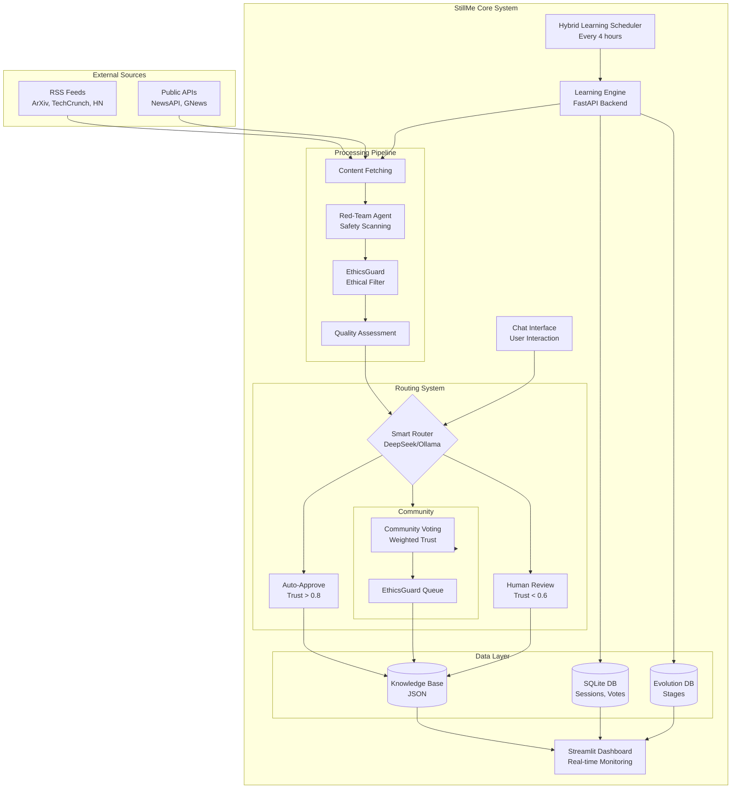
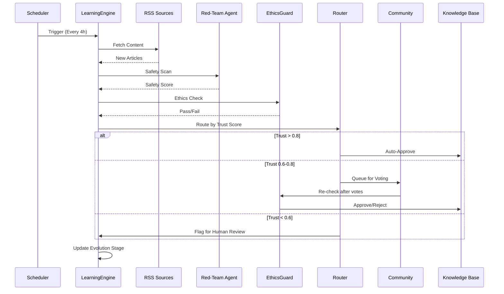

# 🔧 StillMe Architecture

## System Architecture Overview

StillMe is built on a modular architecture with clear separation of concerns:

```
External Sources → Learning Pipeline → Vector DB → RAG → Validator Chain → Response
```

### High-Level Architecture Diagram



## Component Architecture

### Backend (FastAPI)

#### **Learning Engine**
- **Location**: `backend/api/main.py`
- **Purpose**: Core evolutionary learning system
- **Key Features**:
  - RSS feed integration
  - Automated learning scheduler
  - Knowledge retention tracking
  - Accuracy scoring

#### **RSS Pipeline**
- **Location**: `backend/services/rss_fetcher.py`
- **Purpose**: Multi-source content fetching
- **Features**:
  - RSS feed parsing
  - Content pre-filtering (length, keyword scoring)
  - Duplicate detection
  - Fetch history tracking

#### **Content Curator**
- **Location**: `backend/services/content_curator.py`
- **Purpose**: Intelligent content prioritization
- **Features**:
  - Pre-filtering (min 500 chars, keyword scoring)
  - Source quality tracking
  - Content prioritization
  - Cost optimization (30-50% reduction in embeddings)

#### **Vector Database (ChromaDB)**
- **Location**: `backend/vector_db/chroma_client.py`
- **Purpose**: Semantic search and knowledge storage
- **Features**:
  - Document embedding
  - Semantic similarity search
  - Metadata storage
  - Collection management

#### **RAG System**
- **Location**: `backend/vector_db/rag_retrieval.py`
- **Purpose**: Retrieval-Augmented Generation
- **Features**:
  - Context retrieval
  - Prompt building
  - Knowledge and conversation document separation
  - Important knowledge detection

#### **Validator Chain**
- **Location**: `backend/validators/chain.py`
- **Purpose**: Reduce hallucinations through multiple validation checks
- **Components**:
  - Citation validator (`backend/validators/citation.py`)
  - Evidence overlap validator (`backend/validators/evidence_overlap.py`)
  - Numeric validator (`backend/validators/numeric.py`)
  - Ethics adapter (`backend/validators/ethics_adapter.py`)

#### **Learning Scheduler**
- **Location**: `backend/services/learning_scheduler.py`
- **Purpose**: Automated learning cycles
- **Features**:
  - Background task scheduling (every 4 hours)
  - Cycle tracking
  - Error recovery
  - Status monitoring

#### **Knowledge Retention**
- **Location**: `backend/learning/knowledge_retention.py`
- **Purpose**: Track learned knowledge
- **Features**:
  - Retention score calculation
  - Knowledge retrieval with filters
  - Learning session recording
  - Access count tracking

#### **Self-Diagnosis Agent**
- **Location**: `backend/services/self_diagnosis.py`
- **Purpose**: Identify knowledge gaps
- **Features**:
  - Gap detection using RAG
  - Coverage analysis
  - Learning focus suggestions

#### **SPICE Engine** (v0.5+)
- **Location**: `backend/services/spice_engine.py`
- **Purpose**: Self-Play In Corpus Environments
- **Components**:
  - Challenger: Generate questions from corpus
  - Reasoner: Answer and self-evaluate
  - Self-play loop orchestration
- **Reference**: [SPICE Paper](https://arxiv.org/abs/2510.24684)
- **Documentation**: `docs/SPICE_ARCHITECTURE.md`

### Frontend (Streamlit)

#### **Dashboard**
- **Location**: `dashboard.py`
- **Purpose**: Interactive UI for monitoring and control
- **Features**:
  - RAG interface
  - Validation metrics
  - Learning metrics
  - Chat interface
  - Raw learning feed
  - Retained knowledge audit log

### Database Layer

#### **SQLite Databases**

1. **Knowledge Retention DB**
   - **Location**: `data/knowledge_retention.db`
   - **Purpose**: Store learned knowledge with retention scores
   - **Schema**: Knowledge items, retention scores, metadata

2. **RSS Fetch History DB**
   - **Location**: `data/rss_fetch_history.db`
   - **Purpose**: Track RSS fetch cycles and item statuses
   - **Schema**: Fetch cycles, fetch items with status tracking

3. **Learning Sessions DB**
   - **Purpose**: Track learning interactions
   - **Schema**: Sessions, proposals, votes, evolution stages

#### **Vector Database (ChromaDB)**
- **Purpose**: Semantic search and embeddings
- **Collections**:
  - `knowledge`: General knowledge documents
  - `conversations`: Chat conversation examples
- **Storage**: In-memory (can be persisted for production)

## Data Flow

### Learning Flow



### RAG Query Flow

1. **User Query** → Chat Interface
2. **Language Detection** → StillMe Detector
3. **RAG Retrieval** → Vector DB (ChromaDB)
   - Retrieve knowledge documents
   - Retrieve conversation documents
4. **Context Building** → Prompt construction
5. **AI Generation** → LLM (DeepSeek/GPT/Gemini)
6. **Validator Chain** → Quality checks
   - Citation validation
   - Evidence overlap (8% threshold)
   - Numeric validation
   - Ethics check
7. **Response** → User (with citations and metadata)

## Security Architecture

### Rate Limiting
- **Location**: `backend/api/rate_limiter.py`
- **Implementation**: `slowapi`
- **Limits**:
  - Per-IP: 100/minute (default)
  - Per-API-key: 1000/hour (default)
  - Chat: 10/minute
  - RAG add: 20/hour
  - RSS fetch: 5/hour

### Input Validation
- **Location**: `backend/api/models/`
- **Implementation**: Pydantic models
- **Features**:
  - Comprehensive validation
  - XSS prevention (HTML escaping)
  - URL validation
  - String sanitization

### SQL Injection Protection
- **Status**: ✅ All queries use parameterized statements
- **Audit**: Complete - no vulnerabilities found

### HTTPS Enforcement
- **Location**: `backend/api/security_middleware.py`
- **Features**:
  - HTTPS redirect middleware
  - HSTS headers
  - Security headers (X-Frame-Options, CSP, etc.)

## API Architecture

### RESTful Endpoints

#### **Core Learning APIs**
- `GET /api/learning/sessions` - Get learning sessions
- `POST /api/learning/sessions/run` - Trigger learning session
- `GET /api/learning/evolution/stage` - Get current AI stage
- `GET /api/learning/stats` - Get learning statistics

#### **RSS Learning Pipeline APIs**
- `POST /api/learning/rss/fetch` - Fetch RSS feeds
- `GET /api/learning/rss/fetch-history` - Get fetch history
- `GET /api/learning/rss/stats` - Get RSS pipeline stats

#### **RAG APIs**
- `POST /api/rag/add_knowledge` - Add knowledge to vector DB
- `POST /api/rag/query` - Query RAG system
- `GET /api/rag/stats` - Get RAG statistics

#### **Chat API**
- `POST /api/chat/rag` - Chat with RAG support

#### **Validation APIs**
- `GET /api/validators/metrics` - Get validation metrics

See [README.md](../README.md#-api-endpoints) for complete API documentation.

## Deployment Architecture

### Docker Setup
- **Backend**: FastAPI (uvicorn)
- **Frontend**: Streamlit
- **Database**: SQLite (embedded)
- **Vector DB**: ChromaDB (in-memory)

### Production Considerations
- **Database**: SQLite → PostgreSQL (for scale)
- **Task Queue**: Single-threaded → Celery (for distributed tasks)
- **Vector DB**: In-memory → Persisted ChromaDB (for scale)
- **Load Balancer**: Nginx (for high availability)

## Technology Stack

- **Backend**: Python 3.12+, FastAPI 0.104+
- **Frontend**: Streamlit 1.28+
- **Vector DB**: ChromaDB
- **Embeddings**: Sentence Transformers
- **Database**: SQLite (MVP), PostgreSQL (planned)
- **Validation**: Custom validator chain
- **Security**: slowapi (rate limiting), Pydantic (validation)

## Performance Considerations

### Current Limitations
- SQLite database will bottleneck at scale (needs PostgreSQL migration)
- Single-threaded scheduler (needs distributed task queue)
- ChromaDB in-memory (needs persistence strategy for scale)

### Optimization Strategies
- Pre-filtering reduces embedding costs by 30-50%
- Caching for frequently accessed knowledge
- Batch processing for RSS feeds
- Async operations for I/O-bound tasks

---

**See also:**
- [README.md](../README.md) - Quick start and overview
- [PHILOSOPHY.md](PHILOSOPHY.md) - Philosophy and vision
- [RESEARCH_NOTES.md](RESEARCH_NOTES.md) - Research framework
- [SPICE_ARCHITECTURE.md](SPICE_ARCHITECTURE.md) - SPICE framework details

