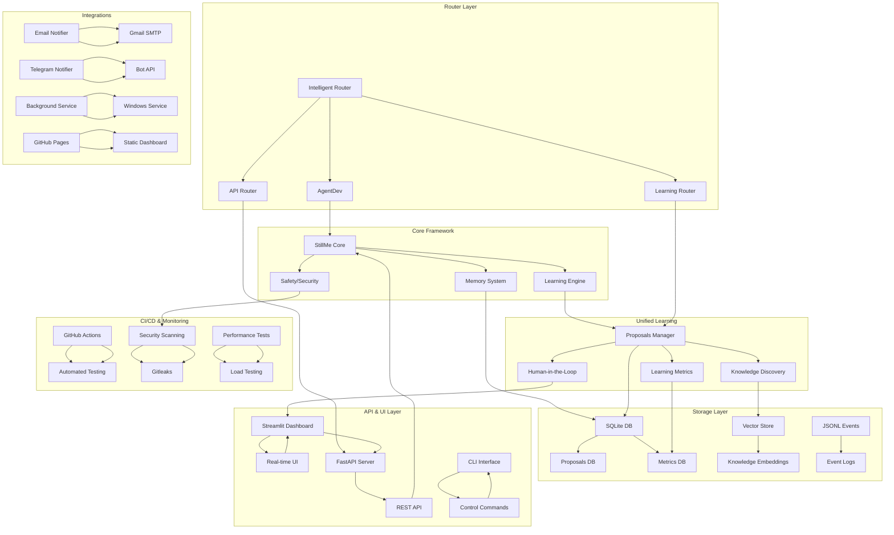

# 🏗️ StillMe IPC Architecture Overview

## System Architecture Diagram

## Component Overview

### Core Framework
- **StillMe Core**: Central framework and orchestration
- **Learning Engine**: AI learning and knowledge processing
- **Memory System**: Long-term knowledge storage and retrieval
- **Safety/Security**: Privacy protection and access control

### Router Layer
- **Intelligent Router**: Request routing and load balancing
- **AgentDev**: Development automation and code generation
- **Learning Router**: Learning-specific request handling
- **API Router**: API request routing and validation

### Unified Learning System
- **Proposals Manager**: Learning proposal lifecycle management
- **Knowledge Discovery**: Automated content discovery
- **Human-in-the-Loop**: User approval workflow
- **Learning Metrics**: Performance tracking and analytics

### Storage Layer
- **SQLite DB**: Structured data storage
- **Vector Store**: Semantic knowledge embeddings
- **JSONL Events**: Event streaming and logging

### API & UI Layer
- **Streamlit Dashboard**: Interactive web interface
- **FastAPI Server**: REST API endpoints
- **CLI Interface**: Command-line control

### Integrations
- **Notification System**: Email, Telegram, Desktop alerts
- **Background Service**: Continuous operation
- **GitHub Pages**: Public dashboard hosting

### CI/CD & Monitoring
- **GitHub Actions**: Automated testing and deployment
- **Security Scanning**: Vulnerability detection
- **Performance Testing**: Load and stress testing

## Data Flow

1. **Learning Request** → Intelligent Router → Learning Engine
2. **Knowledge Discovery** → Proposals Manager → Human Approval
3. **Approved Learning** → Learning Engine → Memory System
4. **Metrics Collection** → Metrics DB → Dashboard Display
5. **Notifications** → Alert System → User Channels
6. **Background Tasks** → Service Manager → Continuous Operation

## Component Mapping Table

| Component | File Path | Tests | Owner | Status |
|-----------|-----------|-------|-------|--------|
| **StillMe Core Framework** | `stillme_core/framework.py` | `tests/test_framework.py` | StillMe Team | ✅ Active |
| **Learning Engine** | `stillme_core/learning/` | `tests/test_learning_*.py` | Learning Team | ✅ Active |
| **Memory System** | `stillme_core/memory/` | `tests/test_memory_*.py` | Memory Team | ✅ Active |
| **Safety/Security** | `stillme_ethical_core/` | `tests/test_ethics/` | Security Team | ✅ Active |
| **Intelligent Router** | `modules/intelligent_router.py` | `tests/test_router.py` | Router Team | ✅ Active |
| **AgentDev** | `agent-dev/` | `tests/agentdev/` | AgentDev Team | ✅ Active |
| **Proposals Manager** | `stillme_core/learning/proposals_manager.py` | `tests/test_proposals_manager.py` | Learning Team | ✅ Active |
| **Knowledge Discovery** | `scripts/knowledge_discovery.py` | `tests/test_knowledge_discovery.py` | Learning Team | ✅ Active |
| **Background Service** | `scripts/stillme_background_service.py` | `tests/test_background_service.py` | Service Team | ✅ Active |
| **Streamlit Dashboard** | `dashboards/streamlit/simple_app.py` | `tests/test_dashboard.py` | UI Team | ✅ Active |
| **Static Dashboard** | `docs/dashboard/index.html` | `tests/test_static_dashboard.py` | UI Team | ✅ Active |
| **Email Notifier** | `stillme_core/alerting/email_notifier.py` | `tests/test_email_notifier.py` | Alerting Team | ✅ Active |
| **Telegram Notifier** | `stillme_core/alerting/telegram_notifier.py` | `tests/test_telegram_notifier.py` | Alerting Team | ✅ Active |
| **Metrics Emitter** | `stillme_core/metrics/emitter.py` | `tests/test_metrics_emitter.py` | Metrics Team | ✅ Active |
| **Metrics Aggregator** | `scripts/aggregate_metrics.py` | `tests/test_metrics_aggregator.py` | Metrics Team | ✅ Active |
| **Guardrails System** | `stillme_core/guardrails/` | `tests/test_guardrails/` | Guardrails Team | ❌ Not Implemented |
| **API Endpoints** | `api/v1/guardrails/` | `tests/test_guardrails_api.py` | API Team | ❌ Not Implemented |
| **Migration Scripts** | `migrations/` | `tests/test_migrations.py` | DB Team | ❌ Not Implemented |

## Security Model

- **Access Control**: User-based permissions
- **Data Encryption**: Sensitive data protection
- **Audit Logging**: All actions tracked
- **Privacy Protection**: PII redaction and anonymization
- **Network Security**: HTTPS-only, secure APIs
