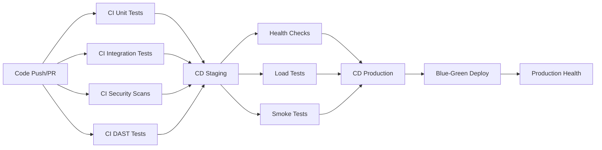

# StillMe CI/CD Overview

## Pipeline Architecture

StillMe implements a comprehensive CI/CD pipeline with 6 GitHub Actions workflows, providing automated testing, security scanning, and deployment capabilities.

---

## **🔄 CI/CD Pipeline Overview**

### **Pipeline Flow**



### **Workflow Triggers**

| Workflow | Trigger | Purpose |
|----------|---------|---------|
| **CI Unit Tests** | Push/PR to main/develop | Code quality, linting, unit tests |
| **CI Integration Tests** | Push/PR to main/develop | Integration and chaos tests |
| **CI Security Scans** | Push/PR + Weekly schedule | SAST, dependency audit, container scan |
| **CI DAST Tests** | Push/PR to main/develop | Dynamic security testing |
| **CD Staging** | Push to develop branch | Deploy to staging environment |
| **CD Production** | Manual trigger only | Deploy to production environment |

---

## **🧪 CI Workflows**

### **1. CI Unit Tests (`ci-unit.yml`)**

**Purpose**: Code quality assurance and unit testing

**Features**:
- **Multi-Python Support**: Python 3.11, 3.12
- **Code Quality**: flake8, black, isort, mypy
- **Test Coverage**: 85% line coverage requirement
- **Artifacts**: Coverage reports, test results

**Pipeline Steps**:
1. **Setup**: Python environment, dependency caching
2. **Linting**: flake8, black, isort, mypy
3. **Testing**: pytest with coverage
4. **Reporting**: Coverage upload, test results

**Quality Gates**:
- ✅ Coverage ≥ 85%
- ✅ All linting checks pass
- ✅ All unit tests pass

### **2. CI Integration Tests (`ci-integration.yml`)**

**Purpose**: Integration testing and chaos testing

**Features**:
- **Integration Tests**: Cross-module integration
- **Chaos Tests**: Error injection, stress testing
- **Timeout Protection**: 300s integration, 600s chaos
- **Artifacts**: Test results, summary reports

**Pipeline Steps**:
1. **Setup**: Python environment, dependencies
2. **Integration Tests**: Cross-module testing
3. **Chaos Tests**: Error injection, stress testing
4. **Reporting**: Test results, summary generation

**Quality Gates**:
- ✅ All integration tests pass
- ✅ All chaos tests pass
- ✅ Tests complete within timeout

### **3. CI Security Scans (`ci-security.yml`)**

**Purpose**: Comprehensive security scanning

**Features**:
- **SAST**: Bandit, Semgrep
- **Dependency Audit**: pip-audit, safety
- **Container Security**: Trivy scanning
- **SARIF Upload**: GitHub security tab integration

**Pipeline Steps**:
1. **SAST Scanning**: Bandit, Semgrep
2. **Dependency Audit**: pip-audit, safety
3. **Container Build**: Docker image creation
4. **Container Scan**: Trivy vulnerability scanning
5. **Reporting**: SARIF upload, artifact generation

**Quality Gates**:
- ✅ 0 High severity SAST findings
- ✅ 0 Critical dependency vulnerabilities
- ✅ 0 Critical container vulnerabilities

### **4. CI DAST Tests (`ci-dast.yml`)**

**Purpose**: Dynamic application security testing

**Features**:
- **OWASP ZAP**: Baseline security scanning
- **Custom Fuzz Testing**: HTTP fuzz testing
- **Test Server**: Automated test environment
- **Artifacts**: ZAP reports, fuzz findings

**Pipeline Steps**:
1. **Setup**: Python environment, test server
2. **OWASP ZAP**: Baseline security scan
3. **Fuzz Testing**: Custom HTTP fuzz tests
4. **Reporting**: ZAP reports, fuzz findings

**Quality Gates**:
- ✅ 0 High severity ZAP findings
- ✅ 0 High-risk fuzz test findings

---

## **🚀 CD Workflows**

### **5. CD Staging (`cd-staging.yml`)**

**Purpose**: Automated staging deployment

**Features**:
- **Docker Build**: Multi-architecture builds
- **Registry Push**: GitHub Container Registry
- **Staging Deploy**: Automated deployment
- **Health Checks**: Post-deployment validation

**Pipeline Steps**:
1. **Build**: Docker image with metadata
2. **Push**: Multi-architecture to GHCR
3. **Deploy**: Staging environment deployment
4. **Health Check**: Service health validation
5. **Smoke Tests**: Basic functionality testing
6. **Load Tests**: K6 performance testing

**Quality Gates**:
- ✅ Docker image builds successfully
- ✅ Staging deployment completes
- ✅ Health checks pass
- ✅ Smoke tests pass
- ✅ Load tests meet SLO

### **6. CD Production (`cd-prod.yml`)**

**Purpose**: Production deployment with manual approval

**Features**:
- **Manual Trigger**: Workflow dispatch only
- **Blue-Green Deploy**: Zero-downtime deployment
- **Rollback Support**: Automated rollback capability
- **Production Health**: Comprehensive health checks

**Pipeline Steps**:
1. **Build**: Production Docker image
2. **Push**: Production image to registry
3. **Blue-Green Deploy**: Zero-downtime deployment
4. **Health Check**: Production health validation
5. **Smoke Tests**: Production functionality testing
6. **Rollback**: Rollback capability if needed

**Quality Gates**:
- ✅ Manual approval required
- ✅ Blue-green deployment successful
- ✅ Production health checks pass
- ✅ Smoke tests pass
- ✅ Rollback capability verified

---

## **📊 Artifacts & Reports**

### **Generated Artifacts**

| Workflow | Artifacts | Purpose |
|----------|-----------|---------|
| **CI Unit** | `coverage-report-*`, `test-results-*` | Coverage and test results |
| **CI Integration** | `integration-test-results`, `chaos-test-results` | Integration test results |
| **CI Security** | `bandit-report`, `semgrep-report`, `trivy-report` | Security scan results |
| **CI DAST** | `zap-report`, `fuzz-findings` | Dynamic security test results |
| **CD Staging** | Deployment logs, health check results | Staging deployment artifacts |
| **CD Production** | Production logs, deployment verification | Production deployment artifacts |

### **Report Locations**

- **Coverage Reports**: `htmlcov/` directory
- **Test Results**: `junit-*.xml` files
- **Security Reports**: `artifacts/` directory
- **Deployment Logs**: GitHub Actions logs
- **Health Check Results**: Service health endpoints

---

## **🔧 Configuration**

### **Environment Variables**

| Variable | Purpose | Default |
|----------|---------|---------|
| `STILLME_ENV` | Environment (dev/staging/prod) | `development` |
| `STILLME_LOG_LEVEL` | Logging level | `INFO` |
| `GITHUB_TOKEN` | GitHub API access | Auto-provided |
| `DOCKER_REGISTRY` | Container registry | `ghcr.io` |

### **Secrets Management**

| Secret | Purpose | Required |
|--------|---------|----------|
| `GITHUB_TOKEN` | GitHub API access | ✅ Yes |
| `DOCKER_USERNAME` | Container registry username | ✅ Yes |
| `DOCKER_PASSWORD` | Container registry password | ✅ Yes |
| `GRAFANA_ADMIN_PASSWORD` | Grafana admin password | ⚠️ Optional |

### **Workflow Configuration**

```yaml
# Example workflow configuration
env:
  STILLME_ENV: production
  STILLME_LOG_LEVEL: WARNING
  DOCKER_REGISTRY: ghcr.io
  DOCKER_IMAGE: stillme

# Example secrets usage
secrets:
  GITHUB_TOKEN: ${{ secrets.GITHUB_TOKEN }}
  DOCKER_PASSWORD: ${{ secrets.DOCKER_PASSWORD }}
```

---

## **📈 Monitoring & Alerting**

### **Pipeline Monitoring**

- **GitHub Actions**: Built-in workflow monitoring
- **Status Badges**: README.md status badges
- **Workflow Notifications**: Email/Slack notifications
- **Artifact Retention**: 90-day artifact retention

### **Deployment Monitoring**

- **Health Endpoints**: `/healthz`, `/readyz`, `/metrics`
- **Prometheus Metrics**: Application metrics
- **Grafana Dashboards**: Visual monitoring
- **Alert Manager**: Automated alerting

### **SLO Monitoring**

- **P95 Latency**: < 500ms under normal load
- **Error Rate**: < 1% under normal conditions
- **Availability**: 99.9% uptime target
- **Response Time**: < 200ms for health checks

---

## **🔄 Rollback Procedures**

### **Automated Rollback**

```bash
# Rollback to previous version
make rollback TAG=v1.2.3

# Rollback via GitHub Actions
# Use workflow dispatch with environment=rollback
```

### **Manual Rollback**

1. **Identify Issue**: Monitor health checks and metrics
2. **Activate Rollback**: Use rollback script or GitHub Actions
3. **Verify Rollback**: Check service health and functionality
4. **Monitor**: Watch for 24-48 hours post-rollback
5. **Document**: Record incident and lessons learned

### **Rollback Triggers**

- **Health Check Failures**: Continuous health check failures
- **High Error Rate**: Error rate > 5%
- **Performance Degradation**: P95 latency > 1000ms
- **Security Incidents**: Security breach or compromise
- **Manual Override**: Manual rollback decision

---

## **🛠️ Local Development**

### **Running CI/CD Locally**

```bash
# Run unit tests
make test

# Run security scans
make security

# Run DAST tests
make dast

# Build Docker image
make build

# Deploy to staging
make deploy-staging

# Deploy to production
make deploy-prod
```

### **Testing Workflows**

```bash
# Test specific workflow
act -j unit-tests

# Test with specific event
act push -e .github/events/push.json

# Test with secrets
act -s GITHUB_TOKEN=$GITHUB_TOKEN
```

---

## **📚 Best Practices**

### **CI/CD Best Practices**

1. **Fast Feedback**: Keep CI pipeline under 10 minutes
2. **Parallel Execution**: Run independent jobs in parallel
3. **Caching**: Cache dependencies and build artifacts
4. **Security First**: Security scans in every pipeline
5. **Quality Gates**: Enforce quality standards

### **Deployment Best Practices**

1. **Blue-Green Deployments**: Zero-downtime deployments
2. **Health Checks**: Comprehensive health validation
3. **Rollback Ready**: Always have rollback capability
4. **Monitoring**: Real-time deployment monitoring
5. **Documentation**: Document all deployment procedures

### **Security Best Practices**

1. **Least Privilege**: Minimal required permissions
2. **Secret Management**: Secure secret handling
3. **Container Security**: Secure container images
4. **Dependency Scanning**: Regular dependency updates
5. **Vulnerability Management**: Rapid vulnerability response

---

**Last Updated**: $(date)
**Next Review**: $(date -d "+3 months")
**Maintainer**: StillMe Security Team
