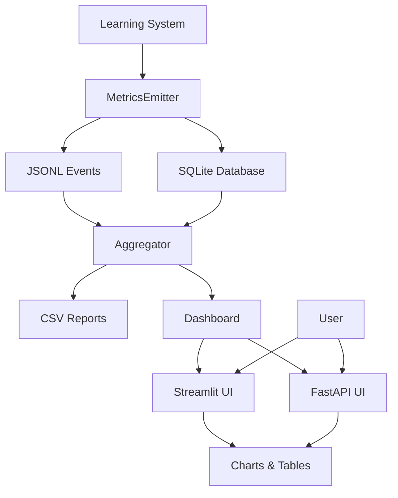
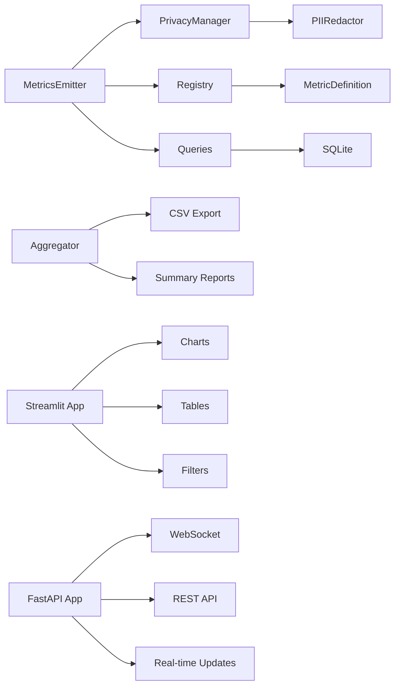
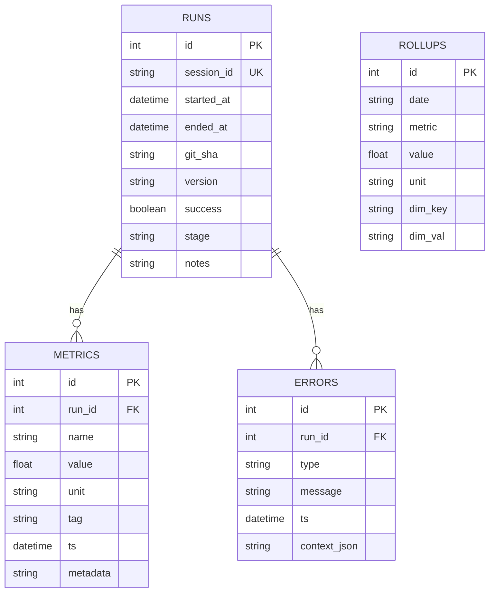
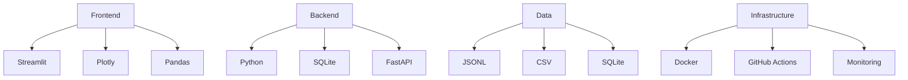
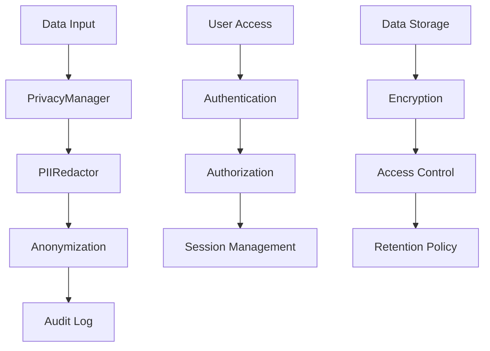
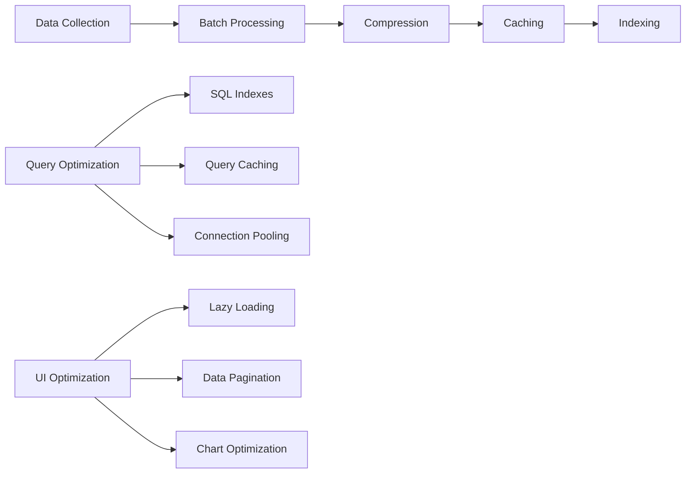
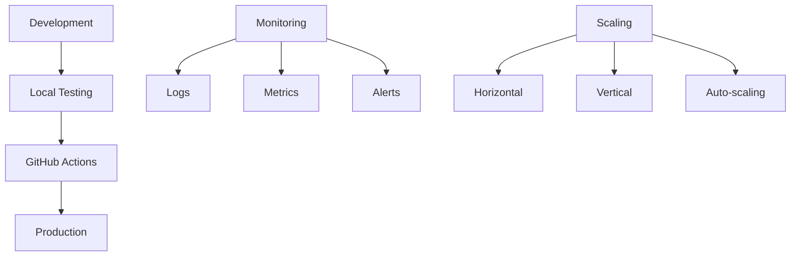

# 📊 StillMe IPC Dashboard Architecture

## Data Flow Diagram

## Component Architecture

## Metrics Schema

## Dashboard Components

```mermaid
graph TD
    A[Streamlit App] --> B[Header]
    A --> C[Sidebar]
    A --> D[Main Content]
    A --> E[Footer]
    
    B --> F[Status Indicators]
    B --> G[Quick Metrics]
    
    C --> H[Date Range Filter]
    C --> I[Stage Filter]
    C --> J[Source Filter]
    C --> K[Component Filter]
    C --> L[Auto-refresh Control]
    
    D --> M[Learning Curve Tab]
    D --> N[Performance Tab]
    D --> O[Ingest Volume Tab]
    D --> P[Error Analysis Tab]
    D --> Q[Sessions Tab]
    
    M --> R[Pass Rate Chart]
    M --> S[Accuracy Chart]
    M --> T[Self-Assessment Chart]
    
    N --> U[Latency Chart]
    N --> V[Memory Gauge]
    N --> W[CPU Gauge]
    
    O --> X[Source Distribution]
    O --> Y[Daily Trends]
    O --> Z[Quality Metrics]
    
    P --> AA[Error Types]
    P --> BB[Error Trends]
    P --> CC[Error Summary]
    
    Q --> DD[Sessions Table]
    Q --> EE[Session Details]
    Q --> FF[Drill-down]
```

## Technology Stack

## Security & Privacy

## Performance Optimization

## Deployment Architecture

