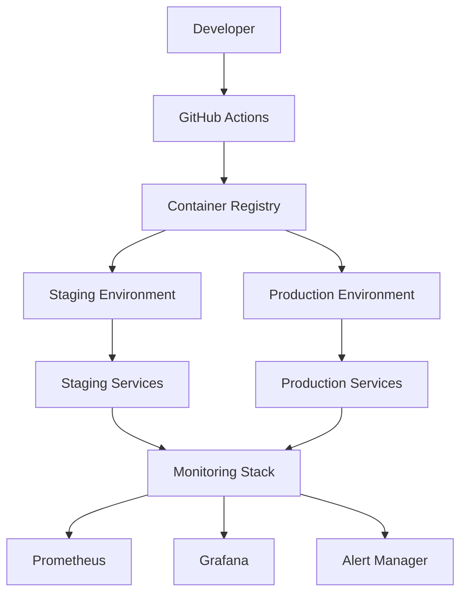

# StillMe Deployment Guide

## Overview

This guide provides comprehensive instructions for deploying StillMe across different environments (development, staging, production) using Docker, Docker Compose, and Kubernetes.

---

## **🏗️ Architecture Overview**

### **Deployment Architecture**



### **Service Components**

- **StillMe Core**: Main application service
- **Prometheus**: Metrics collection and monitoring
- **Grafana**: Metrics visualization and dashboards
- **Loki**: Log aggregation and analysis
- **Alert Manager**: Alert routing and notification

---

## **🐳 Docker Deployment**

### **Prerequisites**

- Docker 20.10+
- Docker Compose 2.0+
- 4GB RAM minimum
- 10GB disk space

### **Quick Start**

```bash
# Clone repository
git clone https://github.com/stillme-ai/stillme.git
cd stillme

# Build and run
make docker

# Check health
make health
```

### **Environment-Specific Deployment**

#### **Development Environment**

```bash
# Development deployment
docker-compose -f docker-compose.dev.yml up -d

# Check logs
docker-compose -f docker-compose.dev.yml logs -f

# Stop services
docker-compose -f docker-compose.dev.yml down
```

#### **Staging Environment**

```bash
# Staging deployment
docker-compose -f docker-compose.staging.yml up -d

# Check health
curl http://localhost:8080/healthz
curl http://localhost:8080/readyz

# View monitoring
open http://localhost:3000  # Grafana
open http://localhost:9090  # Prometheus
```

#### **Production Environment**

```bash
# Production deployment
docker-compose -f docker-compose.prod.yml up -d

# Verify deployment
make health
make load-test

# Monitor services
docker-compose -f docker-compose.prod.yml ps
```

---

## **☸️ Kubernetes Deployment**

### **Prerequisites**

- Kubernetes 1.20+
- kubectl configured
- Helm 3.0+ (optional)
- 8GB RAM minimum
- 20GB disk space

### **Helm Deployment**

#### **Installation**

```bash
# Add Helm repository
helm repo add stillme https://stillme-ai.github.io/helm-charts
helm repo update

# Install StillMe
helm install stillme stillme/stillme \
  --namespace stillme \
  --create-namespace \
  --values values-prod.yaml
```

#### **Configuration**

```yaml
# values-prod.yaml
replicaCount: 3

image:
  repository: ghcr.io/stillme-ai/stillme
  tag: latest
  pullPolicy: IfNotPresent

service:
  type: ClusterIP
  port: 8080

ingress:
  enabled: true
  className: nginx
  annotations:
    cert-manager.io/cluster-issuer: letsencrypt-prod
  hosts:
    - host: stillme.ai
      paths:
        - path: /
          pathType: Prefix
  tls:
    - secretName: stillme-tls
      hosts:
        - stillme.ai

resources:
  limits:
    cpu: 2000m
    memory: 4Gi
  requests:
    cpu: 1000m
    memory: 2Gi

autoscaling:
  enabled: true
  minReplicas: 3
  maxReplicas: 10
  targetCPUUtilizationPercentage: 70
  targetMemoryUtilizationPercentage: 80

monitoring:
  enabled: true
  prometheus:
    enabled: true
  grafana:
    enabled: true
```

### **Manual Kubernetes Deployment**

#### **Namespace Setup**

```bash
# Create namespace
kubectl create namespace stillme

# Create configmap
kubectl apply -f k8s/configmap.yaml

# Create secrets
kubectl apply -f k8s/secrets.yaml
```

#### **Deployment**

```bash
# Deploy StillMe
kubectl apply -f k8s/deployment.yaml

# Deploy service
kubectl apply -f k8s/service.yaml

# Deploy ingress
kubectl apply -f k8s/ingress.yaml

# Check deployment
kubectl get pods -n stillme
kubectl get svc -n stillme
kubectl get ingress -n stillme
```

#### **Health Checks**

```bash
# Check pod health
kubectl get pods -n stillme

# Check service health
kubectl port-forward svc/stillme 8080:8080 -n stillme
curl http://localhost:8080/healthz

# Check logs
kubectl logs -f deployment/stillme -n stillme
```

---

## **🔧 Configuration Management**

### **Environment Configuration**

#### **Development (`config/env/dev.yaml`)**

```yaml
environment: development
debug: true
log_level: DEBUG

server:
  host: localhost
  port: 8080
  workers: 1

database:
  type: sqlite
  path: ./data/dev.db
  pool_size: 5

agentdev:
  mode: SENIOR
  thinking_enabled: true
  learning_enabled: true
  max_iterations: 10

security:
  enable_auth: false
  rate_limit: 1000
  cors_origins: ["*"]

monitoring:
  enabled: true
  metrics_port: 9090
  health_check_interval: 30
```

#### **Staging (`config/env/staging.yaml`)**

```yaml
environment: staging
debug: true
log_level: INFO

server:
  host: 0.0.0.0
  port: 8080
  workers: 2

database:
  type: sqlite
  path: /app/data/staging.db
  pool_size: 10

agentdev:
  mode: SENIOR
  thinking_enabled: true
  learning_enabled: true
  max_iterations: 15

security:
  enable_auth: true
  rate_limit: 500
  cors_origins: ["https://staging.stillme.ai"]

monitoring:
  enabled: true
  metrics_port: 9090
  health_check_interval: 30

slo:
  p95_latency_ms: 500
  error_rate_percent: 1.0
  availability_percent: 99.9
```

#### **Production (`config/env/prod.yaml`)**

```yaml
environment: production
debug: false
log_level: WARNING

server:
  host: 0.0.0.0
  port: 8080
  workers: 4

database:
  type: sqlite
  path: /app/data/prod.db
  pool_size: 20

agentdev:
  mode: SENIOR
  thinking_enabled: true
  learning_enabled: true
  max_iterations: 20

security:
  enable_auth: true
  rate_limit: 100
  cors_origins: ["https://stillme.ai"]
  enable_https: true
  security_headers: true

monitoring:
  enabled: true
  metrics_port: 9090
  health_check_interval: 30
  alerting_enabled: true

slo:
  p95_latency_ms: 500
  error_rate_percent: 0.5
  availability_percent: 99.95

performance:
  cache_enabled: true
  cache_ttl: 3600
  max_memory_mb: 4096
```

### **Secrets Management**

#### **Docker Secrets**

```bash
# Create secrets file
cat > .env << EOF
GRAFANA_ADMIN_PASSWORD=secure_password_here
DATABASE_PASSWORD=secure_db_password
API_KEY=secure_api_key
EOF

# Use secrets in docker-compose
docker-compose --env-file .env up -d
```

#### **Kubernetes Secrets**

```yaml
# k8s/secrets.yaml
apiVersion: v1
kind: Secret
metadata:
  name: stillme-secrets
  namespace: stillme
type: Opaque
data:
  grafana-admin-password: <base64-encoded-password>
  database-password: <base64-encoded-password>
  api-key: <base64-encoded-api-key>
```

---

## **📊 Monitoring & Observability**

### **Health Checks**

#### **Health Endpoints**

- **Liveness Probe**: `GET /healthz`
- **Readiness Probe**: `GET /readyz`
- **Metrics**: `GET /metrics`

#### **Health Check Configuration**

```yaml
# Kubernetes health checks
livenessProbe:
  httpGet:
    path: /healthz
    port: 8080
  initialDelaySeconds: 30
  periodSeconds: 10
  timeoutSeconds: 5
  failureThreshold: 3

readinessProbe:
  httpGet:
    path: /readyz
    port: 8080
  initialDelaySeconds: 5
  periodSeconds: 5
  timeoutSeconds: 3
  failureThreshold: 3
```

### **Monitoring Stack**

#### **Prometheus Configuration**

```yaml
# config/prometheus.yml
global:
  scrape_interval: 15s
  evaluation_interval: 15s

scrape_configs:
  - job_name: 'stillme'
    static_configs:
      - targets: ['stillme:8080']
    metrics_path: '/metrics'
    scrape_interval: 30s
```

#### **Grafana Dashboards**

- **StillMe Overview**: System overview dashboard
- **Performance Metrics**: Performance monitoring
- **Security Metrics**: Security monitoring
- **Error Tracking**: Error rate and types

### **Alerting**

#### **Alert Rules**

```yaml
# alerts/stillme.yml
groups:
  - name: stillme
    rules:
      - alert: StillMeDown
        expr: up{job="stillme"} == 0
        for: 1m
        labels:
          severity: critical
        annotations:
          summary: "StillMe service is down"
          
      - alert: HighErrorRate
        expr: rate(http_requests_total{status=~"5.."}[5m]) > 0.01
        for: 2m
        labels:
          severity: warning
        annotations:
          summary: "High error rate detected"
```

---

## **🔄 Deployment Strategies**

### **Blue-Green Deployment**

#### **Implementation**

```bash
# Deploy blue environment
kubectl apply -f k8s/blue-deployment.yaml

# Wait for blue to be ready
kubectl wait --for=condition=available deployment/stillme-blue

# Switch traffic to blue
kubectl patch service stillme -p '{"spec":{"selector":{"version":"blue"}}}'

# Deploy green environment
kubectl apply -f k8s/green-deployment.yaml

# Wait for green to be ready
kubectl wait --for=condition=available deployment/stillme-green

# Switch traffic to green
kubectl patch service stillme -p '{"spec":{"selector":{"version":"green"}}}'
```

#### **Rollback**

```bash
# Rollback to blue
kubectl patch service stillme -p '{"spec":{"selector":{"version":"blue"}}}'

# Or use rollback script
./scripts/rollback.sh --tag blue
```

### **Canary Deployment**

#### **Implementation**

```yaml
# k8s/canary-deployment.yaml
apiVersion: argoproj.io/v1alpha1
kind: Rollout
metadata:
  name: stillme
spec:
  replicas: 10
  strategy:
    canary:
      steps:
      - setWeight: 10
      - pause: {duration: 10m}
      - setWeight: 20
      - pause: {duration: 10m}
      - setWeight: 50
      - pause: {duration: 10m}
      - setWeight: 100
      - pause: {duration: 10m}
```

---

## **🛠️ Troubleshooting**

### **Common Issues**

#### **Deployment Failures**

```bash
# Check pod status
kubectl get pods -n stillme

# Check pod logs
kubectl logs -f deployment/stillme -n stillme

# Check events
kubectl get events -n stillme --sort-by='.lastTimestamp'

# Check resource usage
kubectl top pods -n stillme
```

#### **Health Check Failures**

```bash
# Check health endpoints
curl http://localhost:8080/healthz
curl http://localhost:8080/readyz

# Check service status
kubectl get svc -n stillme

# Check ingress
kubectl get ingress -n stillme
```

#### **Performance Issues**

```bash
# Check resource usage
kubectl top pods -n stillme
kubectl top nodes

# Check metrics
curl http://localhost:8080/metrics

# Check logs for errors
kubectl logs -f deployment/stillme -n stillme | grep ERROR
```

### **Debug Commands**

```bash
# Debug pod
kubectl debug pod/stillme-xxx -n stillme

# Port forward for debugging
kubectl port-forward svc/stillme 8080:8080 -n stillme

# Execute commands in pod
kubectl exec -it deployment/stillme -n stillme -- /bin/bash

# Check configuration
kubectl describe configmap stillme-config -n stillme
kubectl describe secret stillme-secrets -n stillme
```

---

## **📚 Best Practices**

### **Deployment Best Practices**

1. **Environment Parity**: Keep environments as similar as possible
2. **Configuration Management**: Use environment-specific configs
3. **Secrets Management**: Never hardcode secrets
4. **Health Checks**: Implement comprehensive health checks
5. **Monitoring**: Monitor all deployments

### **Security Best Practices**

1. **Least Privilege**: Use minimal required permissions
2. **Network Security**: Implement network policies
3. **Image Security**: Use trusted base images
4. **Secret Rotation**: Regularly rotate secrets
5. **Audit Logging**: Enable comprehensive audit logging

### **Performance Best Practices**

1. **Resource Limits**: Set appropriate resource limits
2. **Horizontal Scaling**: Use horizontal pod autoscaling
3. **Caching**: Implement appropriate caching strategies
4. **Database Optimization**: Optimize database queries
5. **CDN Usage**: Use CDN for static assets

---

## **🔗 Additional Resources**

### **Documentation**

- [CI/CD Overview](CI_CD_OVERVIEW.md)
- [Rollback Guide](ROLLBACK_GUIDE.md)
- [Security Operations](SECURITY_OPERATIONS.md)
- [Monitoring Guide](MONITORING_GUIDE.md)

### **Tools**

- [Docker](https://docs.docker.com/)
- [Kubernetes](https://kubernetes.io/docs/)
- [Helm](https://helm.sh/docs/)
- [Prometheus](https://prometheus.io/docs/)
- [Grafana](https://grafana.com/docs/)

### **Support**

- **Documentation**: [docs/](docs/)
- **Issues**: [GitHub Issues](https://github.com/stillme-ai/stillme/issues)
- **Security**: [SECURITY.md](../SECURITY.md)
- **Community**: [GitHub Discussions](https://github.com/stillme-ai/stillme/discussions)

---

**Last Updated**: $(date)
**Next Review**: $(date -d "+3 months")
**Maintainer**: StillMe DevOps Team
