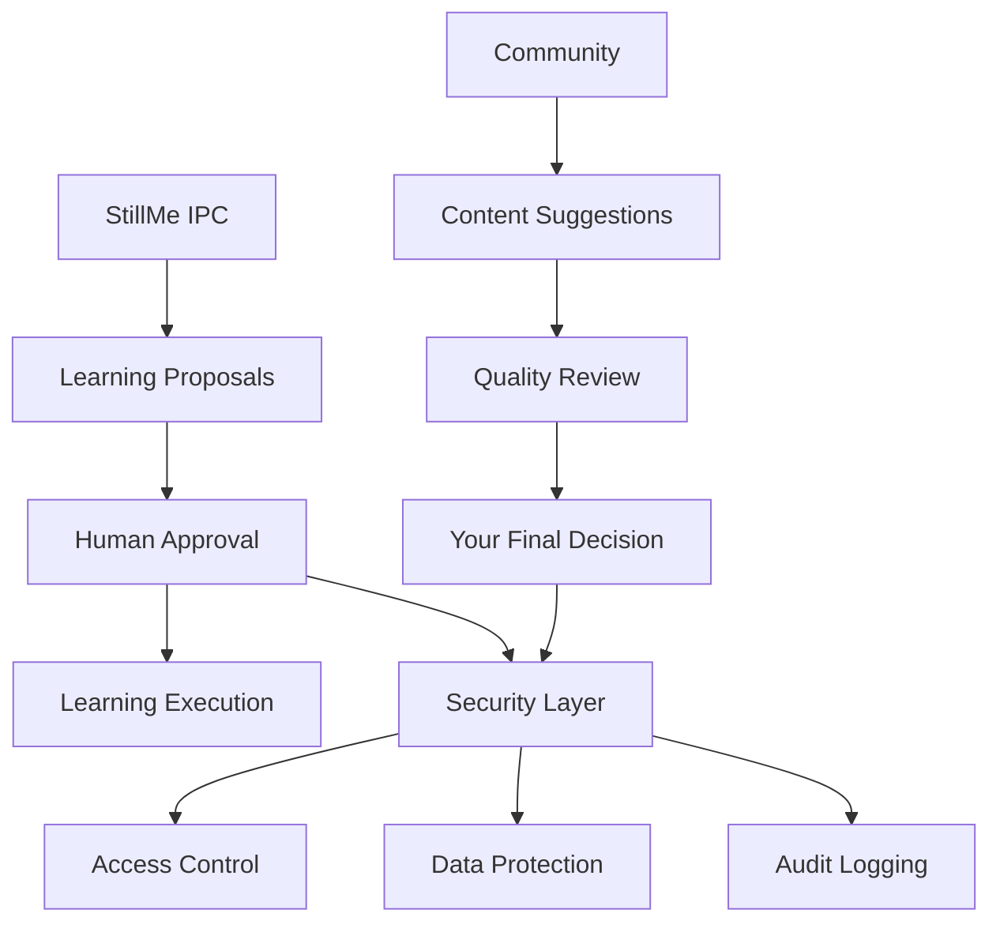

# 📊 StillMe IPC Enhanced Learning Dashboard

## Tổng quan

StillMe IPC Enhanced Learning Dashboard là phiên bản nâng cao của learning metrics dashboard, tích hợp **Human-in-the-Loop Learning System** với khả năng kiểm soát hoàn toàn quá trình học tập của AI.

## 🎯 Tính năng chính

### 📋 Learning Proposals System
- **Đề xuất học tập**: StillMe IPC tự động đề xuất những gì muốn học
- **Chi tiết đầy đủ**: Mô tả, mục tiêu, điều kiện tiên quyết, kết quả mong đợi
- **Đánh giá rủi ro**: Phân tích độ phức tạp, thời gian, giá trị thực tế
- **Điểm chất lượng**: Tự động đánh giá chất lượng nội dung (0.0-1.0)

### ✅ Human-in-the-Loop Approval
- **Quyền kiểm soát**: Chỉ bạn có quyền phê duyệt/từ chối
- **Nút Yes/No**: Giao diện đơn giản để quyết định
- **Lý do rõ ràng**: Có thể ghi lý do phê duyệt/từ chối
- **Bảo mật tuyệt đối**: Không ai khác có thể can thiệp

### 🔒 Security & Privacy Protection
- **Access Control**: Chỉ bạn truy cập được personal data
- **Audit Logging**: Ghi log tất cả hành động
- **Data Encryption**: Mã hóa dữ liệu nhạy cảm
- **Community Limitations**: Cộng đồng chỉ đề xuất, không điều khiển

### 📊 Enhanced Analytics
- **Proposal Analytics**: Thống kê đề xuất theo trạng thái
- **Quality Analysis**: Phân tích chất lượng vs thời gian
- **Learning Progress**: Theo dõi tiến độ học tập
- **Performance Metrics**: Chỉ số hiệu suất chi tiết

## 🚀 Cách sử dụng

### Khởi chạy Enhanced Dashboard

```bash
# Enhanced Dashboard (Recommended)
python scripts/launch_dashboard.py --type enhanced

# Với tùy chỉnh
python scripts/launch_dashboard.py --type enhanced --port 8503 --theme light

# Basic Dashboard (v1)
python scripts/launch_dashboard.py --type streamlit --port 8501
```

### Truy cập Dashboard

- **Enhanced**: http://localhost:8503
- **Basic**: http://localhost:8501

### Quy trình phê duyệt

1. **📋 Xem đề xuất**: StillMe IPC đề xuất nội dung học tập
2. **📖 Chi tiết**: Xem mục tiêu, điều kiện, kết quả mong đợi
3. **✅ Phê duyệt**: Bấm "Approve" nếu đồng ý
4. **❌ Từ chối**: Bấm "Reject" nếu không đồng ý
5. **🎓 Học tập**: StillMe IPC học sau khi được phê duyệt

## 📊 Learning Proposals Schema

### Proposal Structure
```yaml
id: string (UUID)
title: string
description: string
content: string
source: enum (rss|experience|manual|api|community)
priority: enum (low|medium|high|critical)
estimated_duration: int (minutes)
learning_objectives: array[string]
prerequisites: array[string]
expected_outcomes: array[string]
risk_assessment: object
quality_score: float (0.0-1.0)
status: enum (pending|approved|rejected|learning|completed|failed)
approval_required: boolean
metadata: object
```

### Risk Assessment
```yaml
complexity: string (low|medium|high)
time_required: string (low|medium|high)
prerequisites: string (low|medium|high)
practical_value: string (low|medium|high)
```

## 🔧 Cấu hình

### Environment Variables
```bash
# Enhanced Dashboard
STILLME_ENHANCED_DASHBOARD_PORT=8503
STILLME_ENHANCED_DASHBOARD_HOST=localhost
STILLME_ENHANCED_DASHBOARD_THEME=light

# Learning Proposals
STILLME_PROPOSALS_DB=data/learning/proposals.db
STILLME_PROPOSALS_AUTO_APPROVE=false
STILLME_PROPOSALS_REQUIRE_REASON=true

# Security
STILLME_SECURITY_ENABLED=true
STILLME_AUDIT_LOGGING=true
STILLME_DATA_ENCRYPTION=true
```

### Config File
```toml
# config/learning.toml
[enhanced_dashboard]
default_port = 8503
auto_refresh_interval = 30
max_proposals_per_page = 10
enable_analytics = true

[proposals]
auto_approve = false
require_reason = true
quality_threshold = 0.7
max_duration_hours = 8

[security]
audit_logging = true
data_encryption = true
access_control = true
```

## 📈 Data Flow



## 🛡️ Security Features

### Access Control
- **Owner Only**: Chỉ bạn có quyền phê duyệt
- **Read-Only Community**: Cộng đồng chỉ xem, không sửa
- **Encrypted Storage**: Dữ liệu được mã hóa
- **Audit Trail**: Theo dõi mọi thay đổi

### Privacy Protection
- **PII Redaction**: Tự động ẩn thông tin nhạy cảm
- **Data Anonymization**: Ẩn danh dữ liệu
- **Local Processing**: Xử lý cục bộ, không gửi cloud
- **Secure Communication**: Mã hóa giao tiếp

## 🎯 Use Cases

### 1. Personal Learning Control
- **Kiểm soát hoàn toàn** những gì StillMe IPC học
- **Phê duyệt thủ công** từng đề xuất học tập
- **Theo dõi tiến độ** và kết quả học tập

### 2. Community Collaboration
- **Đề xuất nội dung** từ cộng đồng
- **Đánh giá chất lượng** nội dung
- **Báo cáo lỗi** và cải thiện

### 3. Enterprise Security
- **Compliance** với quy định bảo mật
- **Audit logging** cho kiểm tra
- **Access control** cho nhóm người dùng

## 🚨 Troubleshooting

### Common Issues

#### Enhanced Dashboard không load
```bash
# Check dependencies
python -c "import streamlit, plotly, pandas; print('Dependencies OK')"

# Check proposals database
ls -la data/learning/
```

#### Không có proposals
```bash
# Create sample proposal
python -c "from stillme_core.learning.proposals import create_sample_proposal, get_proposals_manager; pm = get_proposals_manager(); pm.create_proposal(create_sample_proposal())"
```

#### Permission errors
```bash
# Check file permissions
chmod 755 data/learning/
chmod 644 data/learning/proposals.db
```

### Logs
```bash
# Enhanced dashboard logs
tail -f logs/enhanced_dashboard.log

# Proposals logs
tail -f logs/proposals.log

# Security logs
tail -f logs/security.log
```

## 📚 API Reference

### Learning Proposals
```python
from stillme_core.learning.proposals import get_proposals_manager, LearningProposal

# Get manager
pm = get_proposals_manager()

# Create proposal
proposal = LearningProposal(...)
pm.create_proposal(proposal)

# Get pending proposals
pending = pm.get_pending_proposals(limit=10)

# Approve proposal
pm.approve_proposal(proposal_id, "user", "Good content")

# Reject proposal
pm.reject_proposal(proposal_id, "user", "Not relevant")
```

### Enhanced Dashboard
```python
from dashboards.streamlit.enhanced_app import EnhancedLearningDashboard

# Create dashboard
dashboard = EnhancedLearningDashboard()

# Run dashboard
dashboard.run()
```

## 🎯 Roadmap

### Phase 2 (Current)
- ✅ Enhanced Dashboard với learning proposals
- ✅ Human-in-the-Loop approval workflow
- ✅ Security và privacy protection
- ✅ Analytics và reporting

### Phase 3 (Planned)
- 🔄 Advanced AI suggestions
- 🔄 Multi-user approval workflow
- 🔄 Integration với external systems
- 🔄 Mobile app support

### Phase 4 (Future)
- 🔮 Predictive learning analytics
- 🔮 Automated quality assessment
- 🔮 Community learning marketplace
- 🔮 Enterprise features

## 📞 Support

- **GitHub Issues**: https://github.com/stillme-ai/stillme/issues
- **Documentation**: https://docs.stillme.ai
- **Community**: https://discord.gg/stillme

## 📄 License

MIT License - Xem [LICENSE](LICENSE) file để biết thêm chi tiết.
