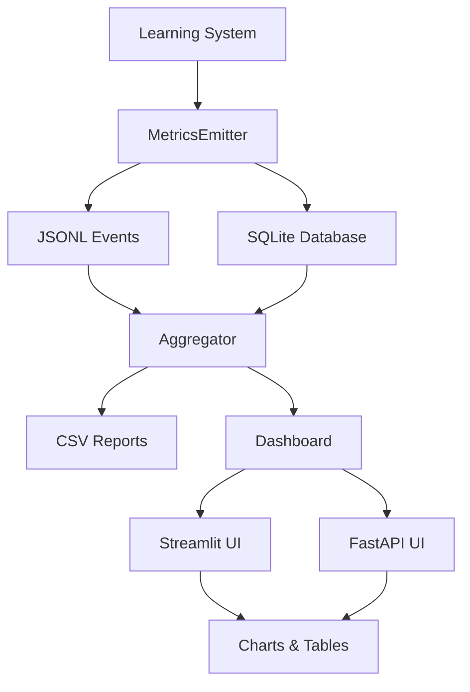

# 📊 StillMe IPC Learning Metrics Dashboard

## Tổng quan

StillMe IPC Learning Metrics Dashboard là hệ thống trực quan hóa metrics cho learning system, cung cấp insights về tiến độ học tập, hiệu suất, và chất lượng của AI system.

## 🎯 Tính năng chính

### 📈 Learning Curve
- **Pass Rate**: Tỷ lệ thành công của các bài test
- **Accuracy**: Độ chính xác của responses
- **Self-Assessment**: Điểm tự đánh giá của AI
- **Trend Analysis**: Phân tích xu hướng theo thời gian

### ⚡ Performance Metrics
- **Latency**: Thời gian phản hồi theo operation
- **Memory Usage**: Sử dụng bộ nhớ
- **CPU Usage**: Sử dụng CPU
- **Throughput**: Số lượng items xử lý/giây

### 📚 Ingest Volume
- **By Source**: RSS, Experience, Manual, API
- **Daily Trends**: Xu hướng theo ngày
- **Source Distribution**: Phân bố theo nguồn
- **Quality Metrics**: Chất lượng content

### 🚨 Error Analysis
- **Error Types**: Phân loại lỗi
- **Error Trends**: Xu hướng lỗi theo thời gian
- **Error Rate**: Tỷ lệ lỗi
- **Recovery Time**: Thời gian phục hồi

### 📋 Session Management
- **Recent Sessions**: 20 sessions gần nhất
- **Session Details**: Chi tiết từng session
- **Drill-down**: Xem chi tiết metrics
- **Status Tracking**: Theo dõi trạng thái

## 🚀 Cách sử dụng

### Khởi chạy Dashboard

```bash
# Streamlit Dashboard (Recommended)
python scripts/launch_dashboard.py

# Với tùy chỉnh
python scripts/launch_dashboard.py --port 8501 --theme light

# FastAPI Dashboard
python scripts/launch_dashboard.py --type fastapi --port 8000
```

### Truy cập Dashboard

- **Streamlit**: http://localhost:8501
- **FastAPI**: http://localhost:8000

### Bộ lọc

- **Date Range**: 7, 14, 30, 90 ngày
- **Learning Stage**: Infant, Child, Adolescent, Adult
- **Data Sources**: RSS, Experience, Manual, API
- **Components**: Learning, Memory, Router, API, AgentDev

## 📊 Metrics Schema

### Learning Metrics
```yaml
learning_pass_rate: float (0.0-1.0)
learning_accuracy: float (0.0-1.0)
self_assessment_score: float (0.0-1.0)
evolution_stage: int (0-3)
```

### Performance Metrics
```yaml
latency_ms: float
memory_usage_mb: float
cpu_usage_percent: float (0-100)
throughput_items_per_second: float
```

### Ingest Metrics
```yaml
ingested_items: int
source: string (rss|experience|manual|api)
quality_score: float (0.0-1.0)
risk_score: float (0.0-1.0)
approval_rate: float (0.0-1.0)
```

### Error Metrics
```yaml
errors_count: int
error_type: string
rollback_count: int
```

## 🔧 Cấu hình

### Environment Variables
```bash
# Dashboard
STILLME_DASHBOARD_PORT=8501
STILLME_DASHBOARD_HOST=localhost
STILLME_DASHBOARD_THEME=light

# Metrics
STILLME_METRICS_ENABLE=1
STILLME_METRICS_DB=data/metrics/metrics.db
STILLME_METRICS_EVENTS_DIR=data/metrics/events

# Auto-refresh
STILLME_DASHBOARD_REFRESH_INTERVAL=30
```

### Config File
```toml
# config/metrics.toml
[dashboard]
default_range_days = 30
refresh_interval_seconds = 30
max_data_points = 1000
enable_animations = true
chart_theme = "light"
```

## 📈 Data Flow



## 🛠️ Development

### Cài đặt Dependencies
```bash
pip install -r requirements-dashboard.txt
```

### Tạo Sample Data
```bash
# Tạo 7 ngày dữ liệu mẫu
python scripts/backfill_metrics.py --days 7

# Tạo reports
python scripts/aggregate_metrics.py --days 7
```

### Chạy Tests
```bash
# Test metrics system
python -c "from stillme_core.metrics import *; print('✅ Metrics system OK')"

# Test dashboard
python scripts/launch_dashboard.py --skip-checks
```

## 📱 Mobile Support

Dashboard hỗ trợ responsive design:
- **Mobile-first**: Tối ưu cho mobile
- **Touch-friendly**: Điều khiển bằng cảm ứng
- **Adaptive layout**: Tự động điều chỉnh layout
- **Offline mode**: Cache data khi offline

## 🔒 Security & Privacy

### PII Protection
- **Automatic redaction**: Tự động ẩn thông tin nhạy cảm
- **Data anonymization**: Ẩn danh dữ liệu
- **Audit logging**: Ghi log truy cập
- **Access control**: Kiểm soát truy cập

### Compliance
- **GDPR compliant**: Tuân thủ GDPR
- **CCPA compliant**: Tuân thủ CCPA
- **Data retention**: Chính sách lưu trữ
- **Encryption**: Mã hóa dữ liệu

## 🚨 Troubleshooting

### Common Issues

#### Dashboard không load
```bash
# Check dependencies
python scripts/launch_dashboard.py --skip-checks

# Check data
ls -la data/metrics/
```

#### Không có data
```bash
# Tạo sample data
python scripts/backfill_metrics.py --days 7

# Check database
sqlite3 data/metrics/metrics.db "SELECT COUNT(*) FROM runs;"
```

#### Performance issues
```bash
# Check memory usage
python -c "import psutil; print(f'Memory: {psutil.virtual_memory().percent}%')"

# Optimize database
python scripts/aggregate_metrics.py --compress-days 30
```

### Logs
```bash
# Dashboard logs
tail -f logs/dashboard.log

# Metrics logs
tail -f logs/metrics.log

# Error logs
tail -f logs/error.log
```

## 📚 API Reference

### Metrics Queries
```python
from stillme_core.metrics.queries import get_metrics_queries

queries = get_metrics_queries()

# Get daily summary
summary = queries.get_daily_summary("2025-09-28")

# Get learning curve
curve = queries.get_learning_curve(30)

# Get performance metrics
performance = queries.get_performance_metrics(7)
```

### Metrics Emitter
```python
from stillme_core.metrics.emitter import get_metrics_emitter, Metric

emitter = get_metrics_emitter()

# Start session
session_id = emitter.start_session("learning", "Daily training")

# Log metric
metric = Metric("learning_pass_rate", 0.85, "ratio", "daily")
emitter.log_metric(metric)

# End session
emitter.end_session(True, "Training completed")
```

## 🎯 Roadmap

### Phase 1 (Completed)
- ✅ Streamlit dashboard v1
- ✅ 4 charts chính
- ✅ Session drill-down
- ✅ Mobile responsive

### Phase 2 (Planned)
- 🔄 FastAPI dashboard
- 🔄 Real-time WebSocket
- 🔄 Advanced filtering
- 🔄 Export capabilities

### Phase 3 (Future)
- 🔮 Predictive analytics
- 🔮 Mobile app
- 🔮 Enterprise features
- 🔮 AI insights

## 📞 Support

- **GitHub Issues**: https://github.com/stillme-ai/stillme/issues
- **Documentation**: https://docs.stillme.ai
- **Community**: https://discord.gg/stillme

## 📄 License

MIT License - Xem [LICENSE](LICENSE) file để biết thêm chi tiết.
