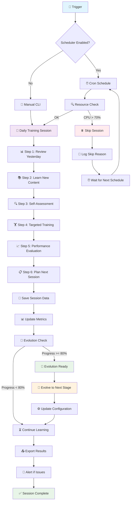

# 🔄 Sơ Đồ Quy Trình Học Tập của StillMe

## Mermaid Diagram

## Quy Trình Chi Tiết

### 1. **Trigger Phase**
- **Manual**: `python -m cli.evolutionary_learning train`
- **Scheduled**: Cron job (chưa implement)
- **Event-based**: Webhook trigger (chưa implement)

### 2. **Resource Check**
- CPU usage < 70%
- Memory available > 512MB
- Token budget remaining > 1000
- No concurrent sessions running

### 3. **Training Session (6 Steps)**
1. **Review Yesterday**: Phân tích kinh nghiệm 24h qua
2. **Learn New Content**: Học từ RSS feeds (chưa implement)
3. **Self-Assessment**: Đánh giá bản thân và tìm gaps
4. **Targeted Training**: Luyện tập có mục tiêu
5. **Performance Evaluation**: Đánh giá hiệu suất
6. **Plan Next Session**: Lập kế hoạch phiên tiếp theo

### 4. **Evolution Check**
- Tính toán evolution progress
- Nếu >= 80% → Sẵn sàng tiến hóa
- Nếu < 80% → Tiếp tục học tập

### 5. **Data Persistence**
- Lưu session data vào database
- Cập nhật metrics và performance history
- Export kết quả ra file JSON

### 6. **Monitoring & Alerting**
- Log tất cả hoạt động
- Gửi alert nếu có lỗi
- Tạo báo cáo hàng ngày

## Trạng Thái Hiện Tại

- ✅ **Manual CLI**: Hoạt động
- ❌ **Scheduler**: Chưa implement
- ❌ **Resource Limits**: Chưa implement
- ❌ **Event Triggers**: Chưa implement
- ❌ **Alerting**: Chưa implement
- ✅ **Session Tracking**: Hoạt động
- ✅ **Evolution Logic**: Hoạt động
- ✅ **Data Export**: Hoạt động
