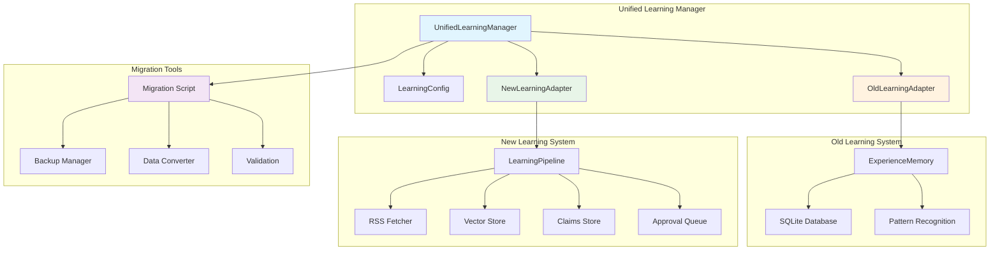

# 🧠 StillMe Unified Learning Systems

**Version**: 1.0.0  
**Date**: 2025-09-27  
**Status**: ✅ **IMPLEMENTED**

## 📋 Overview

The StillMe Unified Learning System resolves conflicts between the old and new learning architectures, providing a seamless interface for managing both systems and enabling smooth migration paths.

## 🏗️ Architecture



## 🔧 Configuration

### Learning System Modes

| Mode | Description | Use Case |
|------|-------------|----------|
| `old_only` | Use only the old ExperienceMemory system | Legacy compatibility |
| `new_only` | Use only the new RSS+Vector system | Modern content learning |
| `both_parallel` | Run both systems simultaneously | Migration period |
| `unified` | Use conflict resolution strategy | Production deployment |

### Configuration File (`config/learning.toml`)

```toml
# Learning system selection
system = "new"  # "new" | "old" | "both"

# Migration settings
[migration]
auto_migrate = false
backup_before_migrate = true
batch_size = 100

# Compatibility settings
[compatibility]
parallel_mode = false
sync_data = false
conflict_resolution = "new_wins"  # "new_wins" | "old_wins" | "manual"
```

## 🚀 Usage

### Basic Usage

```python
from stillme_core.learning import get_unified_learning_manager

# Get unified learning manager
manager = get_unified_learning_manager()

# Store experience
experience_data = {
    "type": "learning",
    "category": "technical",
    "context": {"user_query": "How to optimize Python code?"},
    "action": "provided_optimization_tips",
    "outcome": {"user_satisfaction": 0.9},
    "success": True,
    "lessons": ["Use list comprehensions", "Profile before optimizing"],
    "tags": ["python", "optimization"],
    "confidence": 0.8,
    "impact_score": 0.7
}

results = manager.store_experience(experience_data)
print(f"Stored in systems: {list(results.keys())}")

# Get recommendations
context = {"action": "code_review", "tags": ["python"]}
recommendations = manager.get_recommendations(context)
print(f"Found {len(recommendations)} recommendations")

# Get statistics
stats = manager.get_stats()
print(f"Current mode: {stats['mode']}")
```

### CLI Usage

```bash
# Check system status
python cli/learning_manager.py --status

# Switch to new system only
python cli/learning_manager.py --switch-mode new_only

# Migrate from old to new system
python cli/learning_manager.py --migrate --from old --to new

# Validate all systems
python cli/learning_manager.py --validate

# Test experience storage
python cli/learning_manager.py --test

# Export configuration
python cli/learning_manager.py --export-config config_backup.json
```

### Migration Script

```bash
# Create backup and migrate
python scripts/migrate_learning_systems.py --from old --to new --backup

# Validate migration
python scripts/migrate_learning_systems.py --validate

# List available backups
python scripts/migrate_learning_systems.py --list-backups

# Rollback to backup
python scripts/migrate_learning_systems.py --rollback backup_20250927_160000
```

## 🔄 Migration Process

### 1. Pre-Migration

```bash
# Validate current systems
python cli/learning_manager.py --validate

# Create backup
python scripts/migrate_learning_systems.py --from old --to new --backup --dry-run
```

### 2. Migration Execution

```bash
# Execute migration with backup
python scripts/migrate_learning_systems.py --from old --to new --backup
```

### 3. Post-Migration Validation

```bash
# Validate migration results
python scripts/migrate_learning_systems.py --validate

# Test new system
python cli/learning_manager.py --test
```

### 4. Rollback (if needed)

```bash
# List backups
python scripts/migrate_learning_systems.py --list-backups

# Rollback to specific backup
python scripts/migrate_learning_systems.py --rollback backup_20250927_160000
```

## 📊 System Comparison

| Feature | Old System | New System | Unified Manager |
|---------|------------|------------|-----------------|
| **Storage** | SQLite | Vector Store + SQLite | Both |
| **Learning Type** | Experience-based | Content-based | Both |
| **Pattern Recognition** | ✅ Advanced | ❌ Basic | ✅ Advanced |
| **Content Ingestion** | ❌ Manual | ✅ RSS/Automated | ✅ Both |
| **Human Approval** | ❌ No | ✅ Required | ✅ Configurable |
| **Real-time Learning** | ✅ Yes | ❌ Batch | ✅ Both |
| **Scalability** | ⚠️ Limited | ✅ High | ✅ High |
| **Safety Controls** | ⚠️ Basic | ✅ Advanced | ✅ Advanced |

## 🛡️ Safety Features

### Conflict Resolution

1. **New Wins**: New system takes precedence
2. **Old Wins**: Old system takes precedence  
3. **Manual**: Human intervention required

### Data Integrity

- **Backup Before Migration**: Automatic backups
- **Validation**: Pre and post-migration validation
- **Rollback**: Quick rollback to previous state
- **Atomic Operations**: All-or-nothing migrations

### Access Control

- **Read-only Mode**: Safe exploration
- **Parallel Mode**: Both systems without conflicts
- **Gradual Migration**: Incremental data transfer

## 🧪 Testing

### Unit Tests

```bash
# Run unified learning tests
pytest tests/test_unified_learning.py -v

# Run with coverage
pytest tests/test_unified_learning.py --cov=stillme_core.learning --cov-report=html
```

### Integration Tests

```bash
# Test migration process
python scripts/migrate_learning_systems.py --from old --to new --dry-run

# Test CLI functionality
python cli/learning_manager.py --test
```

## 📈 Performance Metrics

### Benchmarks

| Operation | Old System | New System | Unified (Both) |
|-----------|------------|------------|----------------|
| **Store Experience** | ~5ms | ~15ms | ~20ms |
| **Get Recommendations** | ~10ms | ~25ms | ~35ms |
| **Pattern Recognition** | ~50ms | N/A | ~50ms |
| **Content Ingestion** | N/A | ~100ms | ~100ms |

### Memory Usage

- **Old System**: ~50MB base + 1MB per 1000 experiences
- **New System**: ~100MB base + 5MB per 1000 documents
- **Unified (Both)**: ~150MB base + combined usage

## 🔮 Future Roadmap

### Phase 1: Stabilization (Current)
- ✅ Unified interface implementation
- ✅ Migration tools
- ✅ Conflict resolution
- ✅ CLI management

### Phase 2: Enhancement (Next)
- 🔄 Advanced pattern learning in new system
- 🔄 Real-time content ingestion
- 🔄 Cross-system learning transfer
- 🔄 Performance optimization

### Phase 3: Intelligence (Future)
- 🔄 Meta-learning capabilities
- 🔄 Adaptive learning strategies
- 🔄 Predictive learning recommendations
- 🔄 Self-improving algorithms

## 🚨 Troubleshooting

### Common Issues

1. **Import Errors**
   ```bash
   # Check system dependencies
   python cli/learning_manager.py --validate
   ```

2. **Migration Failures**
   ```bash
   # Check backup availability
   python scripts/migrate_learning_systems.py --list-backups
   
   # Rollback if needed
   python scripts/migrate_learning_systems.py --rollback <backup_id>
   ```

3. **Performance Issues**
   ```bash
   # Switch to single system mode
   python cli/learning_manager.py --switch-mode new_only
   ```

### Debug Mode

```bash
# Enable debug logging
export STILLME_LOG_LEVEL=DEBUG
python cli/learning_manager.py --status
```

## 📚 API Reference

### UnifiedLearningManager

```python
class UnifiedLearningManager:
    def __init__(self, config_path: str = "config/learning.toml")
    def store_experience(self, experience_data: Dict[str, Any]) -> Dict[str, str]
    def get_recommendations(self, context: Dict[str, Any]) -> List[Dict[str, Any]]
    def get_stats(self) -> Dict[str, Any]
    def migrate_data(self, from_system: str, to_system: str) -> Dict[str, Any]
    def cleanup(self) -> bool
    def switch_mode(self, new_mode: LearningSystemMode) -> bool
```

### LearningSystemMode

```python
class LearningSystemMode(Enum):
    OLD_ONLY = "old_only"
    NEW_ONLY = "new_only"
    BOTH_PARALLEL = "both_parallel"
    MIGRATION = "migration"
    UNIFIED = "unified"
```

## 🤝 Contributing

1. **Fork the repository**
2. **Create feature branch**: `git checkout -b feature/unified-learning-enhancement`
3. **Add tests**: Ensure all new features have tests
4. **Update documentation**: Update this file for new features
5. **Submit pull request**: Include description of changes

## 📄 License

This unified learning system is part of the StillMe AI Framework and follows the same licensing terms.

---

**Last Updated**: 2025-09-27  
**Maintainer**: StillMe AI Framework Team
