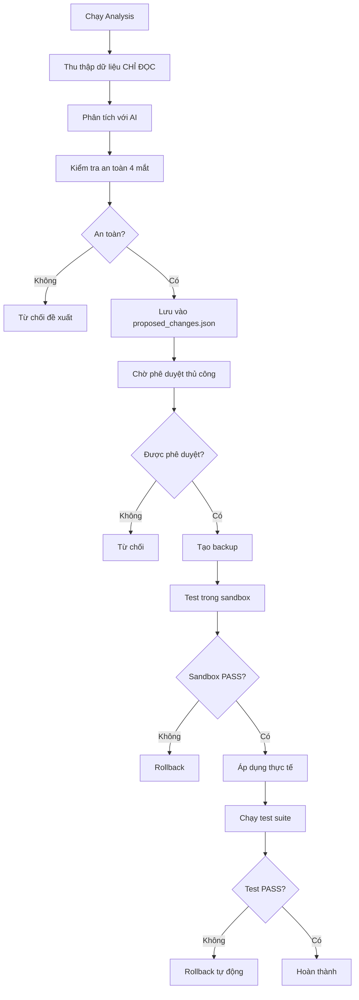

# 🧠 SelfImprovementManager - Module Tự Cải Thiện An Toàn

## 🎯 **GIỚI THIỆU**

`SelfImprovementManager` là module tự cải thiện với **cơ chế an toàn tối đa** được thiết kế để StillMe AI có thể tự phân tích, đề xuất và áp dụng các cải tiến một cách an toàn và có kiểm soát.

## 🚨 **QUY TẮC AN TOÀN BẮT BUỘC (HIẾN PHÁP CỦA STILLME)**

### **1. CHỈ ĐỌC, KHÔNG GHI**
- **Mặc định**: Module chỉ được phép **ĐỌC** dữ liệu và tạo báo cáo đề xuất
- **Không được quyền**: Trực tiếp sửa bất kỳ file code, prompt hay config nào
- **Chế độ**: `read_only_mode = True` (không thể tắt)

### **2. ĐỀ XUẤT PHẢI ĐƯỢC DUYỆT**
- Mọi đề xuất thay đổi được lưu vào `proposed_changes.json`
- **CHỜ** sự phê duyệt **THỦ CÔNG** từ developer
- Hoặc phải vượt qua bài test tự động khắt khe

### **3. VÒNG KIỂM SOÁT CHẶT CHẼ (4 MẮT)**
```
SelfImprovementManager → EthicalCoreSystem → ContentIntegrityFilter → Test Suite
```
- **Bước 1**: Phân tích và đề xuất
- **Bước 2**: Kiểm tra đạo đức (EthicalCoreSystem)
- **Bước 3**: Kiểm tra an toàn (ContentIntegrityFilter)
- **Bước 4**: Chạy toàn bộ test suite
- **Chỉ khi tất cả PASS** → Đề xuất mới được áp dụng

### **4. SANDOX MODE**
- Mọi thay đổi được test trong môi trường sandbox trước
- Sandbox: Bản sao isolated của StillMe
- Chỉ áp dụng thực tế khi sandbox test PASS

### **5. ROLLBACK TỰ ĐỘNG**
- Tự động tạo backup trước khi thay đổi
- Nếu bất kỳ test quan trọng nào FAIL → Lập tức rollback
- Emergency rollback cho toàn bộ hệ thống

## 🔧 **KIẾN TRÚC MODULE**

### **Core Classes:**
```python
class SelfImprovementManager:
    - run_analysis()           # Phân tích dữ liệu (CHỈ ĐỌC)
    - get_proposed_changes()   # Lấy đề xuất
    - approve_change()         # Phê duyệt thay đổi
    - apply_approved_changes() # Áp dụng (SANDOX + ROLLBACK)
    - emergency_rollback_all() # Rollback khẩn cấp

@dataclass
class ProposedChange:
    - id, timestamp, change_type
    - file_path, description
    - current_content, proposed_content
    - reason, risk_level
    - safety_checks, test_results
    - approved, applied, rollback_available

@dataclass  
class SafetyReport:
    - change_id, ethical_check
    - integrity_check, test_check
    - overall_safe, warnings, recommendations
```

### **Safety Modules Integration:**
- **EthicalCoreSystem**: Kiểm tra đạo đức
- **ContentIntegrityFilter**: Kiểm tra an toàn nội dung
- **Test Suite**: Chạy toàn bộ tests

## 📁 **CẤU TRÚC FILES**

```
modules/
├── self_improvement_manager.py    # Module chính
├── ethical_core_system.py         # Kiểm tra đạo đức
└── content_integrity_filter.py    # Kiểm tra an toàn

config/
└── self_improvement_config.json   # Cấu hình an toàn

tests/
└── test_self_improvement_manager.py # Unit tests

backups/
└── self_improvement/              # Backups tự động

sandbox/
└── self_improvement/              # Môi trường test

proposed_changes.json              # Đề xuất chờ duyệt
```

## 🚀 **CÁCH SỬ DỤNG**

### **1. Khởi tạo:**
```python
from modules.self_improvement_manager import create_self_improvement_manager

# Tạo instance với cấu hình an toàn
manager = create_self_improvement_manager()
```

### **2. Chạy phân tích (CHỈ ĐỌC):**
```python
# Phân tích dữ liệu và tạo đề xuất
result = manager.run_analysis()
print(f"Status: {result['status']}")
print(f"Proposed changes: {result['proposed_changes']}")
```

### **3. Xem đề xuất:**
```python
# Lấy danh sách đề xuất
changes = manager.get_proposed_changes()
for change in changes:
    print(f"ID: {change['id']}")
    print(f"Type: {change['change_type']}")
    print(f"Risk: {change['risk_level']}")
    print(f"Description: {change['description']}")
```

### **4. Phê duyệt thay đổi:**
```python
# Phê duyệt một đề xuất
manager.approve_change("change_id_123", approved=True)

# Từ chối một đề xuất
manager.approve_change("change_id_456", approved=False)
```

### **5. Áp dụng thay đổi (SANDOX + ROLLBACK):**
```python
# Áp dụng các đề xuất đã được phê duyệt
result = manager.apply_approved_changes()
print(f"Applied: {result['applied']}")
print(f"Failed: {result['failed']}")
print(f"Rollbacks: {result['rollbacks']}")
```

### **6. Rollback khẩn cấp:**
```python
# Rollback tất cả thay đổi trong trường hợp khẩn cấp
result = manager.emergency_rollback_all()
print(f"Emergency rollback: {result['rollback_count']} successful")
```

### **7. Báo cáo an toàn:**
```python
# Tạo báo cáo an toàn tổng quan
report = manager.get_safety_report()
print(f"Total proposed: {report['total_proposed']}")
print(f"Approved: {report['approved']}")
print(f"Applied: {report['applied']}")
print(f"Safety mode: {report['safety_mode']}")
```

## ⚙️ **CẤU HÌNH AN TOÀN**

### **File: `config/self_improvement_config.json`**

```json
{
  "safety_mode": true,                    // Luôn ở chế độ an toàn
  "read_only_mode": true,                 // Chỉ đọc, không ghi
  "auto_approve_low_risk": false,         // Không tự động phê duyệt
  "max_proposed_changes": 10,             // Giới hạn đề xuất
  "backup_retention_days": 30,            // Lưu backup 30 ngày
  "sandbox_timeout_seconds": 300,         // Timeout sandbox 5 phút
  
  "forbidden_file_patterns": [            // Files bị cấm chỉnh sửa
    "*.pyc", "__pycache__", "*.log",
    "backup_legacy", "tests/fixtures", "node_modules"
  ],
  
  "critical_files": [                     // Files quan trọng cần approval đặc biệt
    "framework.py", "app.py",
    "modules/ethical_core_system.py",
    "modules/content_integrity_filter.py"
  ],
  
  "risk_levels": {                        // Cấp độ rủi ro
    "LOW": {"auto_approve": false},
    "MEDIUM": {"require_manual_review": true},
    "HIGH": {"require_sandbox_test": true},
    "CRITICAL": {"require_emergency_rollback": true}
  }
}
```

## 🧪 **TESTING**

### **Chạy Unit Tests:**
```bash
# Test toàn bộ SelfImprovementManager
python -m pytest tests/test_self_improvement_manager.py -v

# Test với coverage
python -m pytest tests/test_self_improvement_manager.py --cov=modules.self_improvement_manager

# Test integration
python -m pytest tests/test_self_improvement_manager.py::TestSelfImprovementManagerIntegration -v
```

### **Test Categories:**
- **Unit Tests**: Test từng method riêng lẻ
- **Integration Tests**: Test workflow đầy đủ
- **Safety Tests**: Test các cơ chế an toàn
- **Rollback Tests**: Test khả năng rollback

## 📊 **MONITORING & LOGGING**

### **Log Levels:**
- **INFO**: Hoạt động bình thường
- **WARNING**: Cảnh báo an toàn
- **ERROR**: Lỗi cần chú ý
- **CRITICAL**: Lỗi nghiêm trọng

### **Log Files:**
- `logs/self_improvement.log`: Log chính
- `logs/safety_checks.log`: Log kiểm tra an toàn
- `logs/rollback.log`: Log rollback

### **Metrics:**
- Số lượng đề xuất được tạo
- Tỷ lệ đề xuất được phê duyệt
- Tỷ lệ rollback
- Thời gian xử lý sandbox

## 🚨 **CẢNH BÁO QUAN TRỌNG**

### **⚠️ TUYỆT ĐỐI KHÔNG:**
- Tắt `safety_mode` hoặc `read_only_mode`
- Bỏ qua các bước kiểm tra an toàn
- Áp dụng thay đổi mà không test sandbox
- Xóa hoặc sửa file backup

### **✅ LUÔN LÀM:**
- Kiểm tra báo cáo an toàn trước khi áp dụng
- Backup thủ công trước khi thay đổi lớn
- Test trong môi trường development trước
- Monitor logs sau khi áp dụng thay đổi

## 🔄 **WORKFLOW AN TOÀN**



## 📈 **ROADMAP**

### **Version 1.1:**
- [ ] Tích hợp với AI model thực tế
- [ ] Machine learning cho risk assessment
- [ ] Web dashboard cho monitoring

### **Version 1.2:**
- [ ] Multi-environment support
- [ ] Advanced rollback strategies
- [ ] Performance optimization

### **Version 2.0:**
- [ ] Distributed safety checks
- [ ] Real-time collaboration
- [ ] Advanced analytics

---

**🎉 SelfImprovementManager - An toàn tối đa, hiệu quả tối ưu!**

*"Safety first, improvement second" - StillMe AI Framework*
