```mermaid
graph TB
    subgraph "Core Framework"
        A[StillMeFramework] --> B[Router Interface]
        B --> C[StubRouter - OSS]
        B --> D[ProRouter - Private]
        A --> E[Core Modules]
    end
    
    subgraph "Learning Systems - CONFLICT"
        F[Old Learning System]
        G[New Learning System]
        F --> H[ExperienceMemory]
        F --> I[DailyLearningManager]
        G --> J[Learning Pipeline]
        G --> K[Vector Store]
        G --> L[Claims Store]
    end
    
    subgraph "Memory Systems"
        M[LayeredMemoryV1]
        N[SecureMemoryManager]
        O[ContentIntegrityFilter]
    end
    
    subgraph "Security & Safety"
        P[Kill Switch]
        Q[Rationale Logging]
        R[Secrets Sweep]
        S[Ethics Tests]
    end
    
    subgraph "External Dependencies"
        T[OpenRouter API]
        U[RSS Feeds]
        V[SQLite DB]
        W[FAISS Vector DB]
    end
    
    A --> F
    A --> G
    A --> M
    A --> P
    G --> U
    G --> V
    G --> W
    F --> V
    
    style F fill:#ffcccc
    style G fill:#ccffcc
    style A fill:#ffffcc
```

# 🔍 StillMe Architecture Analysis & Conflict Detection

**Generated:** 2025-09-27T15:45:00  
**Status:** CRITICAL ISSUES DETECTED

## 📊 Executive Summary

Sau khi kiểm tra toàn diện hệ thống StillMe, tôi phát hiện **nhiều xung đột nghiêm trọng** giữa hệ thống learning cũ và mới, cùng với các vấn đề bảo mật và tích hợp.

### 🚨 Critical Issues Found

1. **Xung đột Learning Systems**: 2 hệ thống learning song song
2. **Import Errors**: 52 lỗi import trong test suite
3. **Security Issues**: 13 high severity vulnerabilities
4. **Missing Dependencies**: Nhiều module không tồn tại
5. **API Compatibility**: Lỗi khởi tạo UnifiedAPIManager

## 🏗️ StillMe Architecture Flow



## 🔍 Detailed Conflict Analysis

### 1. Learning Systems Conflict

**Old System** (`stillme_core/core/self_learning/`):
- `ExperienceMemory`: SQLite-based experience storage
- Pattern recognition và learning từ experiences
- Behavioral pattern extraction
- Success/failure tracking

**New System** (`stillme_core/learning/`):
- RSS-based content ingestion
- Vector store (FAISS) cho embeddings
- Claims store (SQLite) cho structured data
- Human approval workflow
- Daily digest reports

**Xung đột**:
- Cả 2 đều dùng SQLite nhưng schema khác nhau
- Cả 2 đều có learning capabilities nhưng approach khác nhau
- Có thể ghi đè dữ liệu lẫn nhau

### 2. Import Dependencies Issues

**Missing Modules**:
- `stillme_core.ai_manager` - Core AI management
- `stillme_core.controller` - Agent controller
- `stillme_core.safety_guard` - Safety mechanisms
- `stillme_core.executor` - Code execution
- `stillme_core.sandbox` - Sandbox environment

**Broken Imports**:
- `AsyncHttpClient` từ `common` module
- `SecureHttpClient` từ `common.http`
- Nhiều test files không thể import

### 3. Security Vulnerabilities

**High Severity (13 issues)**:
- Hardcoded secrets trong code
- SQL injection vulnerabilities
- Insecure file operations
- Missing input validation

## 🎯 Recommended Actions

### Immediate (1-2 days)

1. **Fix Import Errors**:
   ```bash
   # Sửa lỗi Tuple import
   # Tạo missing modules hoặc remove broken tests
   # Fix AsyncHttpClient dependency
   ```

2. **Resolve Learning Conflict**:
   ```bash
   # Quyết định: merge 2 systems hoặc disable một cái
   # Tạo migration plan cho data
   # Implement compatibility layer
   ```

3. **Security Fixes**:
   ```bash
   # Fix hardcoded secrets
   # Add input validation
   # Secure file operations
   ```

### Short-term (1-2 weeks)

1. **System Integration**:
   - Tạo unified learning interface
   - Implement data migration tools
   - Add comprehensive testing

2. **Architecture Cleanup**:
   - Remove duplicate functionality
   - Standardize data schemas
   - Implement proper error handling

## 🧪 Testing Strategy

### Parallel Testing Approach

1. **Isolation Testing**:
   ```bash
   # Test old system independently
   python -m pytest tests/test_old_learning/ -v
   
   # Test new system independently  
   python -m pytest tests/test_new_learning/ -v
   ```

2. **Integration Testing**:
   ```bash
   # Test both systems together
   python -m pytest tests/test_learning_integration/ -v
   ```

3. **Performance Testing**:
   ```bash
   # Compare performance
   python scripts/performance_comparison.py
   ```

### A/B Testing Plan

1. **Phase 1**: Run both systems in parallel
2. **Phase 2**: Compare outputs and performance
3. **Phase 3**: Gradually migrate to unified system
4. **Phase 4**: Remove old system

## 📈 Risk Assessment

### High Risk
- **Data Loss**: 2 systems có thể ghi đè dữ liệu
- **Security**: 13 high severity issues
- **Performance**: Duplicate processing

### Medium Risk
- **Compatibility**: API changes break existing code
- **Testing**: 52 import errors prevent proper testing

### Low Risk
- **User Experience**: Temporary instability during migration

## 🔧 Implementation Plan

### Week 1: Emergency Fixes
- [ ] Fix all import errors
- [ ] Resolve security vulnerabilities
- [ ] Create system isolation

### Week 2: Integration Planning
- [ ] Design unified learning interface
- [ ] Plan data migration strategy
- [ ] Create compatibility layer

### Week 3: Implementation
- [ ] Implement unified system
- [ ] Migrate data safely
- [ ] Add comprehensive tests

### Week 4: Validation
- [ ] Performance testing
- [ ] Security audit
- [ ] User acceptance testing

## 📋 Next Steps

1. **Immediate**: Fix critical import errors
2. **Today**: Resolve learning system conflict
3. **This week**: Implement security fixes
4. **Next week**: Complete system integration

## 🎯 Success Criteria

- [ ] 0 import errors in test suite
- [ ] 0 high severity security issues
- [ ] Unified learning system working
- [ ] All tests passing
- [ ] Performance maintained or improved

---

**Kết luận**: Hệ thống StillMe có tiềm năng lớn nhưng cần được refactor và tích hợp cẩn thận để tránh xung đột và đảm bảo tính ổn định.
