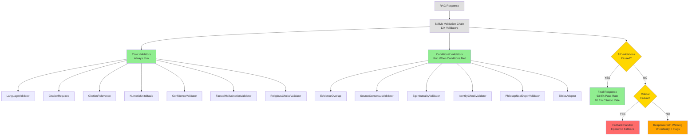

# StillMe Validation Chain: Text Diagram

## Title
**StillMe Validation Chain: Multi-Layer Hallucination Reduction**
*12+ Validators | Validation Pass Rate 93.9% | Zero Hallucination in Custom Tests*

---

## Flow Diagram (Text Format)

```
                    ┌─────────────────────────┐
                    │ Start: RAG Response     │
                    └───────────┬─────────────┘
                                │
                                ▼
        ┌──────────────────────────────────────────────────────┐
        │  StillMe Validation Chain (12+ Validators)          │
        │                                                      │
        │  ┌──────────────────┐    ┌──────────────────────┐ │
        │  │ CORE VALIDATORS   │    │ CONDITIONAL VALIDATORS│ │
        │  │ (Always Run)     │    │ (Run When Conditions)│ │
        │  ├──────────────────┤    ├──────────────────────┤ │
        │  │ 1. Language      │    │ 8. EvidenceOverlap   │ │
        │  │    Validator     │    │    (has context)     │ │
        │  │                  │    │                      │ │
        │  │ 2. Citation      │    │ 9. SourceConsensus   │ │
        │  │    Required      │    │    Validator         │ │
        │  │                  │    │    (2+ sources)     │ │
        │  │ 3. Citation      │    │                      │ │
        │  │    Relevance     │    │ 10. EgoNeutrality    │ │
        │  │                  │    │     Validator        │ │
        │  │ 4. NumericUnits  │    │     (has context)   │ │
        │  │    Basic         │    │                      │ │
        │  │                  │    │ 11. IdentityCheck    │ │
        │  │ 5. Confidence    │    │     Validator       │ │
        │  │    Validator     │    │     (if enabled)    │ │
        │  │                  │    │                      │ │
        │  │ 6. Factual       │    │ 12. Philosophical  │ │
        │  │    Hallucination │    │     DepthValidator  │ │
        │  │    Validator     │    │     (philosophical) │ │
        │  │                  │    │                      │ │
        │  │ 7. Religious     │    │ 13. EthicsAdapter   │ │
        │  │    Choice        │    │                      │ │
        │  │    Validator     │    │                      │ │
        │  └──────────────────┘    └──────────────────────┘ │
        └──────────────────────────────────────────────────────┘
                                │
                                ▼
                    ┌───────────────────────┐
                    │ All Validations       │
                    │ Passed?              │
                    └───┬───────────────┬───┘
                        │               │
                    YES │               │ NO
                        │               │
                        ▼               ▼
        ┌───────────────────────┐  ┌──────────────────┐
        │ Final Response with   │  │ Critical         │
        │ Citations + Metadata  │  │ Failure?         │
        │                       │  └───┬──────────┬───┘
        │ • 93.9% Validation    │      │          │
        │   Pass Rate           │   YES│          │NO
        │ • Zero Hallucination  │      │          │
        │   in Custom Tests     │      ▼          ▼
        │ • 91.1% Citation Rate │  ┌─────────┐ ┌──────────────┐
        │   (full) / 100%       │  │Fallback │ │Response with│
        │   (subset)            │  │Handler  │ │Warning      │
        └───────────────────────┘  │         │ │             │
                                   │Epistemic│ │Uncertainty +│
                                   │Fallback │ │Validator     │
                                   │Response │ │Flags         │
                                   │         │ │             │
                                   │Honest   │ │Non-critical  │
                                   │"I don't │ │warnings     │
                                   │ know"   │ │             │
                                   └─────────┘ └──────────────┘
```

---

## Validator Details

### Core Validators (Always Run)

1. **LanguageValidator**
   - Description: Check language match
   - Purpose: Prevents language drift

2. **CitationRequired**
   - Description: Ensure citations are present
   - Purpose: Requires source attribution

3. **CitationRelevance**
   - Description: Validate citation quality
   - Purpose: Ensures citations are relevant

4. **NumericUnitsBasic**
   - Description: Validate numeric/units claims
   - Purpose: Checks numeric accuracy

5. **ConfidenceValidator**
   - Description: Detect when to express uncertainty
   - Purpose: Ensures intellectual humility

6. **FactualHallucinationValidator**
   - Description: Detect factual errors
   - Purpose: Prevents false information

7. **ReligiousChoiceValidator**
   - Description: Reject religion choice in responses
   - Purpose: Maintains neutrality

### Conditional Validators (Run When Conditions Met)

8. **EvidenceOverlap**
   - Description: Check content matches context
   - Condition: Only when has context
   - Purpose: Validates RAG context alignment

9. **SourceConsensusValidator**
   - Description: Detect contradictions between sources
   - Condition: Only when has 2+ sources
   - Purpose: Ensures source consistency

10. **EgoNeutralityValidator**
    - Description: Catch 'Hallucination of Experience'
    - Condition: Only when has context
    - Purpose: Prevents anthropomorphism

11. **IdentityCheckValidator**
    - Description: Prevent anthropomorphism
    - Condition: If enabled
    - Purpose: Maintains AI identity clarity

12. **PhilosophicalDepthValidator**
    - Description: Validate philosophical depth
    - Condition: Only for philosophical questions
    - Purpose: Ensures philosophical rigor

13. **EthicsAdapter**
    - Description: Ethical content filtering
    - Purpose: Blocks harmful content

---

## Decision Flow

1. **All Validations Passed?**
   - **YES** → Final Response with Citations + Transparency Metadata
   - **NO** → Check Critical Failure

2. **Critical Failure?**
   - **YES** → Fallback Handler (Epistemic Fallback Response)
   - **NO** → Response with Warning (Uncertainty + Validator Flags)

---

## Metrics

- **12+ Validators**: Multi-layer validation chain
- **93.9% Validation Pass Rate**: High-quality, grounded responses
- **91.1% Citation Rate (full)**: Industry-leading source attribution
- **100% Citation Rate (subset)**: Perfect on subset evaluation
- **Zero Hallucination in Custom Tests**: Proven reduction of false information

---

## Notes for Manual Diagram Creation

If creating diagram manually (draw.io, Lucidchart, etc.):

1. Use exact validator names as listed above
2. Verify spelling: hallucination, anthropomorphism, uncertainty, epistemic, philosophical
3. Include all 13 validators (7 core + 6 conditional)
4. Use color coding: GREEN (validators), YELLOW (decisions), RED (failures), ORANGE (warnings)
5. Ensure all metrics are accurate: 93.9%, 91.1%, 100%, 12+

---

## Alternative: Use Mermaid Diagram




