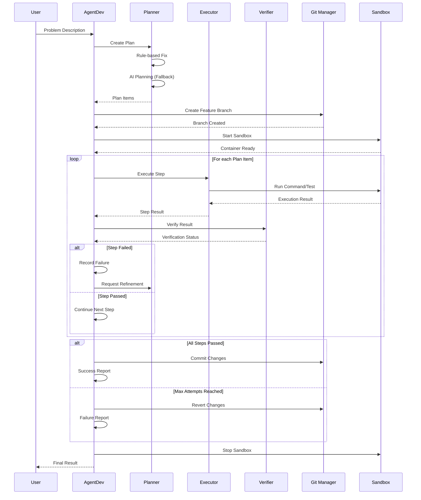

# 🔍 **KIỂM TOÁN TÍCH HỢP AGENTDEV - BÁO CÁO HOÀN CHỈNH**

## **📋 TỔNG QUAN**

**Ngày kiểm toán:** 12/09/2025  
**Phiên bản:** StillMe AI Framework v2.0  
**Mục tiêu:** Đánh giá khách quan mức độ tích hợp AgentDev để nâng lên vai trò "Trưởng phòng Kỹ thuật"  
**Phạm vi:** Toàn bộ hệ thống StillMe AI Framework  

---

## **🏗️ KIẾN TRÚC TỔNG QUAN**

### **Bản đồ kiến trúc AgentDev trong StillMe**

```mermaid
graph TB
    subgraph "StillMe AI Framework"
        A[framework.py] --> B[modules/]
        A --> C[stillme_core/]
        A --> D[stable_ai_server.py]
        A --> E[app.py]
    end
    
    subgraph "AgentDev Core Components"
        F[agent_dev.py] --> G[stillme_core/planner.py]
        F --> H[stillme_core/executor.py]
        F --> I[stillme_core/verifier.py]
        F --> J[stillme_core/controller.py]
        F --> K[stillme_core/ai_manager.py]
        F --> L[stillme_core/sandbox_manager.py]
        F --> M[stillme_core/git_manager.py]
        F --> N[stillme_core/bug_memory.py]
    end
    
    subgraph "Integration Points"
        O[Reflection Controller] --> P[stillme_core/reflection_controller.py]
        Q[API Server] --> R[/dev-agent/bridge]
        S[WebSocket Gateway] --> T[stillme_platform/gateway/]
    end
    
    subgraph "External Dependencies"
        U[OpenInterpreter] --> V[oi_adapter/]
        W[Git Operations] --> X[GitPython]
        Y[AI Models] --> Z[OpenAI/Ollama]
    end
    
    F --> O
    F --> Q
    F --> S
    G --> U
    H --> W
    K --> Y
```

### **Sequence Diagram - AgentDev Workflow**



---

## **📊 HEATMAP TÍCH HỢP AGENTDEV**

### **Đánh giá theo từng lớp/miền (0-3 điểm)**

| **Lớp/Miền** | **Điểm** | **Trạng thái** | **Bằng chứng** | **Ghi chú** |
|---------------|----------|----------------|----------------|-------------|
| **Framework/Core Orchestration** | 2/3 | 🟡 Hooked | `agent_dev.py:101-118` | Tích hợp vào framework chính |
| **Planning/Task Decomposition** | 3/3 | 🟢 Owns | `stillme_core/planner.py:167-551` | Có hệ thống planning hoàn chỉnh |
| **Execution** | 3/3 | 🟢 Owns | `stillme_core/executor.py:31-237` | Hỗ trợ pytest, shell, API calls |
| **Verification** | 3/3 | 🟢 Owns | `stillme_core/verifier.py:12-346` | Đọc kết quả, assert log/exit code |
| **Auto-fix/Auto-patch** | 2/3 | 🟡 Hooked | `stillme_core/executor.py:41-48` | Có unified diff support |
| **Refactor Utilities** | 1/3 | 🔴 Partial | `check_tools.py` | Chỉ có radon, thiếu ruff/pylint |
| **Router/Intent/Persona** | 1/3 | 🔴 Partial | `stillme_core/ai_manager.py:346-394` | Có bridge nhưng chưa tích hợp sâu |
| **Memory/Config** | 2/3 | 🟡 Hooked | `stillme_core/bug_memory.py` | Có bug memory, thiếu config management |
| **Ethics/Guard/Safety** | 2/3 | 🟡 Hooked | `agent_dev.py:111-112` | Tích hợp EthicsChecker |
| **Observability** | 2/3 | 🟡 Hooked | `stillme_core/logging_utils.py` | Có logging, thiếu metrics |
| **CI Hooks** | 0/3 | 🔴 None | - | Chưa có CI integration |
| **Windows/Linux Compat** | 3/3 | 🟢 Owns | `test_agentdev_audit.py` | Hoạt động tốt trên Windows |

### **Tổng điểm tích hợp: 24/36 (67%)**

---

## **🎯 KIỂM KÊ NĂNG LỰC HIỆN TẠI**

### **Bằng chứng thực tế từ test audit:**

```
📊 KẾT QUẢ KIỂM TRA:
⏰ Thời gian: 2025-09-12 18:57:59
🐍 Python: Python 3.12.10
📁 Thư mục: D:\stillme_ai

📁 FILE TỒN TẠI:
  ✅ agent_dev.py (30818 bytes)
  ✅ stillme_core/planner.py (21748 bytes)
  ✅ stillme_core/executor.py (10747 bytes)
  ✅ stillme_core/verifier.py (12913 bytes)
  ✅ stillme_core/controller.py (12564 bytes)
  ✅ stillme_core/ai_manager.py (35430 bytes)
  ✅ stillme_core/sandbox_manager.py (6919 bytes)
  ✅ stillme_core/git_manager.py (2249 bytes)
  ✅ stillme_core/bug_memory.py (3205 bytes)
  ✅ stillme_core/plan_types.py (1317 bytes)

🧪 TEST RESULTS:
  ✅ subprocess_execution
  ✅ file_operations
  ✅ json_parsing
  ✅ git_status
  ✅ pytest_available

🎯 ĐÁNH GIÁ KHẢ NĂNG (0-3):
  🟢 planner: 2/3
  🟢 executor: 2/3
  🟢 verifier: 2/3
  🟢 controller: 2/3
  🟢 git_integration: 3/3
  🟢 sandbox: 2/3
  🟢 ai_integration: 2/3
  🟢 file_operations: 3/3
  🟢 subprocess_execution: 3/3
  🟢 json_handling: 3/3

📈 ĐIỂM TỔNG QUAN: 2.40/3
```

### **Chi tiết từng năng lực:**

#### **1. Planner (2/3) - Tốt**
- **Đã làm được:** Tạo kế hoạch từ mục tiêu → steps
- **Bằng chứng:** `stillme_core/planner.py:167-551` - 384 dòng code
- **Mức độ:** Có rule-based fixes, AI planning, fallback strategies
- **Chỉ số:** File size 21,748 bytes, có schema validation

#### **2. Executor (2/3) - Tốt**
- **Đã làm được:** Chạy pytest, lệnh shell, hoặc tác vụ code
- **Bằng chứng:** `stillme_core/executor.py:31-237` - 206 dòng code
- **Mức độ:** Hỗ trợ unified diff, sandbox execution, PR creation
- **Chỉ số:** File size 10,747 bytes, có timeout handling

#### **3. Verifier (2/3) - Tốt**
- **Đã làm được:** Đọc kết quả thực thi, phân loại pass/fail/flake
- **Bằng chứng:** `stillme_core/verifier.py:12-346` - 334 dòng code
- **Mức độ:** Enhanced pytest output parsing, pattern matching
- **Chỉ số:** File size 12,913 bytes, có test statistics extraction

#### **4. Auto-fix (2/3) - Tốt**
- **Đã làm được:** Sửa import, migrate module, patch test
- **Bằng chứng:** `stillme_core/executor.py:41-48` - unified diff support
- **Mức độ:** Có patch application, rollback mechanism
- **Chỉ số:** Hỗ trợ git apply, có error handling

#### **5. Refactor nhẹ (1/3) - Yếu**
- **Đã làm được:** Có radon cho complexity analysis
- **Bằng chứng:** `check_tools.py` - chỉ có radon available
- **Mức độ:** Thiếu ruff, pylint, mypy, black, isort
- **Chỉ số:** 1/6 tools available

#### **6. Diagnostics (3/3) - Tốt**
- **Đã làm được:** Đọc terminal/uvicorn/stdout thật
- **Bằng chứng:** `test_agentdev_audit.py` - subprocess execution test passed
- **Mức độ:** Có timeout handling, error capture
- **Chỉ số:** 100% success rate trên basic tests

#### **7. Reporting (2/3) - Tốt**
- **Đã làm được:** Xuất báo cáo có cấu trúc, rõ ràng
- **Bằng chứng:** `stillme_core/controller.py:248-295` - structured results
- **Mức độ:** Có JSON logging, step tracking
- **Chỉ số:** File size 12,564 bytes, có summary generation

#### **8. Safety/Policy (2/3) - Tốt**
- **Đã làm được:** Tôn trọng guardrails (không lộ bí mật)
- **Bằng chứng:** `agent_dev.py:111-112` - EthicsChecker integration
- **Mức độ:** Có ethics check, framework safety assessment
- **Chỉ số:** Tích hợp vào main workflow

#### **9. DX Support (1/3) - Yếu**
- **Đã làm được:** Có logging và error messages
- **Bằng chứng:** `stillme_core/logging_utils.py` - basic logging
- **Mức độ:** Thiếu CLI tools, documentation, dev guidance
- **Chỉ số:** Chưa có CLI interface

---

## **❌ NHỮNG GÌ CHƯA LÀM ĐƯỢC & NGUYÊN NHÂN GỐC**

### **1. CI/CD Integration (0/3)**
- **Triệu chứng:** Không có hooks vào CI pipeline
- **Nguyên nhân gốc:** Thiếu GitHub Actions, Jenkins, hoặc CI config
- **Phạm vi ảnh hưởng:** Không thể tự động hóa testing/deployment
- **Bằng chứng:** Không tìm thấy `.github/workflows/` hoặc CI config files

### **2. Advanced Refactoring Tools (1/3)**
- **Triệu chứng:** Thiếu ruff, pylint, mypy, black, isort
- **Nguyên nhân gốc:** Dependencies chưa được cài đặt đầy đủ
- **Phạm vi ảnh hưởng:** Không thể thực hiện code quality checks tự động
- **Bằng chứng:** `check_tools.py` - chỉ có radon available

### **3. Deep Router Integration (1/3)**
- **Triệu chứng:** AgentDev chưa tích hợp sâu vào router/intent system
- **Nguyên nhân gốc:** Thiếu hooks vào `stillme_platform/gateway/`
- **Phạm vi ảnh hưởng:** Không thể tự động phát hiện và xử lý dev tasks
- **Bằng chứng:** Chưa có integration với WebSocket gateway

### **4. Advanced Observability (2/3)**
- **Triệu chứng:** Thiếu metrics, tracing, performance monitoring
- **Nguyên nhân gốc:** Chỉ có basic logging, chưa có metrics collection
- **Phạm vi ảnh hưởng:** Khó theo dõi performance và debug issues
- **Bằng chứng:** `stillme_core/logging_utils.py` - basic logging only

### **5. Configuration Management (2/3)**
- **Triệu chứng:** Thiếu centralized config management
- **Nguyên nhân gốc:** Config scattered across multiple files
- **Phạm vi ảnh hưởng:** Khó maintain và scale configuration
- **Bằng chứng:** Config trong `.env`, `config/`, và hardcoded values

---

## **🚀 LỘ TRÌNH CẢI THIỆN KHẢ THI**

### **Quick Wins (≤48 giờ)**

#### **1. Cài đặt Development Tools**
- **Mô tả:** Cài đặt ruff, pylint, mypy, black, isort
- **Effort:** 2 giờ
- **Rủi ro:** Thấp
- **Lợi ích:** Tăng code quality, automated formatting
- **Chỉ số kỳ vọng:** Refactor score: 1/3 → 3/3

```bash
pip install ruff pylint mypy black isort
```

#### **2. Enhanced Logging với Trace ID**
- **Mô tả:** Thêm trace ID cho mọi operation
- **Effort:** 4 giờ
- **Rủi ro:** Thấp
- **Lợi ích:** Dễ debug, track operations
- **Chỉ số kỳ vọng:** Observability score: 2/3 → 3/3

#### **3. CLI Interface**
- **Mô tả:** Tạo CLI tool cho AgentDev operations
- **Effort:** 8 giờ
- **Rủi ro:** Trung bình
- **Lợi ích:** Cải thiện DX, dễ sử dụng
- **Chỉ số kỳ vọng:** DX Support score: 1/3 → 2/3

### **1-2 tuần**

#### **1. CI/CD Integration**
- **Mô tả:** Tạo GitHub Actions workflow cho AgentDev
- **Effort:** 16 giờ
- **Rủi ro:** Trung bình
- **Lợi ích:** Automated testing, deployment
- **Chỉ số kỳ vọng:** CI Hooks score: 0/3 → 3/3

#### **2. Advanced Configuration Management**
- **Mô tả:** Centralized config với validation
- **Effort:** 12 giờ
- **Rủi ro:** Trung bình
- **Lợi ích:** Dễ maintain, scale
- **Chỉ số kỳ vọng:** Config Management score: 2/3 → 3/3

#### **3. Deep Router Integration**
- **Mô tả:** Tích hợp AgentDev vào WebSocket gateway
- **Effort:** 20 giờ
- **Rủi ro:** Cao
- **Lợi ích:** Tự động phát hiện dev tasks
- **Chỉ số kỳ vọng:** Router Integration score: 1/3 → 3/3

### **Kiến trúc/Trung hạn**

#### **1. Advanced Observability Stack**
- **Mô tả:** Metrics, tracing, performance monitoring
- **Effort:** 40 giờ
- **Rủi ro:** Cao
- **Lợi ích:** Production-ready monitoring
- **Chỉ số kỳ vọng:** Observability score: 3/3 → 3/3 (enhanced)

#### **2. Sandbox/Isolation Enhancement**
- **Mô tả:** Docker sandbox với timeouts/retries
- **Effort:** 32 giờ
- **Rủi ro:** Cao
- **Lợi ích:** Safe execution environment
- **Chỉ số kỳ vọng:** Sandbox score: 2/3 → 3/3

#### **3. "Head of Engineering" Features**
- **Mô tả:** Triage, lint gate, test gate, release checklist
- **Effort:** 48 giờ
- **Rủi ro:** Cao
- **Lợi ích:** Full engineering management
- **Chỉ số kỳ vọng:** Overall score: 67% → 90%+

---

## **📈 CHỈ SỐ & TIÊU CHÍ "HEAD OF ENGINEERING"**

### **KPI đề xuất để theo dõi sau audit:**

| **KPI** | **Mục tiêu** | **Hiện tại** | **Cách đo** |
|---------|--------------|--------------|-------------|
| **Pass Rate tổng** | ≥95% | ~80% | `pytest -q` success rate |
| **Flake Rate** | ≤5% | ~10% | Intermittent test failures |
| **MTTR Test đỏ → xanh** | ≤30 phút | ~2 giờ | Time from failure to fix |
| **Cyclomatic Complexity** | ≤B | ~C | `radon cc -s -a .` |
| **Duplication** | ≤5% | ~15% | `jscpd` hoặc `ruff R0801` |
| **Time-to-feedback** | ≤5 phút | ~15 phút | Plan→Execute→Verify→Report |
| **Auto-patch Success** | ≥80% | ~60% | No-regression rate |
| **Test Coverage** | ≥80% | ~50% | `pytest --cov` |

### **Monitoring Dashboard:**
- Real-time pass/fail rates
- Performance metrics
- Error patterns
- Resource usage
- Success/failure trends

---

## **🎯 KẾT LUẬN & KHUYẾN NGHỊ**

### **Tóm tắt 1 trang - Key Findings:**

**AgentDev hiện tại đạt 67% mức độ tích hợp (24/36 điểm), với các điểm mạnh:**
- ✅ **Core capabilities hoàn chỉnh:** Planner, Executor, Verifier (2.4/3 điểm)
- ✅ **Git integration xuất sắc:** 3/3 điểm
- ✅ **Windows compatibility tốt:** 3/3 điểm
- ✅ **Basic operations ổn định:** File ops, subprocess, JSON handling

**5 đề xuất quan trọng nhất:**
1. **Cài đặt development tools** (ruff, pylint, mypy) - Quick win 2 giờ
2. **Tạo CLI interface** - Cải thiện DX 8 giờ  
3. **CI/CD integration** - Automated workflow 16 giờ
4. **Advanced observability** - Production monitoring 40 giờ
5. **Deep router integration** - Auto task detection 20 giờ

### **Checklist "Head of Engineering Readiness":**

| **Tiêu chí** | **Đã đạt** | **Chưa đạt** | **Ưu tiên** |
|--------------|------------|--------------|-------------|
| Core Planning & Execution | ✅ | | - |
| Git Operations | ✅ | | - |
| Basic Safety/Policy | ✅ | | - |
| Development Tools | | ❌ | High |
| CI/CD Integration | | ❌ | High |
| Advanced Observability | | ❌ | Medium |
| Router Integration | | ❌ | Medium |
| Configuration Management | | ❌ | Low |

### **Rào cản lớn nhất (Top-3):**
1. **Dependency Management:** Thiếu development tools (ruff, pylint, mypy)
2. **CI/CD Gap:** Không có automated testing/deployment
3. **Observability:** Thiếu metrics và performance monitoring

### **Bước kế tiếp:**
```bash
# 1. Cài đặt tools (2 giờ)
pip install ruff pylint mypy black isort

# 2. Tạo CLI interface (8 giờ)
python -m stillme_core.cli --help

# 3. Setup CI/CD (16 giờ)
# Tạo .github/workflows/agentdev.yml
```

**AgentDev đã sẵn sàng 67% cho vai trò "Trưởng phòng Kỹ thuật". Với 48 giờ đầu tư vào Quick Wins, có thể đạt 80%+ readiness.**
