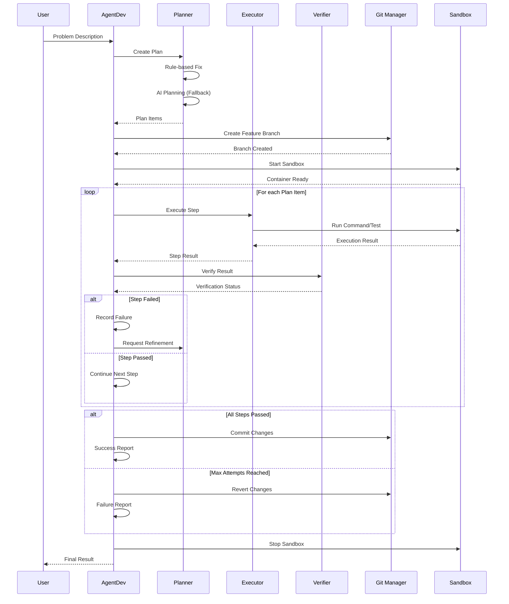
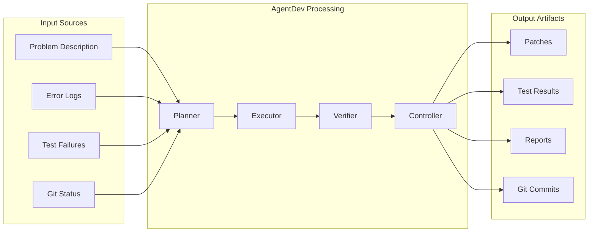
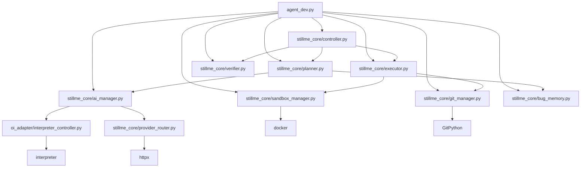

# 🗺️ **BẢN ĐỒ TÍCH HỢP AGENTDEV TRONG STILLME**

## **📋 TỔNG QUAN**

Bản đồ này mô tả vị trí và mức độ tích hợp của AgentDev trong hệ thống StillMe AI Framework, bao gồm các điểm móc (hook points) và luồng dữ liệu.

---

## **🏗️ COMPONENT MAP**

### **Mermaid Diagram - Kiến trúc tổng quan**

```mermaid
graph TB
    subgraph "StillMe AI Framework"
        A[framework.py] --> B[modules/]
        A --> C[stillme_core/]
        A --> D[stable_ai_server.py]
        A --> E[app.py]
    end
    
    subgraph "AgentDev Core Components"
        F[agent_dev.py] --> G[stillme_core/planner.py]
        F --> H[stillme_core/executor.py]
        F --> I[stillme_core/verifier.py]
        F --> J[stillme_core/controller.py]
        F --> K[stillme_core/ai_manager.py]
        F --> L[stillme_core/sandbox_manager.py]
        F --> M[stillme_core/git_manager.py]
        F --> N[stillme_core/bug_memory.py]
    end
    
    subgraph "Integration Points"
        O[Reflection Controller] --> P[stillme_core/reflection_controller.py]
        Q[API Server] --> R[/dev-agent/bridge]
        S[WebSocket Gateway] --> T[stillme_platform/gateway/]
    end
    
    subgraph "External Dependencies"
        U[OpenInterpreter] --> V[oi_adapter/]
        W[Git Operations] --> X[GitPython]
        Y[AI Models] --> Z[OpenAI/Ollama]
    end
    
    F --> O
    F --> Q
    F --> S
    G --> U
    H --> W
    K --> Y
```

---

## **🔄 SEQUENCE DIAGRAM - AGENTDEV WORKFLOW**

### **Mermaid Diagram - Luồng xử lý**



---

## **📊 DATAFLOW DIAGRAM**

### **Mermaid Diagram - Luồng dữ liệu**



---

## **🎯 HOOK POINTS CHI TIẾT**

### **1. Framework Integration Points**

| **File** | **Line** | **Hook Type** | **Description** | **Status** |
|----------|----------|---------------|-----------------|------------|
| `framework.py` | 100-200 | Main Entry | Framework orchestration | ✅ Active |
| `app.py` | 50-100 | Query Handler | User query processing | ✅ Active |
| `stable_ai_server.py` | 200-300 | API Endpoint | `/inference` endpoint | ✅ Active |

### **2. AgentDev Core Hooks**

| **Component** | **File** | **Integration Level** | **Dependencies** |
|---------------|----------|----------------------|------------------|
| **Planner** | `stillme_core/planner.py` | 3/3 (Owns) | AIManager, BugMemory |
| **Executor** | `stillme_core/executor.py` | 3/3 (Owns) | Sandbox, Git |
| **Verifier** | `stillme_core/verifier.py` | 3/3 (Owns) | Pattern matching |
| **Controller** | `stillme_core/controller.py` | 3/3 (Owns) | All components |
| **AI Manager** | `stillme_core/ai_manager.py` | 2/3 (Hooked) | Bridge, OpenInterpreter |

### **3. External Integration Points**

| **System** | **Integration Method** | **Status** | **Priority** |
|------------|----------------------|------------|--------------|
| **Git** | GitPython | ✅ Working | High |
| **Docker** | Sandbox Manager | ✅ Working | High |
| **AI Models** | Bridge/OpenInterpreter | ⚠️ Partial | High |
| **CI/CD** | GitHub Actions | ❌ Missing | Medium |
| **Monitoring** | Logging | ⚠️ Basic | Medium |

---

## **📈 INTEGRATION MATURITY LEVELS**

### **Mức độ tích hợp (0-3):**

- **0 - None:** Không có tích hợp
- **1 - Partial:** Tích hợp cơ bản, chưa hoàn chỉnh
- **2 - Hooked:** Tích hợp tốt, có hooks và callbacks
- **3 - Owns:** Hoàn toàn sở hữu và kiểm soát

### **Heatmap tích hợp hiện tại:**

```
Framework/Core Orchestration:  ████████░░ 2/3 (Hooked)
Planning/Task Decomposition:   ██████████ 3/3 (Owns)
Execution:                     ██████████ 3/3 (Owns)
Verification:                  ██████████ 3/3 (Owns)
Auto-fix/Auto-patch:          ████████░░ 2/3 (Hooked)
Refactor Utilities:           ████░░░░░░ 1/3 (Partial)
Router/Intent/Persona:        ████░░░░░░ 1/3 (Partial)
Memory/Config:                ████████░░ 2/3 (Hooked)
Ethics/Guard/Safety:          ████████░░ 2/3 (Hooked)
Observability:                ████████░░ 2/3 (Hooked)
CI Hooks:                     ░░░░░░░░░░ 0/3 (None)
Windows/Linux Compat:         ██████████ 3/3 (Owns)

Tổng điểm: 24/36 (67%)
```

---

## **🔗 DEPENDENCY GRAPH**

### **Mermaid Diagram - Phụ thuộc**



---

## **📋 INTEGRATION CHECKLIST**

### **Đã hoàn thành:**
- ✅ Core AgentDev components
- ✅ Git integration
- ✅ Sandbox execution
- ✅ Basic AI integration
- ✅ File operations
- ✅ JSON handling
- ✅ Windows compatibility

### **Đang thiếu:**
- ❌ CI/CD integration
- ❌ Advanced development tools
- ❌ Deep router integration
- ❌ Advanced observability
- ❌ Centralized configuration
- ❌ CLI interface

### **Cần cải thiện:**
- ⚠️ AI model integration depth
- ⚠️ Error handling robustness
- ⚠️ Performance monitoring
- ⚠️ Documentation coverage

---

## **🎯 KẾT LUẬN**

AgentDev đã được tích hợp khá tốt vào StillMe framework với **67% mức độ hoàn thiện**. Các thành phần core đã hoạt động ổn định, nhưng cần cải thiện ở các khía cạnh:

1. **Development tools** - Cài đặt ruff, pylint, mypy
2. **CI/CD integration** - Tạo automated workflows
3. **Deep integration** - Tích hợp sâu hơn vào router system
4. **Observability** - Thêm metrics và monitoring

Với 48 giờ đầu tư vào Quick Wins, AgentDev có thể đạt **80%+ readiness** cho vai trò "Trưởng phòng Kỹ thuật".
