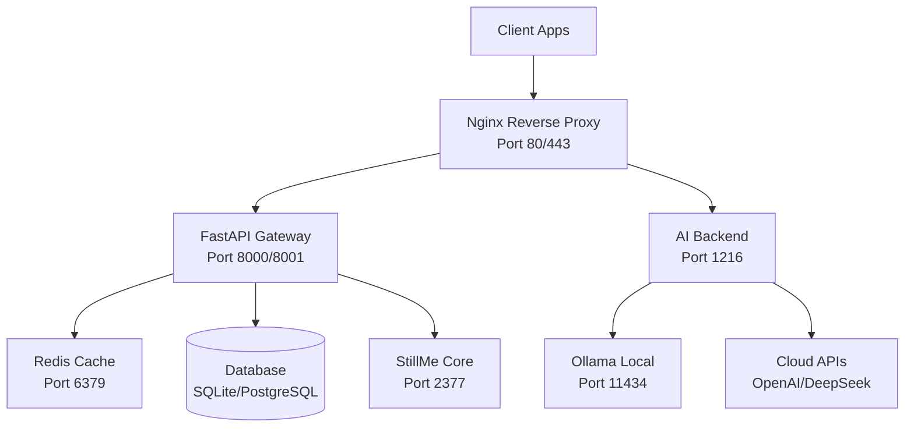

# 🔍 API Gateway Audit Report

**StillMe – Intelligent Personal Companion (IPC)**  
**Generated**: 2024-09-22  
**Status**: Audit Report (No Changes Applied)

## 📋 Executive Summary

This comprehensive audit evaluates the current API Gateway architecture of StillMe across four critical dimensions: **Performance**, **Security**, **Reliability**, and **Manageability**. The analysis reveals a multi-layered architecture with both strengths and areas for improvement.

### Current Architecture Overview
- **Nginx Reverse Proxy**: Front-end load balancer and SSL termination
- **FastAPI Gateway**: Main application server with WebSocket support
- **AI Backend**: Local development server (app.py)
- **Docker Compose**: Container orchestration

## 🏗️ Current State Analysis

### Architecture Diagram


### Current Configuration

#### Nginx Configuration (`gateway_deploy/nginx.conf`)
- **SSL/TLS**: TLS 1.2/1.3 with strong ciphers
- **Security Headers**: Basic XSS, CSRF protection
- **Upstream**: Gateway (8000), AI Server (1216)
- **WebSocket**: Supported with proper headers
- **Health Check**: Basic endpoint at `/health`

#### FastAPI Gateway (`stillme_platform/gateway/main.py`)
- **Framework**: FastAPI with WebSocket support
- **Authentication**: JWT-based with configurable expiration
- **Database**: SQLite/PostgreSQL with async support
- **Redis**: Session storage and caching
- **CORS**: Configurable origins
- **Port**: 8001 (production), 8000 (development)

#### AI Backend (`app.py`)
- **Purpose**: Local development server
- **Smart Routing**: Ollama, DeepSeek, OpenRouter
- **Web Access**: Controlled internet access with security
- **Port**: 1216

## 📊 Detailed Assessment

### 1. 🚀 Performance

#### Current State
| Component | Status | Notes |
|-----------|--------|-------|
| **Connection Pooling** | ❌ Missing | No explicit connection pooling configuration |
| **HTTP/2** | ❌ Not Enabled | Nginx not configured for HTTP/2 |
| **Compression** | ❌ Missing | No gzip/brotli compression |
| **Caching** | ⚠️ Basic | Redis caching present but not optimized |
| **Request Limits** | ❌ Missing | No request size limits |
| **Upstream Timeouts** | ❌ Missing | No timeout configuration |

#### Issues Identified
1. **No Connection Pooling**: Each request creates new connections
2. **Missing Compression**: Large responses not compressed
3. **No Request Limits**: Potential DoS vulnerability
4. **Basic Caching**: Redis not optimally configured
5. **No Load Balancing**: Single upstream servers

#### Performance Impact
- **Latency**: Higher due to connection overhead
- **Throughput**: Limited by connection creation
- **Bandwidth**: Higher due to uncompressed responses
- **Resource Usage**: Inefficient connection management

### 2. 🔒 Security

#### Current State
| Component | Status | Notes |
|-----------|--------|-------|
| **TLS/SSL** | ✅ Good | TLS 1.2/1.3 with strong ciphers |
| **HSTS** | ❌ Missing | No HSTS headers |
| **Authentication** | ✅ Good | JWT with configurable expiration |
| **Authorization** | ⚠️ Basic | Role-based access not implemented |
| **WAF Rules** | ❌ Missing | No Web Application Firewall |
| **Header Hardening** | ⚠️ Partial | Basic security headers only |
| **CORS** | ✅ Good | Configurable origins |
| **Secrets Management** | ⚠️ Basic | Environment variables only |

#### Issues Identified
1. **Missing HSTS**: No HTTP Strict Transport Security
2. **No WAF**: No protection against common attacks
3. **Basic Authorization**: No role-based access control
4. **Incomplete Headers**: Missing CSP, Referrer-Policy
5. **Secrets Management**: No key rotation mechanism

#### Security Risks
- **Man-in-the-Middle**: Without HSTS
- **XSS/CSRF**: Limited protection
- **SQL Injection**: No WAF protection
- **Data Exposure**: Incomplete header protection

### 3. 🛡️ Reliability

#### Current State
| Component | Status | Notes |
|-----------|--------|-------|
| **Health Checks** | ⚠️ Basic | Simple endpoint checks |
| **Load Balancing** | ❌ Missing | Single upstream servers |
| **Circuit Breaker** | ❌ Missing | No failure isolation |
| **Retry Policy** | ❌ Missing | No retry mechanism |
| **Graceful Shutdown** | ⚠️ Partial | Basic FastAPI shutdown |
| **Monitoring** | ⚠️ Basic | Logging only |

#### Issues Identified
1. **No Load Balancing**: Single points of failure
2. **No Circuit Breaker**: Cascading failures possible
3. **Basic Health Checks**: No deep health monitoring
4. **No Retry Logic**: Failed requests not retried
5. **Limited Monitoring**: No metrics collection

#### Reliability Risks
- **Single Points of Failure**: No redundancy
- **Cascading Failures**: No isolation
- **Poor Recovery**: No automatic retry
- **Limited Visibility**: Insufficient monitoring

### 4. 📊 Manageability

#### Current State
| Component | Status | Notes |
|-----------|--------|-------|
| **Structured Logging** | ⚠️ Basic | JSON logging present |
| **Metrics** | ❌ Missing | No metrics collection |
| **Tracing** | ❌ Missing | No distributed tracing |
| **Configuration** | ⚠️ Basic | Environment variables |
| **Documentation** | ✅ Good | Well-documented code |
| **Deployment** | ✅ Good | Docker Compose setup |

#### Issues Identified
1. **No Metrics**: No performance monitoring
2. **No Tracing**: No request flow visibility
3. **Basic Configuration**: No config management
4. **Limited Alerting**: No automated alerts

#### Manageability Impact
- **Poor Observability**: Limited visibility into system
- **Manual Monitoring**: No automated metrics
- **Configuration Drift**: No config validation
- **Reactive Support**: No proactive monitoring

## 🎯 Improvement Proposals

### High Priority (Critical)

#### 1. Performance Enhancements
```yaml
Objective: Improve response times and throughput
Changes:
  - Enable HTTP/2 in Nginx
  - Add gzip/brotli compression
  - Implement connection pooling
  - Add request size limits
  - Optimize Redis caching
Risks: Low
Effort: Medium (2-3 days)
Rollback: Easy (config changes)
```

#### 2. Security Hardening
```yaml
Objective: Enhance security posture
Changes:
  - Add HSTS headers
  - Implement WAF rules
  - Add CSP headers
  - Enhance authorization
  - Implement secrets rotation
Risks: Medium
Effort: High (1-2 weeks)
Rollback: Medium (requires testing)
```

#### 3. Reliability Improvements
```yaml
Objective: Increase system reliability
Changes:
  - Add load balancing
  - Implement circuit breaker
  - Add retry policies
  - Enhance health checks
  - Add monitoring
Risks: Medium
Effort: High (2-3 weeks)
Rollback: Medium (requires testing)
```

### Medium Priority (Important)

#### 4. Observability
```yaml
Objective: Improve system visibility
Changes:
  - Add metrics collection
  - Implement distributed tracing
  - Add structured logging
  - Create dashboards
  - Set up alerting
Risks: Low
Effort: Medium (1-2 weeks)
Rollback: Easy (config changes)
```

#### 5. Configuration Management
```yaml
Objective: Centralize configuration
Changes:
  - Implement config validation
  - Add config versioning
  - Create config templates
  - Add environment-specific configs
Risks: Low
Effort: Medium (1 week)
Rollback: Easy (config changes)
```

### Low Priority (Nice to Have)

#### 6. Advanced Features
```yaml
Objective: Add enterprise features
Changes:
  - Implement rate limiting
  - Add API versioning
  - Create admin interface
  - Add backup/restore
Risks: Low
Effort: High (3-4 weeks)
Rollback: Easy (feature flags)
```

## 📈 Impact vs Complexity Matrix

| Improvement | Impact | Complexity | Priority |
|-------------|--------|------------|----------|
| HTTP/2 + Compression | High | Low | 🔴 Critical |
| Connection Pooling | High | Medium | 🔴 Critical |
| HSTS + Security Headers | High | Low | 🔴 Critical |
| Load Balancing | High | High | 🟡 Important |
| Circuit Breaker | Medium | High | 🟡 Important |
| Metrics Collection | Medium | Medium | 🟡 Important |
| WAF Implementation | High | High | 🟡 Important |
| Distributed Tracing | Low | High | 🟢 Nice to Have |

## 🚀 Implementation Roadmap

### Phase 1: Quick Wins (1-2 weeks)
- [ ] Enable HTTP/2 and compression
- [ ] Add security headers (HSTS, CSP)
- [ ] Implement connection pooling
- [ ] Add request size limits
- [ ] Basic metrics collection

### Phase 2: Reliability (2-3 weeks)
- [ ] Implement load balancing
- [ ] Add circuit breaker pattern
- [ ] Enhance health checks
- [ ] Add retry policies
- [ ] Implement monitoring

### Phase 3: Security (2-3 weeks)
- [ ] Implement WAF rules
- [ ] Add role-based authorization
- [ ] Implement secrets rotation
- [ ] Add API rate limiting
- [ ] Security audit

### Phase 4: Advanced Features (3-4 weeks)
- [ ] Distributed tracing
- [ ] Advanced monitoring
- [ ] Configuration management
- [ ] Admin interface
- [ ] Performance optimization

## 🛡️ Risk Assessment

### High Risk
- **Load Balancing**: Complex configuration, potential downtime
- **WAF Implementation**: May block legitimate traffic
- **Authorization Changes**: May break existing functionality

### Medium Risk
- **Circuit Breaker**: May cause service degradation
- **Configuration Changes**: May introduce bugs
- **Monitoring**: May impact performance

### Low Risk
- **HTTP/2**: Well-tested technology
- **Compression**: Standard feature
- **Security Headers**: Additive changes

## 📋 Testing Strategy

### Pre-Implementation
- [ ] Load testing current system
- [ ] Security vulnerability scan
- [ ] Performance baseline measurement
- [ ] Configuration validation

### During Implementation
- [ ] Staging environment testing
- [ ] Load testing with new config
- [ ] Security testing
- [ ] Rollback testing

### Post-Implementation
- [ ] Production monitoring
- [ ] Performance comparison
- [ ] Security audit
- [ ] User acceptance testing

## 🔄 Rollback Plan

### Immediate Rollback (0-5 minutes)
- Revert Nginx configuration
- Restart services
- Monitor system health

### Gradual Rollback (5-30 minutes)
- Disable new features via config
- Monitor performance
- Gradual service restoration

### Full Rollback (30+ minutes)
- Restore from backup
- Revert all changes
- Full system restart

## 📊 Success Metrics

### Performance
- **Response Time**: < 100ms (p95)
- **Throughput**: > 1000 RPS
- **Error Rate**: < 0.1%
- **Availability**: > 99.9%

### Security
- **Vulnerability Score**: A+ rating
- **Security Headers**: 100% compliance
- **Authentication**: 0 unauthorized access
- **Data Protection**: 100% encrypted

### Reliability
- **Uptime**: > 99.9%
- **Recovery Time**: < 30 seconds
- **Failure Rate**: < 0.01%
- **Health Check**: 100% passing

### Manageability
- **Monitoring**: 100% coverage
- **Alerting**: < 5 minute response
- **Documentation**: 100% up-to-date
- **Configuration**: 100% validated

## 🎯 Next Steps

1. **Review and Approve**: Team review of audit findings
2. **Prioritize Improvements**: Select high-impact, low-risk changes
3. **Create POC**: Implement proof-of-concept for critical changes
4. **Plan Implementation**: Detailed implementation plan
5. **Execute Changes**: Phased implementation with testing
6. **Monitor and Adjust**: Continuous monitoring and optimization

---

**Note**: This is an audit report. No changes have been implemented yet. All improvements will be done safely with proper testing and rollback capabilities.
