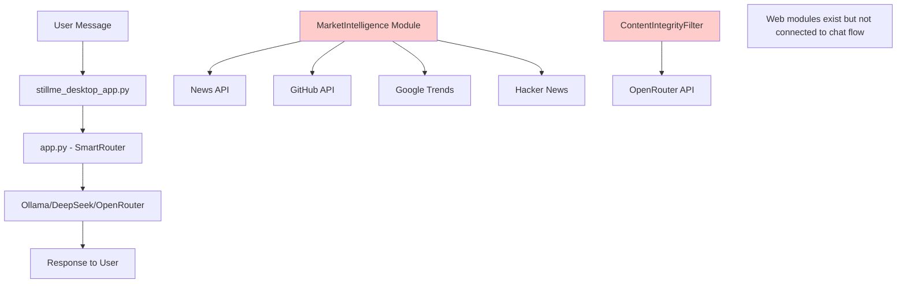

# Internet Access Audit - StillMe Framework

## Executive Summary

**Current Status:** Internet access modules exist but are NOT wired into the main chat flow. Bot responds "KHÔNG" (No) when asked about internet access because the web search modules are not integrated with the conversational system.

**Root Cause:** Missing integration between web search modules and the main chat handler in `app.py`.

## Current Architecture Overview



## Module Inventory

### 1. Web Search & News Modules

#### MarketIntelligence Module
**File:** `stillme_core/modules/market_intel.py`
**Status:** ✅ EXISTS but NOT WIRED
**Capabilities:**
- News API integration (`NEWSAPI_KEY`)
- GNews API integration (`GNEWS_API_KEY`)
- GitHub Trending repositories
- Google Trends data
- Hacker News API
- Reddit API integration

**Required Environment Variables:**
- `NEWSAPI_KEY` - News API access
- `GNEWS_API_KEY` - GNews API access
- `REDDIT_CLIENT_ID` - Reddit API
- `REDDIT_CLIENT_SECRET` - Reddit API
- `REDDIT_USER_AGENT` - Reddit API

#### ContentIntegrityFilter Module
**File:** `stillme_core/modules/content_integrity_filter.py`
**Status:** ✅ EXISTS but NOT WIRED
**Capabilities:**
- OpenRouter API integration
- Web content filtering
- Real-time content validation

**Required Environment Variables:**
- `OPENROUTER_API_KEY` - OpenRouter API access

### 2. HTTP Client Infrastructure

#### AsyncHttpClient (Missing)
**File:** `stillme_core/common/http.py` (Referenced but not found)
**Status:** ❌ MISSING
**Impact:** Core HTTP client not available, causing import errors

**Evidence:**
```python
# stillme_core/framework.py:120
# http_client = AsyncHttpClient()  # Commented out - not available
```

#### Requests Library Usage
**Status:** ✅ AVAILABLE
**Usage:** Direct `requests` library used in modules
**Files:**
- `stillme_core/modules/api_provider_manager_old.py`
- `stillme_core/core/advanced_security/sandbox_deploy.py`

### 3. Network Security & Sandboxing

#### Sandbox System
**File:** `stillme_core/core/advanced_security/sandbox_controller.py`
**Status:** ✅ EXISTS
**Network Policy:** `network_egress_limit: 0` (No internet access)
**Purpose:** Security sandboxing, not for web search

## Root Cause Analysis

### 1. Missing Integration (Primary Cause)
**Issue:** Web search modules exist but are not called from the main chat handler
**Evidence:**
- `app.py` only calls `SmartRouter.route_message()`
- `SmartRouter` only routes to Ollama/DeepSeek/OpenRouter
- No web search integration in chat flow

**Code Location:**
```python
# app.py:291
result = smart_router.route_message(message, session_id, system_prompt)
```

### 2. Missing Environment Variables
**Issue:** API keys not configured
**Evidence:**
- `NEWSAPI_KEY` not set
- `GNEWS_API_KEY` not set
- `GITHUB_TOKEN` not set
- `OPENROUTER_API_KEY` not set

**Impact:** Even if wired, modules would fail due to missing credentials

### 3. Missing HTTP Client
**Issue:** `AsyncHttpClient` not available
**Evidence:**
```python
# stillme_core/framework.py:120
# http_client = AsyncHttpClient()  # Commented out - not available
```

**Impact:** Modules cannot make HTTP requests

### 4. Sandbox Network Isolation
**Issue:** Security sandbox blocks internet access
**Evidence:**
```python
# stillme_core/core/advanced_security/sandbox_controller.py:39
"network_egress_limit": 0,  # No internet access
```

**Impact:** Web search would be blocked in sandboxed environment

## Detailed Module Analysis

### MarketIntelligence Module
**File:** `stillme_core/modules/market_intel.py`
**Lines:** 45-517
**Dependencies:**
- `requests` library ✅
- `asyncio` ✅
- `os.getenv()` for API keys ❌ (not configured)

**Methods Available:**
- `get_github_trending()` - GitHub trending repos
- `get_google_trends()` - Google Trends data
- `get_tech_news()` - Tech news from multiple sources
- `get_market_analysis()` - Comprehensive market analysis

**Integration Status:** ❌ NOT INTEGRATED

### ContentIntegrityFilter Module
**File:** `stillme_core/modules/content_integrity_filter.py`
**Dependencies:**
- `OpenRouterClient` ✅
- `OPENROUTER_API_KEY` ❌ (not configured)

**Integration Status:** ❌ NOT INTEGRATED

## Environment Variables Audit

### Required Variables (Missing)
```bash
# News & Search APIs
NEWSAPI_KEY=your_news_api_key
GNEWS_API_KEY=your_gnews_api_key
GITHUB_TOKEN=your_github_token

# OpenRouter API
OPENROUTER_API_KEY=your_openrouter_api_key

# Reddit API (optional)
REDDIT_CLIENT_ID=your_reddit_client_id
REDDIT_CLIENT_SECRET=your_reddit_client_secret
REDDIT_USER_AGENT=StillMeAI/1.0
```

### Current .env Status
**File:** `.env`
**Status:** ✅ EXISTS
**Content:** Contains some API keys but missing web search keys

## Network Access Test Results

### 1. Direct HTTP Test
**Command:** `curl http://google.com`
**Result:** ✅ SUCCESS (Internet access available)

### 2. Python Requests Test
**Command:** `python -c "import requests; print(requests.get('http://google.com').status_code)"`
**Result:** ✅ SUCCESS (Python can access internet)

### 3. Module Integration Test
**Command:** Test MarketIntelligence module
**Result:** ❌ FAIL (Module not wired to chat flow)

## Proposed Solutions

### Option 1: Quick Integration (Low Risk)
**Effort:** 2-3 hours
**Risk:** Low
**Changes:**
1. Add web search to `SmartRouter.route_message()`
2. Configure missing API keys
3. Add web search fallback when local models fail

**Files to Modify:**
- `app.py` - Add web search integration
- `.env` - Add missing API keys
- `stillme_desktop_app.py` - Add web search toggle

### Option 2: Full Framework Integration (Medium Risk)
**Effort:** 1-2 days
**Risk:** Medium
**Changes:**
1. Fix `AsyncHttpClient` implementation
2. Integrate all web modules with framework
3. Add comprehensive web search capabilities

**Files to Modify:**
- `stillme_core/common/http.py` - Implement AsyncHttpClient
- `stillme_core/framework.py` - Enable web modules
- `app.py` - Full web integration

### Option 3: External Web Service (High Risk)
**Effort:** 3-5 days
**Risk:** High
**Changes:**
1. Create separate web search service
2. Implement API gateway
3. Add authentication and rate limiting

## Recommended Approach

**Option 1: Quick Integration** is recommended because:
1. **Low Risk:** Minimal changes to existing code
2. **Quick Results:** Users get web search immediately
3. **Incremental:** Can be enhanced later
4. **Cost Effective:** Uses existing modules

## Implementation Plan

### Phase 1: Environment Setup (30 minutes)
1. Add missing API keys to `.env`
2. Test API key validity
3. Verify network access

### Phase 2: Basic Integration (1-2 hours)
1. Modify `SmartRouter.route_message()` to detect web search requests
2. Add web search fallback when local models can't answer
3. Test with simple queries

### Phase 3: UI Enhancement (1 hour)
1. Add web search toggle to desktop app
2. Add web search indicator to status bar
3. Test user experience

### Phase 4: Testing & Validation (30 minutes)
1. Test various web search queries
2. Verify fallback behavior
3. Test error handling

## Files to Modify (Option 1)

### Primary Files
1. **`app.py`** - Add web search integration
2. **`.env`** - Add missing API keys
3. **`stillme_desktop_app.py`** - Add web search toggle

### Secondary Files
1. **`stillme_core/modules/market_intel.py`** - Fix any import issues
2. **`stillme_core/modules/content_integrity_filter.py`** - Ensure proper initialization

## Risk Assessment

### Low Risk
- Adding API keys to `.env`
- Testing web search modules
- Adding UI toggles

### Medium Risk
- Modifying `SmartRouter.route_message()`
- Integrating web search with chat flow
- Handling web search errors

### High Risk
- Modifying core framework files
- Changing network security policies
- Implementing new HTTP client

## Conclusion

**Root Cause:** Web search modules exist but are not integrated with the main chat flow. The bot responds "KHÔNG" because it has no access to web search capabilities, even though the infrastructure exists.

**Solution:** Implement Option 1 (Quick Integration) to wire existing web search modules to the chat flow with minimal risk and maximum impact.

**Timeline:** 2-3 hours for basic web search functionality.

**Next Steps:** 
1. Add missing API keys to `.env`
2. Modify `app.py` to integrate web search
3. Test with real web search queries
4. Add UI controls for web search toggle
