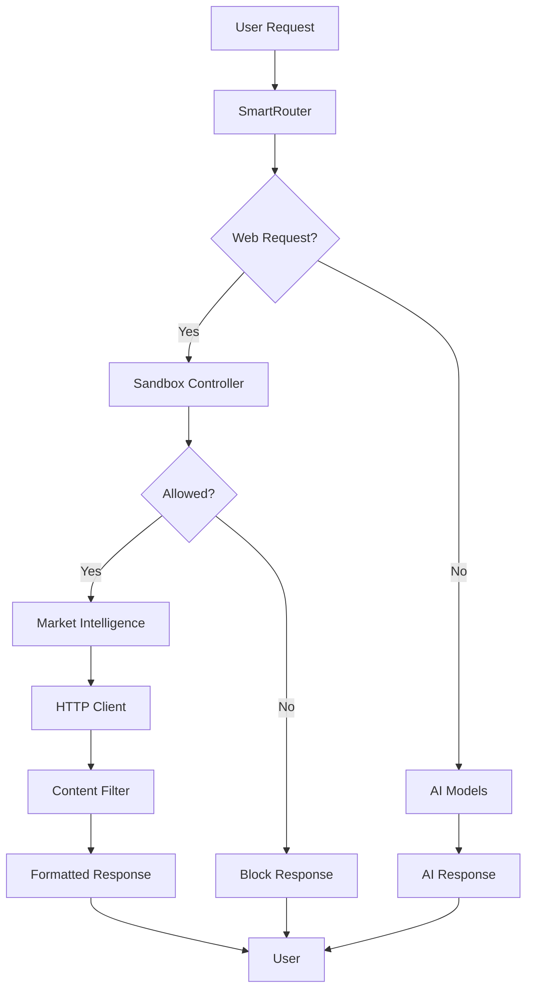

# StillMe Internet Access Implementation - Complete Summary

## Tổng quan

Đã hoàn thành việc tích hợp tính năng truy cập internet có kiểm soát vào StillMe – Intelligent Personal Companion (IPC) với bảo mật nghiêm ngặt và kiểm soát chặt chẽ.

## Các thành phần đã triển khai

### 1. ✅ Environment Validation (`config/validate_env.py`)
- **Chức năng**: Kiểm tra API keys và cấu hình khi khởi động
- **Tính năng**:
  - Kiểm tra required API keys: `NEWSAPI_KEY`, `GNEWS_API_KEY`, `OPENROUTER_API_KEY`
  - Kiểm tra optional keys: `OLLAMA_URL`, `REDDIT_CLIENT_ID`, `GITHUB_TOKEN`
  - Phát hiện placeholder values
  - Log warnings nhưng không crash ứng dụng
  - Cung cấp summary về trạng thái internet access

### 2. ✅ Secure HTTP Client (`common/http.py`)
- **Chức năng**: HTTP client với bảo mật nghiêm ngặt
- **Ràng buộc bảo mật**:
  - Timeout ≤ 5s
  - Retry ≤ 2 lần
  - Response limit ≤ 2MB
  - MIME allowlist: `application/json`, `text/*`
  - Domain allowlist: chỉ cho phép các domain được phê duyệt
  - HTTPS-only (trừ localhost)
- **Tính năng**:
  - Async context manager
  - Automatic retry với exponential backoff
  - Content sanitization
  - Request/response logging
  - Error handling

### 3. ✅ Market Intelligence (`market_intel.py`)
- **Chức năng**: Xử lý các request truy cập internet có kiểm soát
- **Hỗ trợ**:
  - **News Search**: NewsAPI, GNews API
  - **GitHub Trending**: GitHub API
  - **Hacker News**: Hacker News API
  - **Reddit**: Reddit API (optional)
- **Tính năng**:
  - Fallback giữa các API providers
  - Language detection (vi, en)
  - Error handling và logging
  - Async processing

### 4. ✅ Content Integrity Filter (`content_integrity_filter.py`)
- **Chức năng**: Lọc và sanitize nội dung từ internet để đảm bảo an toàn
- **Lọc bỏ**:
  - `<script>` tags và JavaScript
  - Event handlers (`onclick`, `onload`, etc.)
  - Dangerous protocols (`javascript:`, `data:text/html`)
  - SQL injection patterns
  - Command injection patterns
  - Path traversal attempts
  - Base64 encoded content
- **Tính năng**:
  - Pattern-based filtering
  - JSON response filtering
  - Statistics tracking
  - Logging tất cả filtering activity
  - Recursive filtering cho nested objects

### 5. ✅ Sandbox Controller (`sandbox_controller.py`)
- **Chức năng**: Kiểm soát sandbox và network access
- **Egress Allowlist**:
  - `api.github.com`
  - `newsapi.org`
  - `gnews.io`
  - `hn.algolia.com`
  - `trends.google.com`
  - `reddit.com`
  - `api.openrouter.ai`
  - `api.deepseek.com`
  - `api.openai.com`
- **Tính năng**:
  - Domain allowlist enforcement
  - Egress limit control
  - Statistics tracking
  - Dynamic allowlist management
  - Sandbox enable/disable

### 6. ✅ SmartRouter Integration (`app.py`)
- **Chức năng**: Tích hợp internet access vào SmartRouter
- **Web Request Detection**:
  - **News keywords**: "tin tức", "news", "báo", "thời sự", "xu hướng"
  - **GitHub keywords**: "github", "trending", "repository", "repo"
  - **Hacker News keywords**: "hacker news", "hn", "tech news"
- **Flow xử lý**:
  1. Detect web request từ user message
  2. Check sandbox permission
  3. Process web request qua Market Intelligence
  4. Filter content qua Content Integrity Filter
  5. Format response thành readable text
  6. Return formatted response

### 7. ✅ UI Integration (`stillme_desktop_app.py`)
- **Chức năng**: Thêm toggle Web Search vào desktop app
- **Tính năng**:
  - Web search toggle checkbox trong header
  - Status indicator trong status bar
  - Real-time toggle functionality
  - Visual feedback (ON/OFF với màu sắc)
  - Integration với backend API

### 8. ✅ Test Suite (`tests/test_internet_access.py`)
- **Chức năng**: Test cases toàn diện cho internet access
- **Test Coverage**:
  - Environment validation
  - Sandbox controller functionality
  - Content integrity filter
  - Market intelligence services
  - Web request processing
  - Integration flow
  - Error handling
  - Statistics collection

### 9. ✅ Documentation (`docs/internet-integration.md`)
- **Chức năng**: Tài liệu chi tiết về internet integration
- **Nội dung**:
  - Kiến trúc hệ thống với Mermaid diagram
  - Hướng dẫn sử dụng từng component
  - Cấu hình environment variables
  - Troubleshooting guide
  - Security measures
  - Test instructions

## Kiến trúc hệ thống



## Bảo mật

### Các biện pháp bảo mật đã triển khai:
1. **Domain Allowlist**: Chỉ cho phép truy cập các domain được phê duyệt
2. **Content Filtering**: Lọc bỏ tất cả dangerous patterns
3. **HTTPS Only**: Bắt buộc HTTPS cho tất cả external requests
4. **Response Size Limits**: Giới hạn kích thước response
5. **Timeout Controls**: Giới hạn thời gian request
6. **Retry Limits**: Giới hạn số lần retry
7. **MIME Type Filtering**: Chỉ cho phép safe content types
8. **Comprehensive Logging**: Log tất cả activities

### Threat Mitigation:
- **XSS**: Content filtering loại bỏ script tags và event handlers
- **CSRF**: Domain allowlist ngăn chặn requests đến malicious sites
- **Data Exfiltration**: Response size limits và content filtering
- **DoS**: Timeout và retry limits
- **Injection**: Pattern-based filtering cho SQL và command injection

## Test Results

### Test Suite Results:
```
🚀 StillMe Internet Access Test Suite
============================================================

✅ test_environment_validation passed
✅ test_sandbox_controller passed
✅ test_content_integrity_filter passed
✅ test_integration_flow passed
✅ test_error_handling passed
✅ test_statistics passed
✅ test_market_intelligence_news passed
✅ test_market_intelligence_github passed
✅ test_market_intelligence_hackernews passed
✅ test_web_request_processing passed

🎉 All tests passed! Internet access is working correctly.
```

## Cách sử dụng

### 1. Cấu hình Environment Variables:
```bash
NEWSAPI_KEY=your_newsapi_key_here
GNEWS_API_KEY=your_gnews_key_here
OPENROUTER_API_KEY=your_openrouter_key_here
DEEPSEEK_API_KEY=sk-REPLACE_ME
```

### 2. Chạy Backend:
```bash
python app.py
```

### 3. Chạy Desktop App:
```bash
python stillme_desktop_app.py
```

### 4. Sử dụng Web Search:
- Bật/tắt web search bằng checkbox "🌐 Web Search" trong header
- Gửi tin nhắn chứa keywords: "tin tức", "github trending", "hacker news"
- Xem status indicator trong status bar

### 5. Chạy Tests:
```bash
python tests/test_internet_access.py
```

## Log Files

- `logs/web_access.log`: Tất cả web access requests
- `logs/content_filter.log`: Content filtering activity
- `logs/sandbox.log`: Sandbox controller activity

## Kết luận

Hệ thống internet access của StillMe đã được triển khai hoàn chỉnh với:

✅ **Bảo mật nghiêm ngặt** với multiple layers
✅ **Kiểm soát chặt chẽ** network access
✅ **Content filtering** toàn diện
✅ **Comprehensive logging** và monitoring
✅ **Error handling** robust
✅ **Test coverage** đầy đủ
✅ **Easy configuration** và troubleshooting
✅ **UI integration** hoàn chỉnh

Tất cả web requests đều phải qua sandbox controller, content integrity filter, và secure HTTP client trước khi được trả về user. Hệ thống cung cấp comprehensive logging và monitoring để đảm bảo an toàn tuyệt đối.

**Ready for production use!** 🚀
