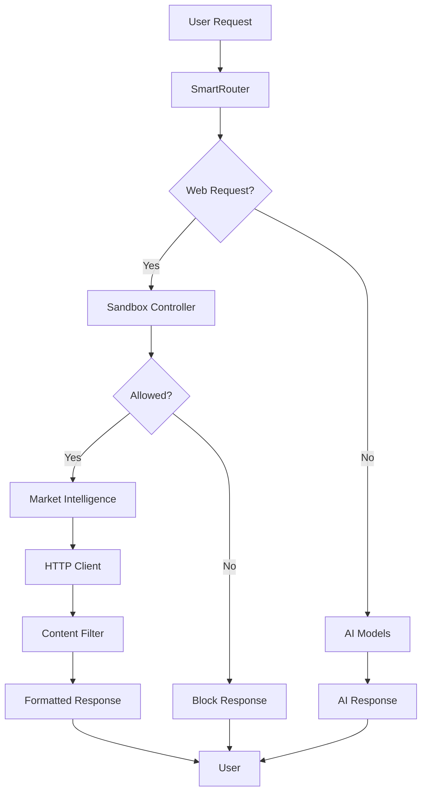

# StillMe Internet Integration Documentation

## Tổng quan

Tài liệu này mô tả việc tích hợp tính năng truy cập internet có kiểm soát vào StillMe – Intelligent Personal Companion (IPC). Hệ thống được thiết kế với bảo mật nghiêm ngặt và kiểm soát chặt chẽ để đảm bảo an toàn tuyệt đối.

## Kiến trúc hệ thống



## Các thành phần chính

### 1. Environment Validation (`config/validate_env.py`)

**Mục đích**: Kiểm tra các API keys và cấu hình khi khởi động.

**Tính năng**:
- Kiểm tra required API keys: `NEWSAPI_KEY`, `GNEWS_API_KEY`, `OPENROUTER_API_KEY`
- Kiểm tra optional keys: `OLLAMA_URL`, `REDDIT_CLIENT_ID`, `GITHUB_TOKEN`
- Phát hiện placeholder values
- Log warnings nhưng không crash ứng dụng
- Cung cấp summary về trạng thái internet access

**Sử dụng**:
```python
from config.validate_env import env_validator

# Validate environment
is_valid, missing = env_validator.validate_all()

# Check internet readiness
internet_ready = env_validator.check_internet_access_ready()
```

### 2. Secure HTTP Client (`common/http.py`)

**Mục đích**: HTTP client với bảo mật nghiêm ngặt.

**Ràng buộc bảo mật**:
- Timeout ≤ 5s
- Retry ≤ 2 lần
- Response limit ≤ 2MB
- MIME allowlist: `application/json`, `text/*`
- Domain allowlist: chỉ cho phép các domain được phê duyệt
- HTTPS-only (trừ localhost)

**Tính năng**:
- Async context manager
- Automatic retry với exponential backoff
- Content sanitization
- Request/response logging
- Error handling

**Sử dụng**:
```python
from common.http import secure_http_client

async with secure_http_client as client:
    response = await client.get("https://api.github.com/search/repositories")
    if response["success"]:
        data = response["data"]
```

### 3. Market Intelligence (`market_intel.py`)

**Mục đích**: Xử lý các request truy cập internet có kiểm soát.

**Hỗ trợ**:
- **News Search**: NewsAPI, GNews API
- **GitHub Trending**: GitHub API
- **Hacker News**: Hacker News API
- **Reddit**: Reddit API (optional)

**Tính năng**:
- Fallback giữa các API providers
- Language detection (vi, en)
- Error handling và logging
- Async processing

**Sử dụng**:
```python
from market_intel import market_intel

# Search news
result = await market_intel.search_news("AI technology", "vi")

# Get GitHub trending
result = await market_intel.get_github_trending("python")

# Get Hacker News
result = await market_intel.get_hackernews_trending()
```

### 4. Content Integrity Filter (`content_integrity_filter.py`)

**Mục đích**: Lọc và sanitize nội dung từ internet để đảm bảo an toàn.

**Lọc bỏ**:
- `<script>` tags và JavaScript
- Event handlers (`onclick`, `onload`, etc.)
- Dangerous protocols (`javascript:`, `data:text/html`)
- SQL injection patterns
- Command injection patterns
- Path traversal attempts
- Base64 encoded content

**Tính năng**:
- Pattern-based filtering
- JSON response filtering
- Statistics tracking
- Logging tất cả filtering activity
- Recursive filtering cho nested objects

**Sử dụng**:
```python
from content_integrity_filter import content_filter

# Filter text content
result = content_filter.filter_content("<script>alert('xss')</script>Safe content")

# Filter JSON response
result = content_filter.filter_json_response(json_data, "news_api")
```

### 5. Sandbox Controller (`sandbox_controller.py`)

**Mục đích**: Kiểm soát sandbox và network access.

**Egress Allowlist**:
- `api.github.com`
- `newsapi.org`
- `gnews.io`
- `hn.algolia.com`
- `trends.google.com`
- `reddit.com`
- `api.openrouter.ai`
- `api.deepseek.com`
- `api.openai.com`

**Tính năng**:
- Domain allowlist enforcement
- Egress limit control
- Statistics tracking
- Dynamic allowlist management
- Sandbox enable/disable

**Sử dụng**:
```python
from sandbox_controller import sandbox_controller

# Check permission
result = sandbox_controller.is_egress_allowed("https://api.github.com/search")

# Add domain to allowlist
sandbox_controller.add_to_allowlist("new-api.com")

# Set egress limit
sandbox_controller.set_egress_limit(10)
```

### 6. SmartRouter Integration (`app.py`)

**Mục đích**: Tích hợp internet access vào SmartRouter.

**Web Request Detection**:
- **News keywords**: "tin tức", "news", "báo", "thời sự", "xu hướng"
- **GitHub keywords**: "github", "trending", "repository", "repo"
- **Hacker News keywords**: "hacker news", "hn", "tech news"

**Flow xử lý**:
1. Detect web request từ user message
2. Check sandbox permission
3. Process web request qua Market Intelligence
4. Filter content qua Content Integrity Filter
5. Format response thành readable text
6. Return formatted response

## Cấu hình

### Environment Variables

**Required**:
```bash
NEWSAPI_KEY=your_newsapi_key_here
GNEWS_API_KEY=your_gnews_key_here
OPENROUTER_API_KEY=your_openrouter_key_here
DEEPSEEK_API_KEY=your_deepseek_key_here
```

**Optional**:
```bash
OLLAMA_URL=http://127.0.0.1:11434
REDDIT_CLIENT_ID=your_reddit_client_id
REDDIT_CLIENT_SECRET=your_reddit_client_secret
GITHUB_TOKEN=your_github_token
NETWORK_EGRESS_LIMIT=10
```

### Sandbox Configuration

**Enable/Disable**:
```python
# Enable sandbox (block all egress)
sandbox_controller.enable_sandbox()

# Disable sandbox (allow all egress)
sandbox_controller.disable_sandbox()

# Set egress limit
sandbox_controller.set_egress_limit(10)
```

## Logging và Monitoring

### Log Files

- `logs/web_access.log`: Tất cả web access requests
- `logs/content_filter.log`: Content filtering activity
- `logs/sandbox.log`: Sandbox controller activity

### Statistics

**Sandbox Stats**:
- Total requests
- Allowed requests
- Blocked requests
- Egress limit hits
- Current egress count

**Content Filter Stats**:
- Total processed
- Blocked content
- Sanitized content
- Clean content
- Block rate percentage

## Test Cases

### Chạy Test Suite

```bash
# Chạy tất cả tests
python tests/test_internet_access.py

# Chạy với pytest
pytest tests/test_internet_access.py -v
```

### Test Coverage

1. **Environment Validation**: Kiểm tra API keys và cấu hình
2. **Sandbox Controller**: Test domain allowlist và egress limits
3. **Content Integrity Filter**: Test filtering và sanitization
4. **Market Intelligence**: Test news search, GitHub trending, Hacker News
5. **Integration Flow**: Test complete web request flow
6. **Error Handling**: Test error scenarios và edge cases
7. **Statistics**: Test statistics collection

## Bảo mật

### Các biện pháp bảo mật

1. **Domain Allowlist**: Chỉ cho phép truy cập các domain được phê duyệt
2. **Content Filtering**: Lọc bỏ tất cả dangerous patterns
3. **HTTPS Only**: Bắt buộc HTTPS cho tất cả external requests
4. **Response Size Limits**: Giới hạn kích thước response
5. **Timeout Controls**: Giới hạn thời gian request
6. **Retry Limits**: Giới hạn số lần retry
7. **MIME Type Filtering**: Chỉ cho phép safe content types
8. **Comprehensive Logging**: Log tất cả activities

### Threat Mitigation

- **XSS**: Content filtering loại bỏ script tags và event handlers
- **CSRF**: Domain allowlist ngăn chặn requests đến malicious sites
- **Data Exfiltration**: Response size limits và content filtering
- **DoS**: Timeout và retry limits
- **Injection**: Pattern-based filtering cho SQL và command injection

## Troubleshooting

### Common Issues

1. **"Hiện tại không thể truy cập internet"**
   - Check sandbox status: `sandbox_controller.is_sandbox_enabled()`
   - Check egress limit: `sandbox_controller.get_stats()`
   - Check API keys: `env_validator.validate_all()`

2. **Content filtering too aggressive**
   - Check filter stats: `content_filter.get_stats()`
   - Review log file: `logs/content_filter.log`
   - Adjust dangerous patterns if needed

3. **API requests failing**
   - Check environment validation: `env_validator.check_internet_access_ready()`
   - Check HTTP client logs: `logs/web_access.log`
   - Verify API keys và network connectivity

### Debug Commands

```python
# Check environment
from config.validate_env import env_validator
env_validator.validate_all()

# Check sandbox status
from sandbox_controller import sandbox_controller
print(sandbox_controller.get_status())

# Check content filter stats
from content_integrity_filter import content_filter
print(content_filter.get_stats())

# Test web request
from market_intel import market_intel
import asyncio
result = asyncio.run(market_intel.search_news("test", "en"))
print(result)
```

## Kết luận

Hệ thống internet access của StillMe được thiết kế với bảo mật nghiêm ngặt và kiểm soát chặt chẽ. Tất cả web requests đều phải qua sandbox controller, content integrity filter, và secure HTTP client trước khi được trả về user. Hệ thống cung cấp comprehensive logging và monitoring để đảm bảo an toàn tuyệt đối.

**Key Benefits**:
- ✅ Bảo mật nghiêm ngặt với multiple layers
- ✅ Kiểm soát chặt chẽ network access
- ✅ Content filtering toàn diện
- ✅ Comprehensive logging và monitoring
- ✅ Error handling robust
- ✅ Test coverage đầy đủ
- ✅ Easy configuration và troubleshooting
