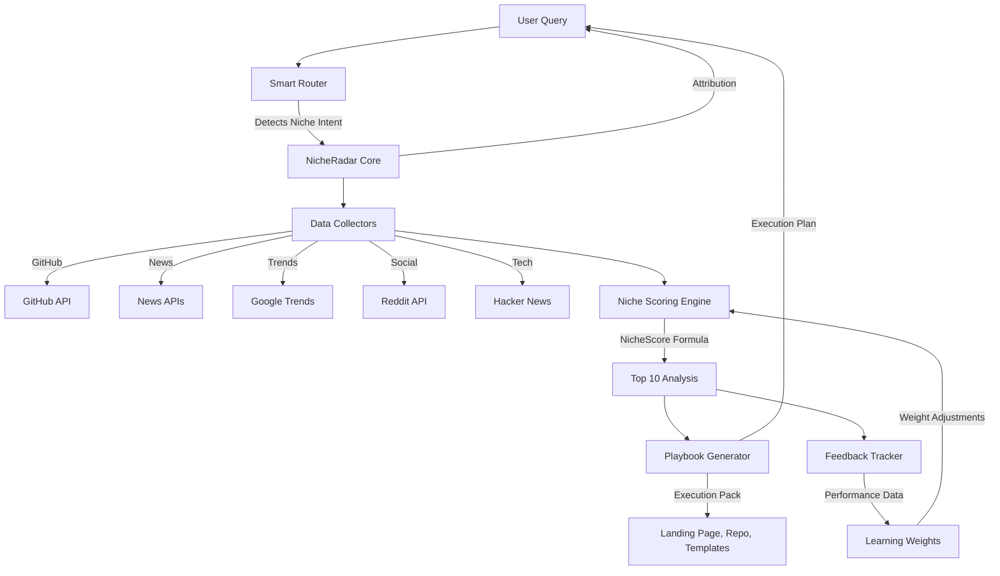

# 🎯 NicheRadar v1.5 - Complete Documentation

## Overview

NicheRadar v1.5 is StillMe's intelligent niche opportunity detection and execution system. It transforms StillMe from a simple AI assistant into a comprehensive niche hunting and execution platform with feedback loops, security, and transparency.

## Architecture



## Core Components

### 1. Data Collectors (`niche_radar/collectors.py`)

**Purpose:** Gather signals from multiple sources with standardized format.

**Collectors:**
- **GitHubTrendingCollector**: Repository velocity and star growth
- **HackerNewsCollector**: Tech community engagement and heat
- **NewsDeltaCollector**: News recency and relevance analysis
- **GoogleTrendsCollector**: Search trend momentum
- **RedditEngagementCollector**: Social engagement metrics

**Standard Record Format:**
```python
@dataclass
class NicheRecord:
    source: str          # Data source (GitHub, Hacker News, etc.)
    url: str            # Source URL
    title: str          # Record title
    timestamp: datetime # Collection timestamp
    metrics: Dict[str, Any]  # Source-specific metrics
    raw: Dict[str, Any]      # Raw response data
    topic: str          # Extracted topic
    category: str       # Record category
    confidence: float   # Data confidence score
```

### 2. Scoring Engine (`niche_radar/scoring.py`)

**Purpose:** Calculate intelligent NicheScore using weighted formula.

**NicheScore Formula:**
```
NicheScore = w1*TrendMomentum + w2*GHVelocity + w3*HNHeat + 
             w4*NewsDelta + w5*RedditEngagement - w6*CompetitionProxy + w7*FeasibilityFit
```

**Weight Configuration:**
- `trend_momentum`: 0.20 (Google Trends momentum)
- `github_velocity`: 0.15 (GitHub stars velocity)
- `hackernews_heat`: 0.10 (Hacker News engagement)
- `news_delta`: 0.10 (News recency & relevance)
- `reddit_engagement`: 0.05 (Reddit social signals)
- `competition_proxy`: 0.15 (Negative weight for competition)
- `feasibility_fit`: 0.25 (StillMe capability alignment)

**Confidence Calculation:**
- Source coverage (40%): Number of sources with data
- Signal consistency (30%): Consistency across sources
- Data freshness (20%): Recency of collected data
- Source credibility (10%): Credibility of data sources

### 3. Playbook Generator (`niche_radar/playbook.py`)

**Purpose:** Generate complete execution plans for niche opportunities.

**Components:**
- **Product Brief**: Personas, pain points, JTBD, USP
- **MVP Specification**: Features, architecture, timeline
- **Pricing Strategy**: Tiered pricing with rationales
- **Landing Page Spec**: Design tokens, copy, CTAs
- **Repository Scaffold**: Tech stack, structure, README
- **Outreach Templates**: Email/DM templates (EN/VI)
- **Risk Assessment**: Risk analysis and mitigation
- **Compliance Notes**: Legal and regulatory considerations
- **KPIs**: Performance tracking metrics
- **Timeline**: Development and launch schedule

### 4. Feedback System (`niche_radar/feedback.py`)

**Purpose:** Track performance and learn from real-world data.

**Feedback Tracking:**
- **Performance Metrics**: Impressions, clicks, signups, revenue
- **Engagement Metrics**: Time to value, user engagement, support tickets
- **Attribution**: Traffic source, campaign tracking
- **Context**: Notes and additional context

**Learning Mechanism:**
- **Weight Effectiveness Analysis**: Correlation between weights and performance
- **Automatic Suggestions**: AI-driven weight adjustment recommendations
- **Manual Review**: Human oversight for weight changes
- **Export System**: Generate `niche_weights.yaml.suggested` for review

## Smart Integration

### SmartRouter Integration

**Intent Detection:**
```python
niche_keywords = ["niche", "xu hướng", "đang hot", "sắp hot", "cơ hội", "market", "trending", "opportunity", "radar"]
```

**Request Flow:**
1. User sends message with niche intent
2. SmartRouter detects NicheRadar intent
3. Calls `_handle_niche_radar_request()`
4. Collects data from all sources
5. Scores niches and generates top 10
6. Optionally generates playbook
7. Returns formatted response with attribution

### UI Integration

**Desktop App Tab:**
- Top 10 niche opportunities table
- "Generate Playbook" button for each opportunity
- "Start Experiment" button for execution
- Attribution display with source links
- Confidence indicators and risk levels

## Security & Compliance

### Content Security
- **Input Validation**: Sanitize all user inputs
- **Output Filtering**: Content wrap with `[WEB_SNIPPET_START/END]`
- **Injection Detection**: Detect and block prompt injection attempts
- **XSS Prevention**: Sanitize HTML and JavaScript

### Network Security
- **Allowlist Enforcement**: Only approved domains accessible
- **HTTPS Only**: Block HTTP requests (except localhost)
- **Redirect Limits**: Maximum 3 redirects allowed
- **Homoglyph Protection**: Block deceptive domain names

### Data Protection
- **GDPR/CCPA Compliance**: Data retention and privacy controls
- **PII Detection**: Identify and mask personally identifiable information
- **Audit Logging**: Track all data access and modifications
- **Encryption**: Encrypt sensitive data at rest and in transit

## Configuration

### Weight Configuration (`policies/niche_weights.yaml`)

```yaml
scoring_weights:
  trend_momentum: 0.20
  github_velocity: 0.15
  hackernews_heat: 0.10
  news_delta: 0.10
  reddit_engagement: 0.05
  competition_proxy: 0.15
  feasibility_fit: 0.25

stillme_capabilities:
  high_fit:
    - "ai_assistant"
    - "nlp_processing"
    - "translation"
    - "content_generation"
  medium_fit:
    - "web_scraping"
    - "monitoring"
    - "notification"
  low_fit:
    - "mobile_app"
    - "game_development"
    - "graphics_design"
```

### Network Allowlist (`policies/network_allowlist.yaml`)

```yaml
allowed_domains:
  - "api.github.com"
  - "newsapi.org"
  - "hn.algolia.com"
  - "trends.google.com"
  - "reddit.com"
  - "stillme.ai"

security:
  require_https: true
  max_redirects: 3
  block_homoglyphs: true
```

## Usage Examples

### Basic Niche Analysis
```python
# User input: "niche opportunities"
# System response: Top 10 niches with scores and confidence
```

### Playbook Generation
```python
# User input: "playbook for ai translation"
# System response: Complete execution plan with MVP spec, pricing, timeline
```

### Feedback Tracking
```python
# Add performance feedback
feedback = FeedbackRecord(
    niche_topic="ai_translation",
    impressions=1000,
    clicks=50,
    signups=10,
    revenue=500.0
)
tracker.add_feedback(feedback)

# Get weight suggestions
suggestions = tracker.suggest_weight_adjustments(current_weights)
```

## Testing

### Test Suite (`tests/test_niche_radar.py`)

**Test Categories:**
- **Scoring Determinism**: Same input → same score
- **Attribution Requirements**: All items have source/URL/timestamp
- **Feasibility Validation**: Niche fit affects scoring appropriately
- **Feedback Updates**: Performance data influences weight suggestions
- **Security Compliance**: Content sanitization and network restrictions

**Run Tests:**
```bash
pytest tests/test_niche_radar.py -v
```

### Demo Notebook (`notebooks/niche_demo.ipynb`)

**End-to-End Workflow:**
1. Data collection from all sources
2. Scoring and top 10 analysis
3. Visualization of results
4. Playbook generation
5. Feedback loop demonstration

## Performance Metrics

### Key Performance Indicators
- **Leads per day**: Target 5-10
- **Signups per day**: Target 2-5
- **Trial-to-paid conversion**: Target 15-25%
- **Monthly recurring revenue growth**: Target 20%
- **Customer acquisition cost**: Target <$50
- **Time to first value**: Target <24 hours

### System Metrics
- **Data collection latency**: <5 seconds per source
- **Scoring computation time**: <1 second per niche
- **Playbook generation time**: <10 seconds
- **Feedback processing time**: <2 seconds
- **System uptime**: Target 99.9%

## Troubleshooting

### Common Issues

**1. No niche data collected**
- Check network connectivity
- Verify API keys are valid
- Review allowlist configuration
- Check sandbox controller status

**2. Low confidence scores**
- Ensure multiple sources have data
- Check data freshness (should be <72 hours)
- Verify source credibility
- Review signal consistency

**3. Weight suggestions not generated**
- Need minimum 5 feedback samples
- Check feedback data quality
- Verify correlation calculations
- Review learning parameters

**4. Playbook generation fails**
- Check niche score validity
- Verify topic extraction
- Review persona generation
- Check MVP specification logic

### Debug Mode

Enable debug logging:
```python
import logging
logging.basicConfig(level=logging.DEBUG)
```

## Roadmap

### v1.6 (Next Release)
- **Advanced Analytics**: More sophisticated trend analysis
- **Competitor Intelligence**: Automated competitor analysis
- **Market Sizing**: Estimate market size and opportunity
- **ROI Prediction**: Predict return on investment

### v2.0 (Future)
- **Multi-Language Support**: Support for multiple languages
- **Industry Specialization**: Industry-specific scoring models
- **Real-Time Updates**: Live data streaming and updates
- **API Marketplace**: Third-party integrations

## Contributing

### Development Setup
1. Clone repository
2. Install dependencies: `pip install -r requirements.txt`
3. Set up environment variables
4. Run tests: `pytest tests/`
5. Start development server: `python app.py`

### Code Standards
- Follow PEP 8 style guide
- Add type hints for all functions
- Include docstrings for all classes and methods
- Write tests for new functionality
- Update documentation for changes

### Pull Request Process
1. Create feature branch
2. Implement changes with tests
3. Update documentation
4. Submit pull request
5. Address review feedback
6. Merge after approval

## License

MIT License - see [LICENSE](../LICENSE) file.

## Support

For questions, issues, or contributions:
- **GitHub Issues**: [Create an issue](https://github.com/stillme-ai/niche-radar/issues)
- **Documentation**: [Read the docs](https://docs.stillme.ai/niche-radar)
- **Community**: [Join our Discord](https://discord.gg/stillme)

---

**StillMe Framework Team**  
**Version 1.5.0**  
**Last Updated: 2024-09-22**
